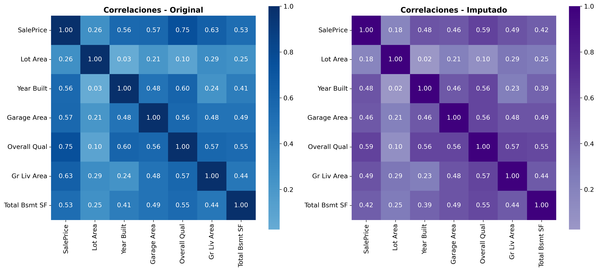
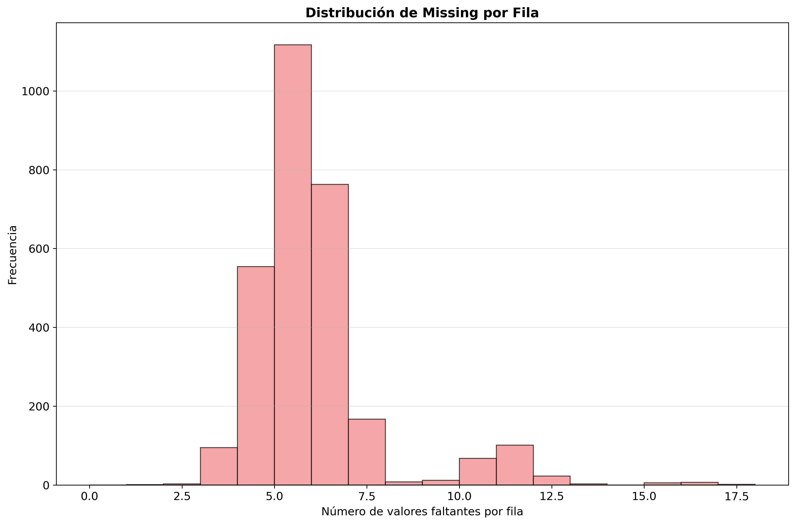
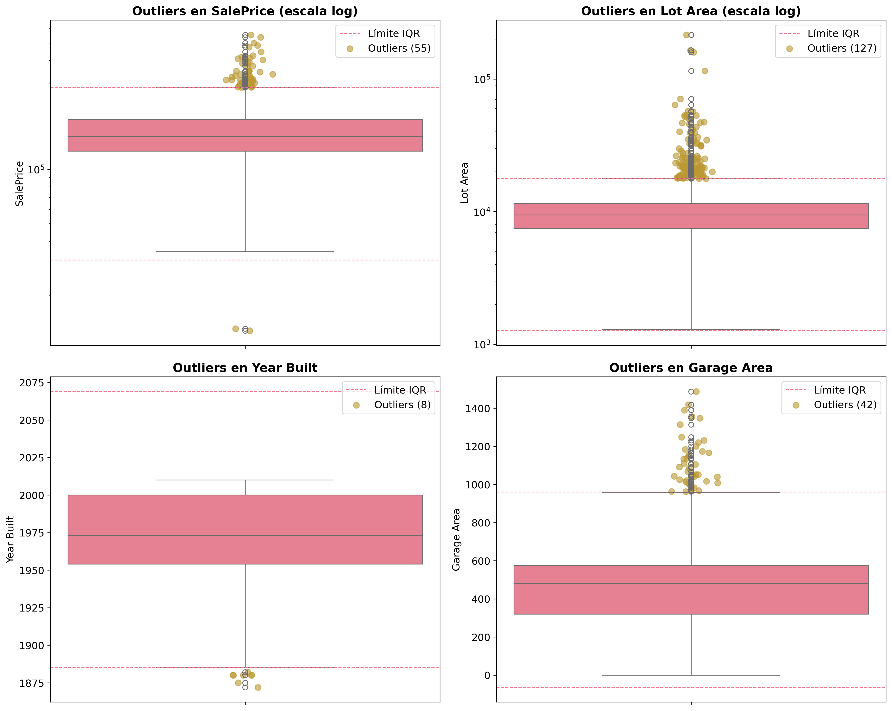

# 📊 Resultados - Análisis del Dataset Ames Housing - Actividad Individual 

Esta página contiene todos los resultados generados durante el análisis exploratorio del dataset Ames Housing, tanto en la actividad 5 como en la actividad 6.

## 🎨 Visualizaciones

### Gráficos Generados

- **correlation_comparison.png**

- **distribution_comparison.png**

- **missing_patterns.png**

- **outliers_analysis.png**git 

