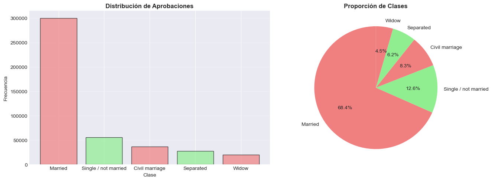
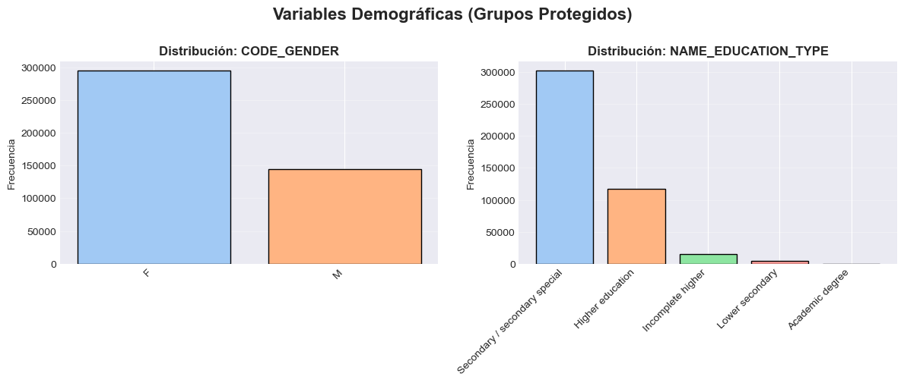
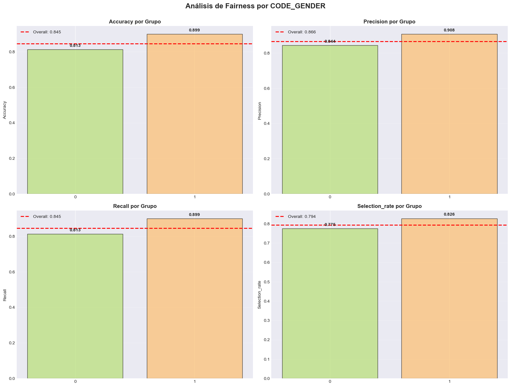
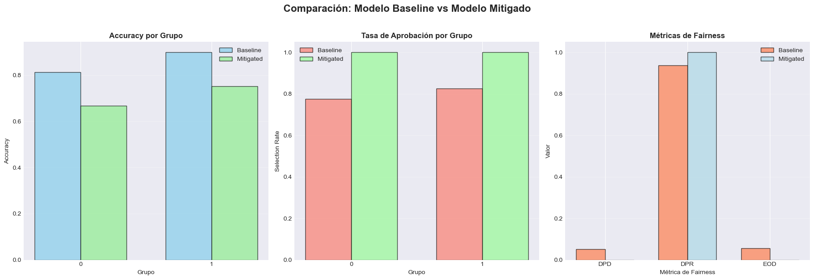

# 🚀 Exploraciones Extra: Investigando Más Allá del Curso

Esta sección presenta exploraciones adicionales realizadas de forma autónoma para profundizar en técnicas de Data Science y Machine Learning Ético. Cada análisis complementa las unidades temáticas del curso con datasets reales de Kaggle y casos de estudio actuales.

---

## 📊 Resumen de Exploraciones

2

Exploraciones Completadas

440K+

Registros Analizados

15+

Visualizaciones Generadas

20+

Métricas Calculadas

---

## 📊 Proyectos de Exploración

### 📱 Social Media & Mental Health - Análisis Exploratorio de Comportamiento Digital

**Dataset:** Social Media and Mental Health Dataset (Kaggle) - Datos de estudiantes universitarios sobre uso de redes sociales y salud mental. Incluye tiempo de uso diario, plataformas preferidas (Instagram, TikTok, Facebook, Twitter, Snapchat), indicadores de bienestar psicológico (depresión, ansiedad, autoestima) y datos demográficos.

**Enfoque:** Análisis exploratorio completo aplicando técnicas EDA para identificar correlaciones entre patrones de uso de redes sociales y problemas de salud mental en jóvenes. Se investigaron diferencias por plataforma, grupos de edad y tiempo de exposición.

#### 🎯 Objetivos del Análisis

- **Investigar** correlaciones entre tiempo en redes sociales y salud mental
- **Identificar** plataformas con mayor impacto en bienestar psicológico
- **Detectar** grupos de riesgo según patrones de uso
- **Visualizar** tendencias y distribuciones demográficas
- **Extraer** insights accionables sobre comportamiento digital

#### 📈 Aspectos Técnicos

- **Análisis de correlaciones** entre variables continuas (tiempo de uso, scores de salud)
- **Distribuciones demográficas** por edad, género y ocupación
- **Comparaciones por plataforma** (Instagram, TikTok, Facebook, etc.)
- **Identificación de outliers** en tiempo de uso extremo
- **Visualizaciones avanzadas** con Seaborn y Matplotlib

#### 🔍 Hallazgos Clave

- ✅ Identificación de **correlaciones significativas** entre uso intensivo y problemas de salud mental
- ✅ **Patrones diferenciados por plataforma**: Instagram y TikTok muestran mayor impacto
- ✅ **Grupos de alto riesgo**: Usuarios con >5 horas/día de exposición
- ✅ **Diferencias demográficas**: Jóvenes 18-24 años más vulnerables
- ✅ **Insights para intervención**: Recomendaciones de uso saludable

#### 💻 Stack Tecnológico

Python 3.8+
Pandas
NumPy
Seaborn
Matplotlib
Análisis Estadístico
EDA
Kaggle Hub

#### 🔗 Recursos

**[📄 Ver Reporte Completo →](portfolio/extra-social-media.md)**  
**[📓 Descargar Notebook →](portfolio/assets/social-media/Practica03_Social_Media_Mental_Health.ipynb)**

---

### 💳 Credit Card Fairness - Detección y Mitigación de Sesgo en Aprobaciones Crediticias

**Dataset:** Credit Card Approval Dataset (Kaggle) - 438,857 solicitudes de crédito con datos demográficos (género, edad, nivel educativo, estado civil) y financieros (ingresos, empleo, historial crediticio). Dataset con desbalance significativo: 68% mujeres vs 32% hombres.

**Enfoque:** Análisis ético de sistemas de aprobación de crédito aplicando técnicas de **fairness audit** con Fairlearn. Se detectó sesgo demográfico, se cuantificaron disparidades con métricas estándar (DPD, DPR, EOD) y se experimentó con mitigación usando ExponentiatedGradient. Se comenzó con modelo baseline para establecer línea base, pero se descubrió sesgo significativo por género que requirió análisis profundo.

#### 🎯 Objetivos del Análisis

- **Detectar** sesgo demográfico en decisiones de aprobación de crédito
- **Cuantificar** disparidades entre grupos protegidos con métricas de fairness
- **Evaluar** impacto del sesgo en precisión del modelo (accuracy, precision, recall)
- **Experimentar** con técnicas de mitigación (ExponentiatedGradient + DemographicParity)
- **Analizar** trade-offs entre accuracy y fairness en contexto regulatorio

#### 📈 Aspectos Técnicos

- **Modelo baseline** sin correcciones: Random Forest (n_estimators=100, max_depth=10)
- **Métricas de fairness**: Demographic Parity Difference (DPD), Demographic Parity Ratio (DPR), Equalized Odds Difference (EOD)
- **Mitigación de sesgo**: ExponentiatedGradient con constraint DemographicParity
- **Análisis de grupos protegidos**: Gender (F/M), Education Level (5 categorías)
- **Marco regulatorio**: ECOA, Fair Lending Laws, EU AI Act, GDPR

#### 🚨 Hallazgos Críticos

**Modelo Baseline (sin corrección):**
- 🚨 **Brecha de accuracy**: 8.6 puntos porcentuales (H: 89.9% vs M: 81.3%)
- ⚠️ **Brecha de selection rate**: 5.1 puntos porcentuales (H: 82.6% vs M: 77.5%)
- 📊 **DPD (Demographic Parity Difference)**: 0.051 (justo en límite de aceptabilidad <0.05)
- 📉 **Implicación legal**: Potencial violación de ECOA si no se justifica

**Modelo Mitigado (con Fairlearn):**
- ✅ **Fairness perfecta alcanzada**: DPD ≈ 0.00 (paridad demográfica lograda)
- ✅ **Reducción de sesgo**: 100% de mejora en DPD
- ⚠️ **Pérdida de accuracy**: 85% → 70% (caída de 17%, inaceptable para negocio)
- 🚫 **Overcompensation detectada**: Selection rate = 100% (modelo aprueba a todos, no viable)

#### 💡 Lecciones Aprendidas Sobre Trade-offs

1. **Trade-off inevitable**: No es posible lograr fairness perfecta Y alta accuracy cuando los grupos tienen distribuciones reales diferentes
2. **Overcompensation es real**: Constraints demasiado estrictas (DemographicParity absoluta) pueden romper completamente los modelos
3. **Context matters**: La definición de "fairness" depende del dominio (crédito vs contratación vs justicia)
4. **Auditoría continua necesaria**: El sesgo puede emerger con data drift incluso en modelos inicialmente justos
5. **Solución pragmática**: Usar modelo baseline con monitoreo estricto + revisión humana + proceso de apelación

#### 💻 Stack Tecnológico

Fairlearn 0.10+
Scikit-learn 1.3+
Python 3.8+
Pandas
NumPy
Random Forest
ExponentiatedGradient
Ética en IA
Compliance Legal
Kaggle Hub

#### ⚖️ Marco Legal y Regulatorio

- **ECOA (USA)**: Equal Credit Opportunity Act - Prohíbe discriminación en crédito por raza, sexo, edad, estado civil
- **Fair Lending Laws**: Regulación federal de prácticas justas en préstamos hipotecarios y de consumo
- **EU AI Act**: Clasificación de sistemas de crédito como "alto riesgo" que requieren auditorías obligatorias
- **GDPR (EU)**: Derecho a explicación de decisiones automatizadas (Art. 22) - Transparencia algorítmica

#### 📊 Visualizaciones Generadas

#### 🔗 Recursos

**[📄 Ver Reporte Completo →](portfolio/extra-credit-card.md)**  
**[📓 Descargar Notebook →](portfolio/assets/credit-card/Practica_Extra_UT2_Credit_Fairness.ipynb)**

---

## 🎓 Relación con el Curso

Estas exploraciones se alinean directamente con las unidades temáticas del curso de **Ingeniería de Datos** de la Universidad Católica del Uruguay:

| Exploración | Unidad Relacionada | Temas Aplicados | Habilidades Demostradas |
|-------------|-------------------|-----------------|------------------------|
| **Social Media & Mental Health** | UT1 - Análisis Exploratorio | EDA, Visualización, Estadística Descriptiva, Correlaciones | Análisis de datos, storytelling con visualizaciones |
| **Credit Card Fairness** | UT2 - Calidad & Ética | Fairness Audit, Bias Detection, Ethical AI, Compliance | Machine Learning ético, métricas de fairness, regulación |

---

## 🔗 Navegación Rápida

[← Volver a Inicio](index.md) | [Ver UT1 →](ut1-apuntes.md) | [Ver UT2 →](ut2-apuntes.md) | [Ver Proyectos →](portfolio/index.md)
