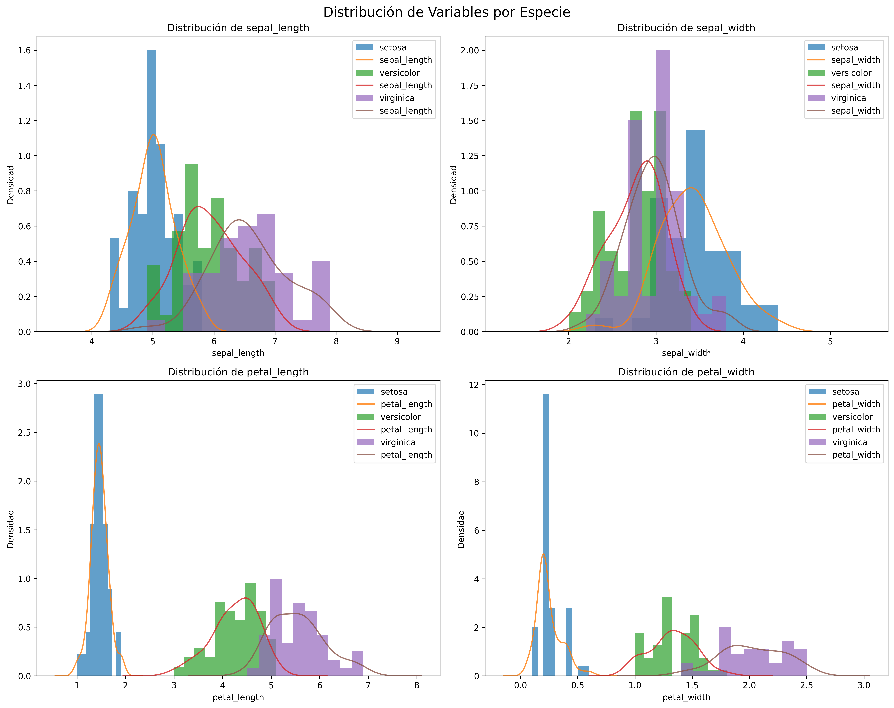
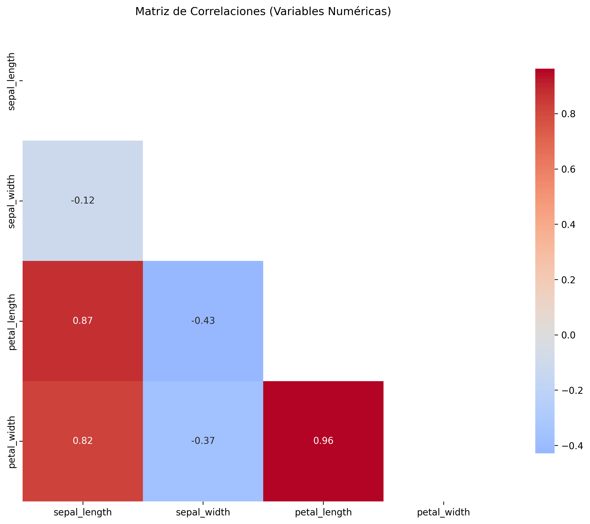
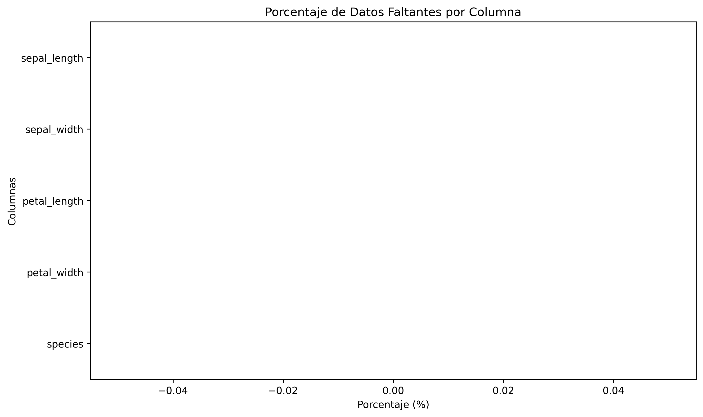

# 🌸 Exploración del Dataset *Iris* — Análisis morfológico y correlaciones entre especies
 
> 📚**Tiempo estimado de lectura:** ~8 min  
> - **Autora:** Milagros Cancela  
> - **Fecha:** 13/08/2025  
> - **Entorno:** Python + VSCode + Cursor
> - **Referencia de la tarea:** [Tarea 1 — Exploración del Dataset Iris](https://juanfkurucz.com/ucu-id/ut1/01-exploracion-iris/)

---

## 💾 Descargar Notebook

Para acceder al notebook completo con el código, gráficos y análisis reproducible:

[**Descargar notebook — dataset_iris.ipynb**](./assets/iris/dataset_iris.ipynb){: .btn .btn-primary target="_blank" download="dataset_iris.ipynb"}

> 📂 Archivo disponible dentro del repositorio:  
> `docs/portfolio/assets/iris/dataset_iris.ipynb`
---

## 🎯 Objetivo

### El objetivo de esta práctica fue realizar un **Análisis Exploratorio de Datos (EDA)** sobre el clásico dataset *Iris*, utilizando **pandas**, **seaborn** y **matplotlib**.  
### El propósito fue comprender la estructura del dataset, analizar las relaciones entre variables y evaluar la calidad de los datos antes de avanzar hacia etapas de limpieza y modelado.

---

## 📘 Descripción general

El dataset contiene **150 observaciones** de tres especies de flores: *Setosa*, *Versicolor* y *Virginica*.  
Incluye cuatro variables numéricas (longitud y ancho de pétalos y sépalos) y una categórica (`species`).  
Está completamente limpio y balanceado, con 50 muestras por especie.

| Variable | Tipo | Unidad | Descripción |
|:----------|:------|:---------|:-------------|
| sepal_length | float | cm | Longitud del sépalo |
| sepal_width  | float | cm | Ancho del sépalo |
| petal_length | float | cm | Longitud del pétalo |
| petal_width  | float | cm | Ancho del pétalo |
| species | category | — | Especie de la flor |

---

## 🔧 Metodología

1. **Carga y validación de datos** → `sns.load_dataset("iris")`  
   Se verificaron estructura, tipos de datos y ausencia de valores faltantes.  
2. **Análisis estadístico descriptivo** → uso de `.describe()`, `.corr()` y medidas de asimetría y curtosis.  
3. **Exploración visual** → generación de gráficos comparativos para examinar la separación entre especies y sus correlaciones.  
4. **Documentación** → exportación de perfiles, tablas y reportes a `/results/`, incluyendo el reporte automatizado `profile_iris.html`.

---

## 🌸 Distribución de las variables

Los **histogramas con curvas KDE** permiten observar cómo se distribuyen las variables dentro de cada especie:



- En los **pétalos**, las tres especies se separan con claridad.  
  *Setosa* presenta pétalos cortos y angostos, *Versicolor* ocupa una posición intermedia, y *Virginica* concentra los valores más altos.  
  Esto sugiere que las variables de pétalos son las más útiles para tareas de clasificación.  
- En los **sépalos**, las distribuciones se superponen más, por lo que aportan menor poder discriminante.

---

## 🔍 Relaciones entre variables

El siguiente gráfico de pares muestra cómo se relacionan las dimensiones:


Cada punto representa una flor. A partir del gráfico se observa que:
- *Setosa* forma un grupo totalmente aislado del resto.  
- *Versicolor* y *Virginica* se solapan parcialmente, aunque pueden diferenciarse bien si se consideran `petal_length` y `petal_width`.  

Esto confirma que **solo con las variables de pétalos podría construirse un modelo de clasificación con buena precisión**.

---

## 📊 Correlaciones

Para verificar las observaciones visuales, analicé la matriz de correlaciones:



| Variables | Correlación | Interpretación |
|:-----------|:-------------|:----------------|
| petal_length ↔ petal_width | **0.86** | Correlación muy fuerte: ambas crecen de manera proporcional. |
| sepal_length ↔ sepal_width | -0.12 | Correlación débil e inversa: son prácticamente independientes. |
| sepal_length ↔ petal_length | 0.87 | Relación positiva, aunque con mayor dispersión. |

Las **variables de pétalos concentran la mayor información explicativa**, mientras que las de sépalo aportan contexto morfológico, pero no separan especies por sí solas.

---

## 🧩 Calidad de los datos



| Criterio | Evaluación | Observación |
|:-----------|:-----------|:-------------|
| **Valores faltantes** | ❌ Ninguno | Dataset completamente completo. |
| **Outliers** | ⚠️ Mínimos | Algunos valores extremos en `sepal_width`, sin impacto en la media. |
| **Duplicados** | ❌ Ninguno | Todos los registros son únicos. |
| **Distribución** | ✅ Aproximadamente normal | Variables de pétalos muestran distribuciones suaves. |

El gráfico de valores faltantes confirma un resultado poco común: **no existe ningún valor nulo**.  
También se validó que los rangos estén dentro de límites biológicos razonables (por ejemplo, sépalos entre 4 y 8 cm).  
No se detectaron duplicados, lo que refuerza la confiabilidad del dataset y su utilidad para prácticas de EDA.

---

## 📂 Estructura de Resultados

```bash
results/
├── visualizaciones/
│   ├── histogramas_kde_por_especie.png
│   ├── pairplot_por_especie.png
│   ├── matriz_correlaciones.png
│   ├── missing.png
│   └── boxplots_por_especie.png
├── perfiles/
│   ├── describe.csv
│   ├── cov.csv
│   ├── skew_kurt.csv
│   ├── species_dist.csv
│   ├── missing.csv
│   ├── missing_prop.csv
│   └── nulos.csv
└── reportes/
    ├── range_check.csv
    ├── data_dictionary.md
    ├── data_dictionary.csv
    ├── respuestas_negocio.md
    └── profile_iris.html
```
---

## 💡 Hallazgos principales

- Los **pétalos son las variables clave**: longitud y ancho bastan para distinguir especies.  
- **Setosa** es la especie más fácil de identificar; sus valores no se superponen con los de las otras dos.  
- **Virginica** presenta mayor variabilidad interna, especialmente en el largo del pétalo.  
- Las medidas de sépalo son menos discriminantes, pero aportan independencia estadística.  
- El dataset es **completo, balanceado y sin anomalías**, lo que lo hace ideal para modelado supervisado.

---

## 🗂️ Insights de Negocio

### 🔍 Variables críticas para la toma de decisiones
Las variables `petal_length` y `petal_width` concentran casi toda la información útil.
En contextos de clasificación real (por ejemplo, detección automática de especies), se puede reducir la cantidad de sensores o variables medidas sin perder precisión.
En términos de negocio: menor costo de adquisición de datos, misma efectividad predictiva.
### 🌸 Separabilidad como métrica de eficiencia
Setosa presenta una separación morfológica total respecto a las otras dos especies.
Los sistemas pueden clasificarla sin ambigüedad, liberando capacidad de cómputo para las clases más difíciles (Versicolor y Virginica).
### 📈 Estabilidad y calidad del dataset
Esto lo convierte en un benchmark ideal para calibrar pipelines de validación de datos o probar frameworks de EDA automatizado sin sesgos introducidos por ruido o errores de captura.
 Es un ejemplo de “datos bien diseñados” que reflejan procesos de medición estandarizados.

---
## ⚙️ Notas de Implementación

- Análisis realizado en VS Code con entorno Python 3.
- Dependencias:
```bash
pip install pandas seaborn matplotlib ydata-profiling
```
- Todas las figuras se exportaron con dpi=200 y bbox_inches='tight'.
- Reporte HTML automático generado con ydata-profiling.
---

## 💭 Reflexión Personal
Este proyecto fue, para mí, un ejercicio de aprendizaje técnico, pero también de observación.
Al principio pensaba que hacer un EDA era simplemente generar gráficos bonitos, pero terminé entendiendo que explorar datos es una forma de pensar: una búsqueda de sentido, paso a paso.
Cada figura que exporté no era solo un resultado, sino una confirmación de que los patrones existen incluso en datasets tan simples como este.
Aprendí a organizar mis ideas, a limpiar y documentar, y sobre todo, a no apurarme en sacar conclusiones sin mirar el contexto.
Lo más desafiante fue elegir cómo mostrar las visualizaciones sin que pierdan claridad.
Y lo más gratificante fue comprobar que, al final, los datos hablan solos, si uno sabe cómo escucharlos.

---

## 📚 Referencias

- [Brust, A. V. (2023). *Ciencia de Datos para Gente Sociable*, Capítulos 1–4.](https://bitsandbricks.github.io/ciencia_de_datos_gente_sociable/) 
- [Google Developers. *Good Data Analysis Guide.*](https://developers.google.com/machine-learning/guides/good-data-analysis)
- [UCI Machine Learning Repository — *Iris Dataset.*](https://archive.ics.uci.edu/dataset/53/iris) 
- [Kaggle — *Iris Species Dataset.*](https://www.kaggle.com/datasets/uciml/iris)
- Documentación de [*pandas*]( https://pandas.pydata.org/docs/), [*seaborn*](https://seaborn.pydata.org/), [*matplotlib*](https://matplotlib.org/stable/contents.html) y [*ydata-profiling.*](https://docs.profiling.ydata.ai/latest/)

---

> 📁 **Ubicación:** `docs/portfolio/01-iris.md`  
> 📂 **Resultados:** ver [`../../actividades/act_dos_iris/results/`](../../actividades/act_dos_iris/results/) para acceder a perfiles y reportes completos en el repositorio.
