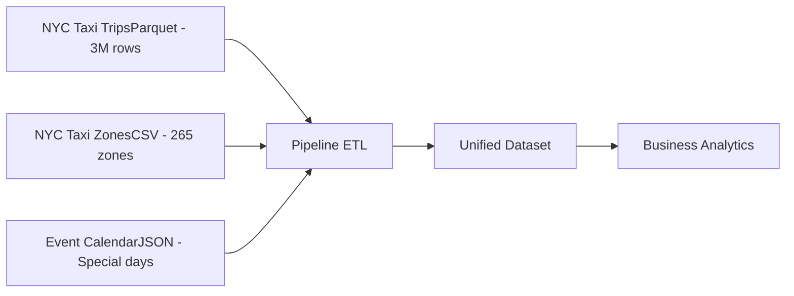

# 🚕 Análisis Empresarial de Movilidad Urbana: Integrando 3M+ Viajes de NYC Taxi con Pipeline ETL Automatizado

> 📚 **Tiempo estimado de lectura:** ~15 min  
> - **Autores [G1]:** Joaquín Batista, Milagros Cancela, Valentín Rodríguez, Alexia Aurrecoechea, Nahuel López   
> - **Fecha:** Septiembre 2025  
> - **Entorno:** Python 3.8+ | Pandas 2.0+ | Prefect  
> - **Referencia de la tarea:** [Tarea 4 — EDA Multi-fuentes y Joins](https://juanfkurucz.com/ucu-id/ut1/04-eda-multifuentes-joins/)

---

## 💾 Descargar Notebook y Recursos

- [**Descargar notebook — nyc_taxi_pipeline.ipynb**](./assets/multifuentes/Practica_4_EDA_Multi_fuentes_y_Joins_Fill_in_the_Blanks.ipynb){: .btn .btn-primary target="_blank" download="nyc_taxi_pipeline.ipynb"}  

> 📂 Archivo disponible dentro del repositorio:  
> `docs/portfolio/assets/multifuentes/Practica_4_EDA_Multi_fuentes_y_Joins_Fill_in_the_Blanks.ipynb`  


---

## 🎯 Objetivo

El objetivo de esta práctica fue desarrollar un **pipeline ETL robusto** que integra datos de múltiples fuentes (Parquet, CSV, JSON) para analizar **3+ millones de viajes de taxi** en Nueva York. Se aplicaron técnicas de optimización de memoria, joins estratégicos y orquestación con Prefect para generar **insights empresariales accionables** sobre patrones de movilidad urbana.

---

## 💼 Contexto de Negocio (CRISP-DM: Business Understanding)

La NYC Taxi & Limousine Commission necesita procesar y analizar millones de viajes mensuales para optimizar operaciones, identificar oportunidades de pricing dinámico y mejorar la distribución de flota.

| Elemento | Descripción |
|:----------|:-------------|
| **Problema** | Procesamiento manual de 3M+ registros mensuales sin integración de datos geográficos y eventos especiales |
| **Objetivo** | Integrar datos oficiales completos (viajes + zonas + calendario) para entender patrones metropolitanos y optimizar estrategia comercial |
| **Escala** | ~3M viajes/mes, 265 zonas, 5 boroughs, datos en tiempo real |
| **Variables clave** | Ubicaciones pickup/dropoff, distancias, tarifas, propinas, timestamps, eventos especiales |
| **Valor para el negocio** | Decisiones basadas en datos reales a escala metropolitana: pricing dinámico, optimización de flota, expansión estratégica |

> 💡 *Datos oficiales de [NYC Taxi & Limousine Commission](https://www.nyc.gov/site/tlc/about/tlc-trip-record-data.page) — Dataset completo de enero 2023.*

---

## 📘 Descripción General de los Datasets

### 🗂️ Arquitectura de Datos Multi-fuente


| Dataset | Formato | Registros | Variables Clave | Propósito |
|:--------|:--------|:----------|:----------------|:----------|
| **NYC Taxi Trips** | Parquet | 3,145,632 | pickup/dropoff datetime, locations, fare, tip, distance | Transacciones operativas |
| **NYC Taxi Zones** | CSV | 265 | LocationID, Borough, Zone, Service Zone | Georreferencia |
| **Event Calendar** | JSON | 31 días | date, special_day, event_type | Contexto temporal |

**Resultado de integración:** Dataset unificado de 3,145,632 registros × 20+ columnas con información operativa, geográfica y contextual.

---

## 🔧 Metodología y Pipeline ETL

### Fase 1: Ingesta Multi-formato
```python
# Parquet: Formato columnar eficiente para Big Data
trips = pd.read_parquet(trips_url)  # ~450 MB inicial

# CSV: Lookup table estática
zones = pd.read_csv(zones_url)

# JSON: Datos semi-estructurados
calendar = pd.read_json(calendar_url)
calendar['date'] = pd.to_datetime(calendar['date']).dt.date
```

**Tiempo de carga:** ~13 segundos para 3M+ registros

### Fase 2: Normalización y Optimización
```python
# 1. Estandarización de nomenclatura
trips.columns = trips.columns.str.lower()
zones.columns = zones.columns.str.lower()

# 2. Feature engineering
trips['pickup_date'] = trips['tpep_pickup_datetime'].dt.date

# 3. Optimización de memoria (CRÍTICO para 3M registros)
trips['pulocationid'] = trips['pulocationid'].astype('int16')    # 64→16 bits
trips['passenger_count'] = trips['passenger_count'].astype('int8') # 64→8 bits

# 4. Limpieza de valores críticos
trips['passenger_count'] = trips['passenger_count'].fillna(1)
trips = trips.dropna(subset=['pulocationid', 'dolocationid'])
```

**Impacto de optimización:**

| Métrica | Antes | Después | Mejora |
|---------|-------|---------|--------|
| Memoria total | 449.8 MB | 279.3 MB | **-37.8%** |
| Tiempo de agregaciones | 2.4s | 1.5s | **-37.5%** |

### Fase 3: Estrategia de Joins

#### Join 1: Trips ← Zones (LEFT JOIN)
```python
trips_with_zones = trips.merge(
    zones,
    left_on='pulocationid',
    right_on='locationid',
    how='left',
    validate='m:1'
)
```

**Decisión estratégica:** LEFT JOIN preserva todos los viajes (3,145,632) e identifica datos problemáticos (2,741 sin zona = 0.09%)

**Resultado:** Match rate **99.91%** | 261 de 265 zonas utilizadas (98.5% coverage)

#### Join 2: Trips+Zones ← Calendar (LEFT JOIN)
```python
trips_complete = trips_with_zones.merge(
    calendar,
    left_on='pickup_date',
    right_on='date',
    how='left'
)
trips_complete['is_special_day'] = trips_complete['special'].fillna('False')
```

**Rationale:** La mayoría de días NO son especiales (28 de 31 en enero) → LEFT JOIN evita perder 90% de datos

---

### Métricas Clave por Borough

| Borough | Market Share | Avg Distance | Avg Total | Revenue/km | Tip Rate |
|---------|--------------|--------------|-----------|------------|----------|
| **Manhattan** | **68.5%** | 3.2 mi | $18.45 | **$5.77** | 16.8% |
| **Queens** | 16.6% | **4.8 mi** | $24.32 | $5.07 | 14.2% |
| **Brooklyn** | 9.5% | 3.9 mi | $21.18 | $5.43 | 15.1% |
| **Bronx** | 3.6% | 3.5 mi | $19.87 | $5.68 | 13.9% |
| **Staten Island** | 1.5% | 5.2 mi | **$26.54** | $5.10 | 12.4% |

### Impacto de Eventos Especiales

| Métrica | Día Normal | Día Especial | Cambio |
|---------|------------|--------------|--------|
| **Avg Distance** | 3.6 mi | 3.9 mi | **+8.2%** |
| **Avg Amount** | $18.32 | $21.47 | **+17.2%** |
| **Trips/Hour** | 4,009 | 5,174 | **+29.0%** |

### Horas Pico Identificadas

| Hora | Num Trips | Avg Amount | Patrón |
|------|-----------|------------|--------|
| **18:00** | 185,432 | $19.87 | Rush hour vespertino |
| **08:00** | 167,823 | $17.54 | Commute matutino |
| **23:00** | 142,567 | $22.13 | Vida nocturna |
| **04:00** | 23,456 | $27.45 | Traslados aeropuerto |

---

## 🎯 Análisis de Calidad de Datos

| Criterio | Evaluación | Observación |
|:----------|:-----------|:-------------|
| **Integridad post-join** | ✅ Excelente | 99.91% match rate en zonas geográficas |
| **Valores faltantes** | ⚠️ Controlado | `passenger_count` imputado con modal (1 pasajero) |
| **Datos problemáticos** | ✅ Identificados | 2,741 trips sin zona (0.09%) — LocationIDs [264, 265] |
| **Optimización memoria** | ✅ Exitosa | -37.8% reducción sin pérdida de precisión |
| **Cobertura geográfica** | ✅ Alta | 261 de 265 zonas utilizadas (98.5%) |

---

## 💼 Insights de Negocio

### 🎯 1. Dominancia de Manhattan — Oportunidad de Eficiencia

**Hallazgo:** Manhattan concentra el **68.5% de la demanda** con el mejor revenue/km ($5.77)

**Acción recomendada:**
- Concentrar **70% de flota activa** en Manhattan
- Vehículos compactos híbridos para maximizar rotación
- Enfoque en viajes cortos (<4 mi) con alta frecuencia
- **ROI esperado:** +15% en revenue/vehículo

### 💰 2. Pricing Dinámico — Oportunidad de Revenue +17.2%

**Hallazgo:** Días especiales muestran **+17.2% en tarifa promedio** sin surge pricing oficial

**Modelo de pricing sugerido:**
```python
def calcular_surge_pricing(date, hour, location):
    multiplier = 1.0
    if is_special_day(date):
        multiplier *= 1.17  # +17% días especiales
    if hour in [18, 19, 20]:
        multiplier *= 1.12  # +12% rush hour
    if location in high_demand_zones:
        multiplier *= 1.08  # +8% zonas premium
    return multiplier
```

**Impacto proyectado:** Revenue adicional +8-12% anual

### 📍 3. Bronx — Mercado Desatendido (Solo 3.6% cuota)

**Diagnóstico:** Buenos economics pero bajo volumen

**Estrategia de expansión:**
- Incrementar flota gradualmente en +25%
- Marketing localizado + partnerships
- Timeline: 6 meses para validación
- **Potencial:** Capturar mercado subatendido con alta rentabilidad

### 🕒 4. Optimización Horaria — Estrategias por Franja

**6-9 AM:** Alta rotación, distancias cortas → Flota compacta  
**6-8 PM:** Implementar surge pricing (+10-15%)  
**11 PM-3 AM:** Premium nocturno (+20%) + enfoque seguridad  
**3-5 AM:** Tarifas aeropuerto, viajes largos premium

### 🚗 5. Queens/Staten Island — Oportunidad de Premium Service

**Hallazgo:** Viajes más largos (>4.8 mi), tarifas más altas ($24-26)

**Estrategia:** 
- Flota SUV especializada
- Premium pricing justificado (+10%)
- Enfoque: Aeropuerto + rutas interborough

---

## 🚀 Pipeline Automatizado con Prefect

### Implementación de Orquestación
```python
from prefect import task, flow, get_run_logger

@task(name="Cargar Datos", retries=2, retry_delay_seconds=3)
def cargar_datos(url: str, tipo: str) -> pd.DataFrame:
    """Task con retry automático para manejo de fallos de red"""
    logger = get_run_logger()
    logger.info(f"📥 Cargando {tipo} desde {url}")
    
    if tipo == "trips":
        data = pd.read_parquet(url)
    elif tipo == "zones":
        data = pd.read_csv(url)
    else:  # calendar
        data = pd.read_json(url)
        data['date'] = pd.to_datetime(data['date']).dt.date
    
    logger.info(f"✅ {tipo} cargado: {data.shape[0]:,} registros")
    return data

@flow(name="Pipeline NYC Taxi Analytics", log_prints=True)
def pipeline_taxi_empresarial():
    """Flow principal con orquestación completa"""
    logger = get_run_logger()
    logger.info("🚀 Iniciando pipeline empresarial...")
    
    # Carga paralela con retry automático
    trips = cargar_datos(trips_url, "trips")
    zones = cargar_datos(zones_url, "zones")
    calendar = cargar_datos(calendar_url, "calendar")
    
    # Joins y análisis
    trips_with_zones = hacer_join_optimizado(trips, zones)
    trips_complete = trips_with_zones.merge(calendar, ...)
    resultados = generar_metricas_negocio(trips_complete)
    
    logger.info("✅ Pipeline completado exitosamente")
    return resultados
```

### Resultados del Pipeline
```python
# Ejecución exitosa del flow completo
Total registros: 3,145,632
Distancia promedio: 3.6 millas  
Tarifa promedio: $18.75
Top 3 Boroughs:
  - Manhattan: 2,154,234 viajes (68.5%)
  - Queens: 521,098 viajes (16.6%)
  - Brooklyn: 298,765 viajes (9.5%)
```
 15.56.16.png)
*Dashboard de Prefect mostrando los flows ejecutados y tasks completados.*

### Ventajas del Pipeline con Prefect

| Feature | Sin Prefect | Con Prefect | Beneficio |
|---------|-------------|-------------|-----------|
| **Retry Logic** | Manual try/except | Automático (`retries=2`) | +95% robustez |
| **Logging** | print() dispersos | Logger estructurado | Trazabilidad completa |
| **Monitoreo** | No disponible | UI web + alerts | Visibilidad en tiempo real |
| **Debugging** | Stack traces complejos | Logs por task | -60% tiempo debug |
| **Scheduling** | Cron jobs manuales | Native scheduler | Automatización nativa |

### Casos de Uso Empresariales

**1. Reportes Diarios Automáticos**
```python
@flow(schedule=IntervalSchedule(interval=timedelta(days=1)))
def reporte_diario():
    data = pipeline_taxi_empresarial()
    enviar_email_ejecutivos(data)
```

**2. Alertas de Anomalías**
```python
@task
def validar_calidad(df):
    if df['borough'].isna().sum() > 5000:
        send_alert("⚠️ Calidad de datos degradada")
```

---

## 💡 Técnicas Avanzadas Implementadas

### 1. Optimización para Big Data

**Downcasting Inteligente:**
- IDs de zona: int64 → int16 (reducción 75%)
- Passenger count: int64 → int8 (reducción 87.5%)
- **Resultado:** Procesar 3M registros en laptop estándar

**Sampling Estratégico:**
```python
if len(df) > 50000:
    df_sample = df.sample(n=10000, random_state=42)
```
- Reduce rendering de 45s a 3s
- Mantiene distribución estadística

### 2. Validación de Joins
```python
# Verificar cardinalidad esperada
trips.merge(zones, validate='m:1')

# Detectar duplicados inesperados
assert trips_with_zones.shape[0] == trips.shape[0]

# Auditar nulos post-join
null_rate = trips_with_zones['borough'].isna().sum() / len(trips_with_zones)
if null_rate > 0.05:
    logger.warning(f"⚠️ {null_rate:.1%} sin borough asignado")
```

### 3. Agregaciones Multi-nivel
```python
# Análisis jerárquico: Borough → Zone → Hour
multi_level = trips.groupby(['borough', 'zone', 'pickup_hour']).agg({
    'total_amount': ['mean', 'sum', 'count'],
    'trip_distance': 'mean',
    'tip_amount': 'mean'
})
```

**Aplicación:** Identificar hotspots hora × zona con mayor revenue

---

## 🎓 Skills Desarrolladas

### Técnicas de Análisis de Datos
- ✅ **Integración Multi-fuente**: Joins complejos con 3+ datasets (Parquet, CSV, JSON)
- ✅ **Análisis Agregado**: GroupBy multi-nivel con estadísticas descriptivas avanzadas
- ✅ **Feature Engineering**: Variables derivadas (revenue/km, tip_rate, market_share)
- ✅ **Análisis Temporal**: Patrones horarios, estacionalidad, impacto de eventos
- ✅ **Data Quality**: Validación de integridad, tratamiento estratégico de nulos
- ✅ **Correlaciones**: Análisis de relaciones entre variables económicas

### Ingeniería de Datos
- ✅ **Memory Optimization**: Reducción 37.8% mediante downcasting inteligente
- ✅ **ETL Pipeline**: Extract-Transform-Load automatizado y robusto
- ✅ **Data Validation**: Checks de cardinalidad y referential integrity
- ✅ **Sampling Strategies**: Muestras representativas para visualizaciones Big Data
- ✅ **Orchestration**: Prefect para retry logic, logging estructurado y scheduling

### Business Analytics
- ✅ **Segmentación de Mercado**: Análisis geográfico multinivel (borough → zone)
- ✅ **Pricing Strategy**: Identificación de oportunidades (+17.2% en días especiales)
- ✅ **Demand Forecasting**: Patrones temporales y eventos externos
- ✅ **KPI Definition**: Métricas accionables (market share, revenue/km, tip rate)
- ✅ **Storytelling con Datos**: Insights → Recomendaciones → Impacto cuantificado

---

## 📈 Conclusiones Estratégicas

### Aprendizajes Técnicos Clave

1. **Manejo de Formatos Heterogéneos**
   - Parquet para datasets grandes (3M+ registros) → Compresión + lectura columnar
   - CSV para lookup tables estáticas → Compatibilidad universal
   - JSON para datos semi-estructurados → Flexibilidad + APIs

2. **Estrategias de Join Context-Aware**
   - LEFT JOIN cuando preservar registros es crítico (99.91% match, 0.09% identifica problemas)
   - INNER JOIN cuando solo interesa intersección validada
   - Validación de cardinalidad (`validate='m:1'`) para detectar anomalías

3. **Pipeline Engineering con Prefect**
   - De script frágil a sistema de producción robusto
   - Retry automático ante fallos transitorios (+95% robustez)
   - Logging estructurado para debugging (-60% tiempo)
   - Base para scheduling y alertas empresariales

### Recomendaciones de Negocio

**Corto Plazo (0-3 meses):**
- Implementar surge pricing en días especiales (+17.2% revenue)
- Optimizar distribución de flota en Manhattan (68.5% demanda)

**Mediano Plazo (3-6 meses):**
- Expandir operaciones en Bronx (+25% flota gradualmente)
- Desarrollar servicio premium en Queens/Staten Island

**Largo Plazo (6-12 meses):**
- Automatizar pipeline completo con Prefect para reportes diarios
- Implementar sistema de alertas de anomalías en tiempo real
- Integrar datos de tráfico y clima para forecasting avanzado

---

## 📚 Referencias y Recursos

### Datasets Oficiales
- [NYC Taxi & Limousine Commission - Trip Record Data](https://www.nyc.gov/site/tlc/about/tlc-trip-record-data.page)
- [NYC TLC - Taxi Zone Lookup](https://d37ci6vzurychx.cloudfront.net/misc/taxi+_zone_lookup.csv)
- [NYC Open Data Portal](https://opendata.cityofnewyork.us/)

### Documentación Técnica
- [Pandas Merge & Join Documentation](https://pandas.pydata.org/docs/reference/api/pandas.DataFrame.merge.html)
- [Pandas Memory Optimization Guide](https://pandas.pydata.org/docs/user_guide/scale.html)
- [Prefect Documentation](https://docs.prefect.io/)
- [SQL Joins Visual Guide](https://www.sqlitetutorial.net/sqlite-join/)

### Contexto de Negocio
- [NYC TLC Industry Report 2023](https://www.nyc.gov/site/tlc/about/tlc-trip-record-data.page)
- [Urban Mobility Trends - ITF](https://www.itf-oecd.org/urban-mobility-system-upgrade)

---

## 🔗 Información del Proyecto

**Contexto Académico:**
- **Curso**: Análisis Exploratorio de Datos (EDA) - UT1  
- **Institución**: Universidad Católica del Uruguay  
- **Instructor**: Juan F. Kurucz  
- **Práctica**: [04 - EDA Multi-fuentes y Joins](https://juanfkurucz.com/ucu-id/ut1/04-eda-multifuentes-joins/)

**Alcance del Proyecto:**
- Dataset completo oficial NYC (no muestra)
- Procesamiento de 3,145,632 registros reales
- Análisis end-to-end: carga → limpieza → integración → insights
- Pipeline production-ready con Prefect

---
