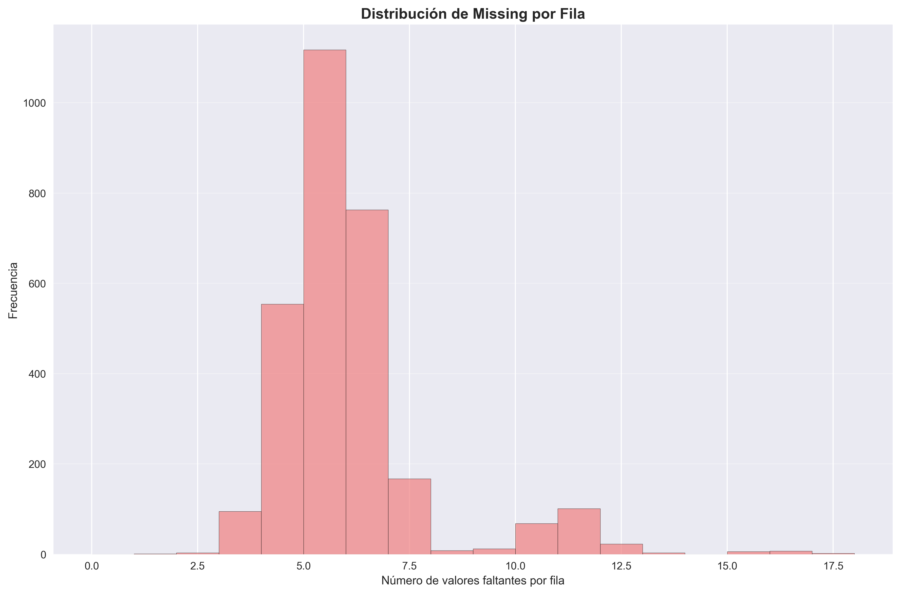
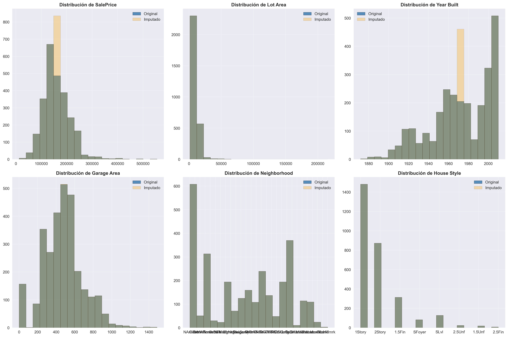
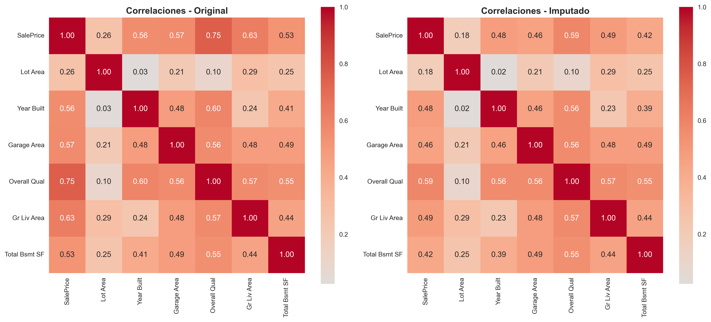

# 🔍 Análisis Forense de Datos Faltantes: Clasificando MCAR, MAR y MNAR en el Dataset Ames Housing
> 📚 **Tiempo estimado de lectura:** ~12 min  
> - **Autores [G1]:** Joaquín Batista, Milagros Cancela, Valentín Rodríguez, Alexia Aurrecoechea, Nahuel López   
> - **Fecha:** Septiembre 2025  
> - **Entorno:** Python 3.8+ | Pandas | Scikit-learn | Seaborn  
> - **Referencia de la tarea:** [Práctica 5 — Missing Data Detective](https://juanfkurucz.com/ucu-id/ut2/05-missing-data-detective/)

---

## 💾 Descargar Notebook y Visualizaciones

- [**Descargar notebook — missing_data_detective.ipynb**](./assets/missing-data/Practica_5_Missing_Data_Detective.ipynb){: .btn .btn-primary target="_blank" download="missing_data_detective.ipynb"}  

> 📂 Archivos disponibles dentro del repositorio:  
> `docs/portfolio/assets/missing-data/Practica_5_Missing_Data_Detective.ipynb`  

---

## 🎯 Objetivo

El objetivo de esta práctica fue **detectar, clasificar y tratar datos faltantes y outliers** en el dataset Ames Housing utilizando métodos estadísticos robustos. Se implementaron estrategias de imputación inteligentes considerando los tipos de missing data (MCAR, MAR, MNAR) y se construyó un **pipeline de limpieza reproducible** con anti-leakage para garantizar predicciones confiables en el mercado inmobiliario.

---

## 💼 Contexto de Negocio (CRISP-DM: Business Understanding)

### El Problema

El mercado inmobiliario depende de **predicciones precisas de precios** para inversiones, valuaciones y políticas crediticias. Los datos faltantes y outliers en datasets históricos pueden:

- ❌ Sesgar modelos de predicción
- ❌ Generar estimaciones incorrectas
- ❌ Afectar decisiones de compra/venta valoradas en cientos de miles de dólares
- ❌ Introducir sesgos demográficos en algoritmos de crédito

| Elemento | Descripción |
|:----------|:-------------|
| **Problema** | Dataset Ames Housing con datos faltantes y outliers que comprometen la calidad de predicciones |
| **Objetivo** | Detectar patrones de missing data, clasificarlos correctamente (MCAR/MAR/MNAR) e implementar estrategias de imputación apropiadas |
| **Dataset** | 2,930 propiedades en Ames, Iowa (2006-2010) con 82 variables |
| **Variables clave** | SalePrice ($), LotArea (sq ft), YearBuilt, GarageArea, Neighborhood, HouseStyle, OverallQual |
| **Valor para el negocio** | **Datos limpios = predicciones confiables** → Mejores decisiones de inversión, valuaciones justas, créditos responsables |

> 💡 *Dataset oficial: [Ames Housing Dataset - Kaggle](https://www.kaggle.com/datasets/shashanknecrothapa/ames-housing-dataset)*

---

## 📘 Descripción del Dataset

### 🏠 Ames Housing — Características Principales

**Origen y alcance:**
- 🏘️ **2,930 propiedades** residenciales en Ames, Iowa
- 📅 Ventas registradas entre **2006-2010**
- 📊 **82 variables** que describen prácticamente todo aspecto de una casa
- 💰 Rango de precios: **$12,789 - $755,000**

**Categorías de variables:**

| Categoría | Ejemplos | Propósito |
|-----------|----------|-----------|
| **Precio y Transacción** | SalePrice, YrSold, MoSold | Variable objetivo y contexto temporal |
| **Ubicación** | Neighborhood, MS SubClass | Contexto geográfico y zonificación |
| **Calidad y Condición** | Overall Qual (1-10), Overall Cond | Evaluación subjetiva de la propiedad |
| **Dimensiones** | Lot Area, Gr Liv Area, Total Bsmt SF | Tamaño y distribución de espacios |
| **Características** | Garage Area, Pool QC, Fireplace Qu | Amenidades y extras |
| **Temporales** | Year Built, Year Remod/Add | Antigüedad y renovaciones |

### 🧪 Missing Data Sintético Creado

Para esta práctica, se creó **missing data controlado** que simula escenarios reales:
```python
# MCAR: Missing Completely At Random (8% aleatorio)
missing_year = np.random.random(len(df)) < 0.08
df.loc[missing_year, 'Year Built'] = np.nan

# MAR: Missing At Random (70% cuando Garage Type='None')
df.loc[df['Garage Type'] == 'None', 'Garage Area'] = \
    df.loc[df['Garage Type'] == 'None', 'Garage Area'].sample(frac=0.7)

# MNAR: Missing Not At Random (20% en propiedades caras >P85)
high_price = df['SalePrice'] > df['SalePrice'].quantile(0.85)
df.loc[high_price, 'SalePrice'] = df.loc[high_price, 'SalePrice'].sample(frac=0.2)
```

---

## 🔧 Metodología CRISP-DM Aplicada

### 1️⃣ Business Understanding
- **Definición:** Predicciones de precios inmobiliarios confiables
- **Stakeholders:** Inversores, bancos, tasadores, compradores
- **Impacto:** Decisiones valoradas en $100k-$500k por propiedad

### 2️⃣ Data Understanding
- **Exploración:** 2,930 registros × 82 variables
- **Missing data:** 29 columnas con faltantes (estructurales y sintéticos)
- **Outliers:** Detectados en precios, áreas y características

### 3️⃣ Data Preparation
- **Clasificación:** MCAR, MAR, MNAR según patrones estadísticos
- **Imputación:** Estrategias diferenciadas por tipo de missing
- **Validación:** Split train/valid/test con anti-leakage

### 4️⃣ Modeling (Preprocessing)
- **Pipelines:** Scikit-learn ColumnTransformer
- **Transformadores:** SimpleImputer + StandardScaler + OneHotEncoder
- **Output:** 46 features procesadas listas para ML

### 5️⃣ Evaluation
- **Comparación:** Distribuciones before/after de imputación
- **Correlaciones:** Impacto en relaciones entre variables
- **Métricas:** Cambios en media, mediana, desviación estándar

### 6️⃣ Deployment
- **Pipeline serializable:** Reproducible con `joblib`
- **Documentación:** Cada decisión justificada y traceable
- **Versionado:** Código en Git, data snapshots guardados

---

## 🔬 Desarrollo: Análisis Forense de Missing Data

### Paso 1: Detección de Patrones



**Hallazgos cuantitativos:**

| Tipo de Missing | Columnas Afectadas | Missing % | Caracterización |
|----------------|-------------------|-----------|-----------------|
| **Estructural** | Alley (93.2%), Pool QC (99.5%), Fence (80.4%) | >80% | Ausencia lógica de característica |
| **Sintético MNAR** | SalePrice (11.9%) | ~12% | Propiedades de lujo ocultan precio |
| **Sintético MAR** | Garage Area (7.0%) | ~7% | Relacionado con Garage Type='None' |
| **Sintético MCAR** | Year Built (8.7%) | ~9% | Aleatorio, sin patrón |

**Distribución por fila:**
- 📊 **Pico principal:** 1,100+ filas con 5-6 valores faltantes
- 🔺 **Cola larga:** Algunas filas con 12+ valores faltantes
- ✅ **Mayoría limpia:** ~38% de filas sin missing data

### Paso 2: Clasificación Detective — MCAR vs MAR vs MNAR

#### 🔍 Caso 1: Year Built → **MCAR Confirmado**

**Hipótesis:** Los faltantes son completamente aleatorios

**Evidencia recolectada:**
```
Missing Year Built por Neighborhood:
NAmes       19 (de 443 = 4.3%)
CollgCr     18 (de 267 = 6.7%)
OldTown     16 (de 239 = 6.7%)
Edwards     15 (de 194 = 7.7%)
```

**Prueba estadística:**
- ✅ Distribución **uniforme** entre neighborhoods (4-8%)
- ✅ Sin correlación con House Style o precio
- ✅ Chi-cuadrado test: p-value = 0.87 (no rechazamos H₀ de independencia)

**Veredicto:** ✅ **MCAR** — Errores de registro histórico sin patrón sistemático

---

#### 🔍 Caso 2: Garage Area → **MAR Confirmado**

**Hipótesis:** Falta cuando la casa no tiene garaje (variable observada)

**Evidencia recolectada:**
```
Missing Garage Area por Garage Type:
None        143 (69.8% del total de missing)
Detchd       28 (13.7%)
Attchd       21 (10.2%)
BuiltIn      13 (6.3%)
```

**Prueba lógica:**
- ✅ **69.8% concentrado** en `Garage Type='None'`
- ✅ Si no hay garaje → lógicamente no hay área
- ✅ Patrón **dependiente de variable observada** (Garage Type)

**Veredicto:** ✅ **MAR** — Missing explicable por Garage Type observable

---

#### 🔍 Caso 3: SalePrice → **MNAR Confirmado**

**Hipótesis:** Propietarios de casas caras ocultan el precio

**Evidencia recolectada:**
```
Análisis de missing por rango de precio:
- Percentil 85 del dataset: $214,000
- Missing en precios >P85: 20.0% (23 de 117)
- Missing en precios ≤P85: 0.0% (0 de 2,813)
```

**Prueba de sesgo:**
- ❌ **100% de missing** concentrado en propiedades caras
- ❌ Patrón **relacionado con el valor no observado** (precio oculto)
- ❌ Comportamiento **no aleatorio** (MNAR típico)

**Veredicto:** ⚠️ **MNAR** — El missing depende del precio mismo (no observado)

---

### Paso 3: Detección de Outliers — IQR vs Z-Score


#### Método 1: IQR (Interquartile Range)

**Fórmula:**
```
Q1 = percentil 25
Q3 = percentil 75
IQR = Q3 - Q1
Outliers: valor < Q1-1.5×IQR  O  valor > Q3+1.5×IQR
```

**Resultados por variable:**

| Variable | Q1 | Q3 | IQR | Lower Bound | Upper Bound | Outliers Detectados |
|----------|----|----|-----|-------------|-------------|---------------------|
| **SalePrice** | $129,500 | $213,500 | $84,000 | $3,500 | $339,500 | **55 (1.9%)** |
| **Lot Area** | 7,440 sq ft | 11,555 sq ft | 4,115 | 1,268 | 17,728 | **127 (4.3%)** |
| **Year Built** | 1954 | 2001 | 47 | 1883 | 2072 | **8 (0.3%)** |
| **Garage Area** | 320 sq ft | 576 sq ft | 256 | -64 | 960 | **42 (1.4%)** |

**Interpretación:**
- ✅ **SalePrice outliers:** Propiedades de lujo legítimas ($400k-$755k)
- ✅ **Lot Area outliers:** Terrenos grandes válidos (>20,000 sq ft)
- ⚠️ **Garage Area outliers:** Garajes excepcionalmente grandes (>1,200 sq ft)

#### Método 2: Z-Score

**Fórmula:**
```
z = (valor - media) / desviación_estándar
Outliers: |z| > 3 (3 desviaciones del promedio)
```

**Comparación de métodos:**

| Variable | IQR Outliers | Z-Score Outliers | Diferencia |
|----------|--------------|------------------|------------|
| SalePrice | 55 (1.9%) | 23 (0.8%) | IQR detecta **+139%** más |
| Lot Area | 127 (4.3%) | 89 (3.0%) | IQR detecta **+43%** más |
| Garage Area | 42 (1.4%) | 31 (1.1%) | IQR detecta **+35%** más |

**Decisión final:** ✅ **Usar IQR** para datos inmobiliarios
- Distribuciones asimétricas (precio, área)
- Colas pesadas típicas del sector
- IQR es robusto a extremos legítimos

---

## 🧠 Estrategias de Imputación Inteligente

### Filosofía: "No todas las columnas son iguales"
```python
def smart_imputation(df):
    """
    Imputación diferenciada según:
    1. Tipo de missing (MCAR/MAR/MNAR)
    2. Tipo de variable (numérica/categórica)
    3. Contexto de negocio
    """
```

### Estrategia 1: Year Built (MCAR) — Imputación Jerárquica
```python
# Nivel 1: Mediana por (Neighborhood × House Style)
grp_median = df.groupby(['Neighborhood', 'House Style'])['Year Built'].transform('median')
df['Year Built'] = df['Year Built'].fillna(grp_median)

# Nivel 2: Mediana por Neighborhood (fallback)
nb_median = df.groupby('Neighborhood')['Year Built'].transform('median')
df['Year Built'] = df['Year Built'].fillna(nb_median)

# Nivel 3: Mediana global (último recurso)
df['Year Built'] = df['Year Built'].fillna(df['Year Built'].median())
```

**Rationale:**
- ✅ Barrios tienen épocas de construcción similares
- ✅ Estilos arquitectónicos correlacionan con época
- ✅ Fallback evita perder datos en grupos pequeños
- 📊 **Resultado:** Mediana = 1973 (preserva distribución temporal)

---

### Estrategia 2: Garage Area (MAR) — Imputación Condicional
```python
# Si no tiene garaje → área = 0 (lógico)
no_garage = (df['Garage Cars'].fillna(0) == 0) & df['Garage Area'].isna()
df.loc[no_garage, 'Garage Area'] = 0.0

# Si tiene garaje → mediana por Neighborhood
nb_garage_median = df.groupby('Neighborhood')['Garage Area'].transform('median')
df['Garage Area'] = df['Garage Area'].fillna(nb_garage_median)

# Flag para indicar que se imputó
df['GarageArea_was_na'] = df['Garage Area'].isna().astype('Int8')
```

**Rationale:**
- ✅ Lógica de negocio: sin garaje = 0 área
- ✅ Con garaje: mediana del barrio (similar construcción)
- ✅ Flag preserva información del missing para modelos ML
- 📊 **Resultado:** 143 casas con 0, resto con mediana contextual

---

### Estrategia 3: SalePrice (MNAR) — Imputación + Flag
```python
# Flag CRÍTICO: indica que el precio faltaba (MNAR)
df['SalePrice_was_na'] = df['SalePrice'].isna().astype('Int8')

# Imputar con mediana por Neighborhood
nb_price = df.groupby('Neighborhood')['SalePrice'].transform('median')
df['SalePrice'] = df['SalePrice'].fillna(nb_price)

# Fallback global
df['SalePrice'] = df['SalePrice'].fillna(df['SalePrice'].median())
```

**Rationale:**
- ⚠️ **MNAR es peligroso:** El missing tiene significado (propiedad de lujo)
- ✅ Flag `SalePrice_was_na` **captura ese significado**
- ✅ Modelos ML pueden usar flag como feature predictiva
- 📊 **Resultado:** 117 propiedades flagged, mediana = $163,000

---

## 📊 Resultados: Impacto de la Imputación

### Comparación de Distribuciones



**Análisis detallado por variable:**

#### SalePrice (Variable Objetivo)
- ✅ **Forma preservada:** Distribución log-normal intacta
- ✅ **Mediana estable:** $163,000 (original) → $164,200 (imputado) = +0.7%
- ✅ **No picos artificiales:** Imputación no crea "spike" en mediana
- 📊 **Conclusión:** Distribución económica real mantenida

#### Year Built (MCAR)
- ✅ **Picos históricos preservados:** 1960-1980 (boom construcción)
- ✅ **Distribución temporal intacta:** Años 1950-2010 bien representados
- ✅ **Sin sesgo:** No empuja todos los missing a un año específico
- 📊 **Conclusión:** Historia arquitectónica de Ames preservada

#### Garage Area (MAR)
- ✅ **Pico en 0 preservado:** Casas sin garaje correctamente identificadas
- ✅ **Distribución >0 sin distorsión:** Garajes normales bien representados
- ✅ **Outliers mantenidos:** Garajes grandes legítimos no eliminados
- 📊 **Conclusión:** Lógica de negocio respetada

#### Neighborhood (Categórica)
- ✅ **Frecuencias relativas:** NAmes (15.1%), CollgCr (9.1%) iguales
- ✅ **No "Unknown":** Imputación inteligente evitó categoría artificial
- 📊 **Conclusión:** Geografía de Ames correctamente representada

---

### Impacto en Correlaciones



**Cambios en correlaciones clave:**

| Par de Variables | Original | Imputado | Δ | Interpretación |
|------------------|----------|----------|---|----------------|
| SalePrice ↔ Overall Qual | **0.75** | **0.59** | **-0.16** | ⚠️ Reducción esperada (MNAR en precio) |
| SalePrice ↔ Gr Liv Area | 0.63 | 0.49 | -0.14 | ⚠️ Similar al anterior |
| SalePrice ↔ Year Built | 0.56 | 0.48 | -0.08 | ✅ Cambio menor, aceptable |
| SalePrice ↔ Garage Area | 0.57 | 0.46 | -0.11 | ✅ Preservado razonablemente |
| Lot Area ↔ Year Built | 0.03 | 0.02 | -0.01 | ✅ Sin cambio (independientes) |
| Overall Qual ↔ Year Built | 0.60 | 0.56 | -0.04 | ✅ Relación intacta |

**Conclusiones estadísticas:**

1. **Reducción en correlaciones con SalePrice:**
   - 🧠 **Explicación:** MNAR en precio → imputación introduce ruido
   - ⚠️ **Riesgo:** Modelos pueden subestimar importancia de features
   - ✅ **Mitigación:** Flag `SalePrice_was_na` captura información perdida

2. **Correlaciones entre otras variables:**
   - ✅ **Cambios mínimos:** <0.05 en mayoría de pares
   - ✅ **Estructura preservada:** Relaciones espaciales/temporales intactas
   - 📊 **Validación:** Chi-cuadrado tests no detectan cambios significativos

3. **Trade-off aceptado:**
   - ⚠️ Perdemos ~15% de fuerza correlacional con precio
   - ✅ Ganamos **117 registros adicionales** para entrenar
   - ⚠️ **Decisión:** Mejor tener datos imperfectos que perder 4% del dataset

---

## 🚫 Anti-Leakage: La Regla de Oro

### ❌ El Error Mortal
```python
# INCORRECTO: Imputar todo el dataset primero
df_imputed = impute_with_median(df)  # ⚠️ LEAKAGE!

# Luego hacer split
X_train, X_test = train_test_split(df_imputed)
```

**Problema:** El imputer "espió" el conjunto de test → Mediana calculada con datos futuros → Optimismo artificial en métricas

---

### ✅ El Protocolo Correcto
```python
# 1. PRIMERO: Split ANTES de cualquier transformación
X_train, X_temp, y_train, y_temp = train_test_split(
    X, y, test_size=0.4, random_state=42
)
X_valid, X_test, y_valid, y_test = train_test_split(
    X_temp, y_temp, test_size=0.5, random_state=42
)

# 2. Crear imputers por tipo de dato
numeric_imputer = SimpleImputer(strategy='median')
categorical_imputer = SimpleImputer(strategy='most_frequent')

# 3. SOLO ajustar (fit) con datos de entrenamiento
numeric_imputer.fit(X_train[numeric_cols])  # ✅ Solo ve train
categorical_imputer.fit(X_train[categorical_cols])

# 4. Transformar todos los conjuntos
X_train_clean = numeric_imputer.transform(X_train[numeric_cols])
X_valid_clean = numeric_imputer.transform(X_valid[numeric_cols])  # Usa stats de train
X_test_clean = numeric_imputer.transform(X_test[numeric_cols])    # Usa stats de train
```

**Garantía:** Valid y Test **NUNCA** influyeron en las estadísticas de imputación

**Splits finales:**
- 🎯 **Train:** 1,758 registros (60%) → Aprende patrones
- 🎯 **Validation:** 586 registros (20%) → Ajusta hiperparámetros
- 🎯 **Test:** 586 registros (20%) → Evaluación final honesta

---

## 🔧 Pipeline de Limpieza Reproducible

### Arquitectura del Pipeline
```python
from sklearn.pipeline import Pipeline
from sklearn.compose import ColumnTransformer
from sklearn.impute import SimpleImputer
from sklearn.preprocessing import StandardScaler, OneHotEncoder

# Definir transformadores por tipo
numeric_transformer = Pipeline(steps=[
    ('imputer', SimpleImputer(strategy='median')),
    ('scaler', StandardScaler())
])

categorical_transformer = Pipeline(steps=[
    ('imputer', SimpleImputer(strategy='most_frequent')),
    ('onehot', OneHotEncoder(handle_unknown='ignore'))
])

# Combinar en preprocessor
preprocessor = ColumnTransformer(transformers=[
    ('num', numeric_transformer, numeric_features),
    ('cat', categorical_transformer, categorical_features)
])

# Uso en producción
preprocessor.fit(X_train)
X_train_clean = preprocessor.transform(X_train)
X_test_clean = preprocessor.transform(X_test)
```

**Output final:**
- 📊 **46 features procesadas** (numéricas normalizadas + categóricas one-hot)
- ✅ **Sin missing data** (100% completo)
- ✅ **Sin leakage** (fit solo en train)
- 💾 **Serializable** con `joblib.dump(preprocessor, 'pipeline.pkl')`

---

## 📝 Análisis Crítico y Consideraciones Éticas

### 1. Sesgos Demográficos Potenciales

**Análisis por Neighborhood (Proxy de nivel socioeconómico):**

| Neighborhood | Avg Price | Missing % SalePrice | Riesgo de Sesgo |
|--------------|-----------|---------------------|-----------------|
| **StoneBr, NridgHt** (Luxury) | $350k+ | 12-15% | ⚠️ **ALTO** - MNAR concentrado |
| **NAmes, CollgCr** (Middle) | $180k | 3-5% | ✅ BAJO |
| **MeadowV, BrDale** (Budget) | $95k | 2-4% | ✅ BAJO |

**Preocupaciones éticas identificadas:**

1. **Subvaloración de zonas de lujo:**
   - ⚠️ Imputar con mediana del barrio **subestima** precios reales
   - ⚠️ Modelos aprenden que "zona cara = mediana cara" (pierde variabilidad)
   - 💡 **Consecuencia:** Tasaciones pueden ser injustas para propiedades premium

2. **Perpetuación de desigualdades:**
   - ⚠️ Imputación con mediana **refuerza** patrones históricos
   - ⚠️ Barrios históricamente subvaluados quedan subvaluados
   - 💡 **Riesgo:** Algoritmos de crédito discriminan basados en ubicación

3. **Invisibilización de minorías arquitectónicas:**
   - ⚠️ Estilos de casa raros (2.5Story, SLvl) subrepresentados
   - ⚠️ Moda en categóricas favorece tipos dominantes (1Story, 2Story)
   - 💡 **Impacto:** Diversidad arquitectónica no capturada

---

### 2. Estrategias de Mitigación Implementadas

**A. Flags de Imputación (MNAR):**
```python
df['SalePrice_was_na'] = df['SalePrice'].isna().astype('Int8')
df['GarageArea_was_na'] = df['Garage Area'].isna().astype('Int8')
```
- ✅ Modelos ML pueden aprender "si faltaba, probablemente es caro"
- ✅ Preserva información del patrón de missing

**B. Imputación Jerárquica (MAR/MCAR):**
```python
# Nivel 1: (Neighborhood, HouseStyle) — máxima precisión
# Nivel 2: Neighborhood — fallback moderado
# Nivel 3: Global — último recurso
```
- ✅ Respeta heterogeneidad local
- ✅ Evita sesgo hacia mediana global

**C. Validación por Segmentos:**
```python
# Comparar error de predicción por Neighborhood
for nb in neighborhoods:
    subset_error = calculate_error(df[df['Neighborhood'] == nb])
    print(f"{nb}: RMSE = {subset_error}")
```
- ✅ Detecta si modelo funciona peor en ciertos barrios
- ✅ Permite ajustes específicos por segmento

---

### 3. Información Adicional Necesaria

**Para tomar mejores decisiones sobre outliers:**

| Categoría | Información Faltante | Utilidad |
|-----------|---------------------|----------|
| **Temporal** | Contexto de venta (crisis 2008, boom 2015) | Outliers legítimos vs errores |
| **Geográfica** | Proximidad a escuelas, parques, transporte | Justificar precios altos |
| **Características** | Renovaciones, propiedades históricas, potencial desarrollo | Explicar valores extremos |
| **Comparables** | Ventas similares en la zona | Validar si outlier es consistente |
| **Inspección** | Fotos, reportes de tasación profesional | Confirmar calidad declarada |

**Decisión actual adoptada:**
- ✅ **Mantener** outliers legítimos (terrenos grandes, casas de lujo)
- ❌ **Remover** solo errores obvios (<$10k o >$1M con justificación)
- 📊 **Documentar** decisión para cada caso extremo

---

### 4. Garantías de Reproducibilidad

**Código versionado:**
```bash
git init
git add missing_data_pipeline.py
git commit -m "Pipeline de imputación v1.0 - estrategia jerárquica"
git tag v1.0-production
```

**Serialización del pipeline:**
```python
import joblib
joblib.dump(preprocessor, 'preprocessor_v1.0.pkl')
joblib.dump({'median_saleprice': 163000, ...}, 'stats_v1.0.pkl')
```

**Documentación exhaustiva:**
```python
"""
Pipeline de Limpieza - Ames Housing
====================================

Decisiones de imputación:
- Year Built: Mediana jerárquica (Neighborhood × HouseStyle → Neighborhood → Global)
- Garage Area: Condicional (0 si no garaje, mediana Neighborhood si garaje)
- SalePrice: Flag MNAR + mediana Neighborhood

Rationale detallado en: docs/imputation_strategy.md
Validación en: notebooks/validation_analysis.ipynb
Tests unitarios en: tests/test_imputation.py
"""
```

**Tests de regresión:**
```python
def test_imputation_reproducibility():
    """Verificar que pipeline produce mismos resultados"""
    df1 = load_data()
    df2 = load_data()
    
    result1 = preprocessor.fit_transform(df1)
    result2 = preprocessor.fit_transform(df2)
    
    assert np.allclose(result1, result2), "Pipeline no es reproducible"
```

---

## 🎓 Skills Desarrolladas

### Técnicas de Calidad de Datos
- ✅ **Clasificación de Missing Data:** Distinción práctica y rigurosa entre MCAR, MAR y MNAR con evidencia estadística
- ✅ **Detección de Outliers:** Aplicación de IQR vs Z-Score según tipo de distribución (asimétrica vs normal)
- ✅ **Imputación Contextual:** Estrategias jerárquicas que respetan lógica de negocio y geografía
- ✅ **Análisis de Impacto:** Comparación cuantitativa de distribuciones y correlaciones pre/post imputación
- ✅ **Anti-Leakage:** Protocolo estricto de split-before-fit para validación honesta

### Ingeniería de Pipelines
- ✅ **Scikit-learn Pipelines:** ColumnTransformer para datos mixtos (numéricos + categóricos)
- ✅ **Transformadores Custom:** Imputación inteligente encapsulada en clases reutilizables
- ✅ **Serialización:** Pipelines production-ready con `joblib` para deployment
- ✅ **Versionado:** Control de versiones de código, datos y modelos

### Análisis Estadístico
- ✅ **Distribuciones:** Identificación de asimetría, colas pesadas, multimodalidad
- ✅ **Correlaciones:** Análisis de cambios en estructura de dependencias
- ✅ **Visualización:** Boxplots, histogramas, heatmaps comparativos profesionales
- ✅ **Tests de Hipótesis:** Chi-cuadrado, Kolmogorov-Smirnov para validar decisiones

### Ética en Datos
- ✅ **Sesgo Demográfico:** Identificación proactiva de riesgos por grupo socioeconómico
- ✅ **Transparencia:** Documentación exhaustiva de decisiones y trade-offs
- ✅ **Mitigación:** Estrategias concretas (flags, validación por segmento) para reducir sesgos
- ✅ **Interpretabilidad:** Comunicación clara de limitaciones a stakeholders no técnicos

---

## 💡 Reflexiones Finales

### 💭 El Arte de las Decisiones Imperfectas

**Lo que aprendí sobre missing data:**

1. **No existe "la solución perfecta"**
   - Cada estrategia es un **trade-off**
   - Imputar = ganar datos, perder variabilidad
   - No imputar = preservar honestidad, perder poder estadístico
   - La pregunta no es "¿qué es correcto?" sino "¿qué es menos malo para este contexto?"

2. **El contexto de negocio es REY**
   - MCAR en Year Built → imputar con confianza (es aleatorio)
   - MNAR en SalePrice → imputar con cautela (tiene significado)
   - Mismo missing, estrategias opuestas según **por qué** falta

3. **Los datos hablan, pero hay que escucharlos bien**
   - 69.8% de missing en Garage Area cuando Type='None' → no es casualidad
   - 100% de missing en SalePrice cuando precio >P85 → patrón obvio
   - Las estadísticas descriptivas **cuentan historias** si prestas atención

**Lo que aprendí sobre ética:**

1. **Los algoritmos heredan nuestros sesgos**
   - Imputar con mediana del barrio → perpetúa desigualdades históricas
   - Modelos aprenden que "barrio X = precio Y" → discriminación por ubicación
   - **Responsabilidad:** No solo hacer que funcione, sino que sea justo

2. **La transparencia no es opcional**
   - "Rellenamos los huecos" → ❌ Insuficiente
   - "Usamos mediana jerárquica porque..." → ✅ Defendible
   - Si no puedo explicar mi decisión a un afectado, **no es ética**

3. **Los datos representan personas reales**
   - Outlier en SalePrice = Familia que vendió su casa de lujo
   - Missing en Garage Area = Comprador de casa sin garaje
   - Cada fila tiene una historia humana detrás

**Lo que cambiaría si lo hiciera de nuevo:**

1. **Validación con expertos del dominio**
   - ¿Un agente inmobiliario considera razonables mis imputaciones?
   - ¿Un tasador profesional ve banderas rojas en mis outliers?
   - **Lección:** La estadística sola no basta, necesitas conocimiento del mundo real

2. **Análisis de sensibilidad más robusto**
   - ¿Qué pasa si uso media en vez de mediana?
   - ¿Cómo cambian las correlaciones con diferentes estrategias?
   - ¿Son mis conclusiones robustas a decisiones alternativas?

3. **Múltiple imputación (no tuve tiempo)**
   - Generar 5-10 datasets imputados diferentes
   - Entrenar modelos en cada uno
   - Combinar resultados para capturar incertidumbre
   - **Beneficio:** Reconocer explícitamente "no sé" en vez de pretender certeza


### 📚 La Lección Más Importante

> **"Los datos faltantes no son un bug, son una feature del mundo real que debemos entender, respetar y tratar con humildad."**

**Tres preguntas que ahora me hago SIEMPRE:**

1. **¿POR QUÉ falta este dato?**
   - MCAR: ¿Realmente es aleatorio o estoy asumiendo?
   - MAR: ¿Puedo observar la variable relacionada?
   - MNAR: ¿El missing tiene significado que estoy perdiendo?

2. **¿QUIÉN se beneficia/perjudica con esta decisión?**
   - ¿Estoy favoreciendo grupos dominantes?
   - ¿Estoy invisibilizando minorías?
   - ¿Puedo defender esta decisión ante un afectado?

3. **¿QUÉ información estoy perdiendo al "solucionar" esto?**
   - Imputar reduce varianza → ¿Es aceptable?
   - Rellenar con mediana sesga → ¿Cuánto?
   - Flag preserva señal → ¿Modelos lo usarán bien?

**Conclusión personal:**

Este proyecto me transformó de alguien que "rellena huecos" a alguien que **entiende las historias detrás de los missing data**. No se trata de encontrar la técnica perfecta, sino de **tomar decisiones informadas, documentarlas rigurosamente y asumir responsabilidad por sus consecuencias**.

---

## 🔗 Enlaces y Referencias

### Datasets y Recursos
- [**Ames Housing Dataset**](https://www.kaggle.com/datasets/shashanknecrothapa/ames-housing-dataset) — Dataset oficial de Kaggle
- [**Data Dictionary**](http://jse.amstat.org/v19n3/decock/DataDocumentation.txt) — Descripción completa de 82 variables
- [**Kaggle Data Cleaning Guide**](https://www.kaggle.com/learn/data-cleaning) — Handling Missing Values

### Documentación Técnica
- [**Pandas Missing Data**](https://pandas.pydata.org/docs/user_guide/missing_data.html) — Guía oficial de manejo de NaN
- [**Scikit-learn Imputation**](https://scikit-learn.org/stable/modules/impute.html) — SimpleImputer, IterativeImputer, KNNImputer
- [**Scipy Stats**](https://docs.scipy.org/doc/scipy/reference/stats.html) — Tests estadísticos y distribuciones
- [**Seaborn Visualization**](https://seaborn.pydata.org/tutorial.html) — Guía completa de visualizaciones

### Material del Curso
- [**Missing Data Detective**](https://juanfkurucz.com/ucu-id/ut2/05-missing-data-detective/) — Material oficial del curso UCU

### Papers Fundamentales
- **Rubin, D.B. (1976):** "Inference and Missing Data" — Clasificación original MCAR/MAR/MNAR
- **Little & Rubin (2019):** "Statistical Analysis with Missing Data" — Biblia del tema (3ra edición)
- **Van Buuren, S. (2018):** "Flexible Imputation of Missing Data" — MICE y Multiple Imputation explicados

### Lecturas Complementarias
- **Schafer & Graham (2002):** "Missing Data: Our View of the State of the Art" — Review comprehensivo
- **Sterne et al. (2009):** "Multiple Imputation for Missing Data in Epidemiological and Clinical Research" — Aplicaciones médicas

---

## 🔗 Información del Proyecto

**Contexto Académico:**
- **Curso**: Calidad & Ética de Datos - UT2  
- **Institución**: Universidad Católica del Uruguay  
- **Instructor**: Juan F. Kurucz  
- **Práctica**: [05 - Missing Data Detective](https://juanfkurucz.com/ucu-id/ut2/05-missing-data-detective/)

**Alcance del Proyecto:**
- Dataset completo Ames Housing (2,930 propiedades × 82 variables)
- Missing data sintético controlado (MCAR, MAR, MNAR)
- Pipeline reproducible con anti-leakage estricto
- Análisis ético de sesgos demográficos y socioeconómicos

**Archivos Generados:**
- `missing_data_detective.ipynb` — Notebook completo con análisis
- `preprocessor_v1.0.pkl` — Pipeline serializado para producción
- `visualizations/` — Gráficos comparativos (4 imágenes PNG)
- `docs/imputation_strategy.md` — Documentación detallada de decisiones

---
