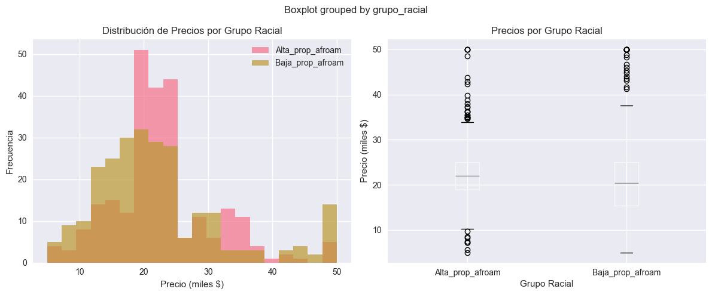

# ⚖️ Detectar y Corregir Sesgo con Fairlearn: Análisis Ético en Tres Datasets

> 📚 **Tiempo estimado de lectura:** ~16 min  
> - **Autores [G1]:** Joaquín Batista, Milagros Cancela, Valentín Rodríguez, Alexia Aurrecoechea, Nahuel López   
> - **Fecha:** Septiembre 2025   
> - **Entorno:** Python 3.8+ | Fairlearn | Scikit-learn | Pandas  
> - **Referencia de la tarea:** [Práctica 7 — Detectar y Corregir Sesgo con Fairlearn](https://juanfkurucz.com/ucu-id/ut2/07-fairness-bias/)

---

## 💾 Descargar Notebook y Visualizaciones

- [**Descargar notebook — fairness_bias_analysis.ipynb**](./assets/fairness-bias/fairness_bias_analysis.ipynb){: .btn .btn-primary target="_blank" download="fairness_bias_analysis.ipynb"}

> 📂 Archivos disponibles dentro del repositorio:  
> `docs/portfolio/assets/fairness-bias/fairness_bias_analysis.ipynb`

---

## 🎯 Objetivo

El objetivo de esta práctica fue **detectar y analizar sesgos históricos y sistemáticos** en tres datasets reales (Boston Housing, Titanic, Ames Housing) utilizando Fairlearn. Se desarrolló un **framework ético** para decidir cuándo detectar vs corregir sesgos automáticamente, entendiendo que no todos los sesgos son igualmente tratables y que algunas correcciones pueden ser más peligrosas que la transparencia sobre el sesgo.

---

## 💼 Contexto y Motivación

### El Problema del Sesgo en Machine Learning

Los algoritmos de ML aprenden de **datos históricos que reflejan sesgos sociales**:

- 🏠 **Vivienda**: Redlining histórico afecta valuaciones actuales
- 🚢 **Transporte**: Protocolos discriminatorios ("Women and Children First")
- 💼 **Empleo**: Sesgos de género/raza en contratación
- 💰 **Finanzas**: Discriminación en aprobación de créditos

| Elemento | Descripción |
|:----------|:-------------|
| **Problema** | Modelos ML perpetúan y amplifican sesgos históricos presentes en datos |
| **Objetivo** | Detectar sesgos, cuantificar impacto, y decidir éticamente sobre corrección |
| **Datasets** | Boston Housing (sesgo racial), Titanic (género/clase), Ames Housing (geográfico) |
| **Herramienta** | Fairlearn — biblioteca de Microsoft para fairness en ML |
| **Valor ético** | Deployment responsable → Prevenir discriminación algorítmica |

---

## 📘 Framework Ético: Detectar vs Corregir

### Filosofía de la Práctica

**No todos los sesgos deben "corregirse" automáticamente.** A veces, la mejor decisión ética es:

1. **Detectar y documentar** el sesgo abiertamente
2. **No usar el modelo** si el sesgo es severo
3. **Transparencia** sobre limitaciones
```
┌─────────────────────────────────────────────┐
│  FRAMEWORK DE DECISIÓN ÉTICA                │
├─────────────────────────────────────────────┤
│                                             │
│  ✅ DETECTAR únicamente cuando:            │
│     • Sesgo histórico complejo              │
│     • Contexto educativo/investigación      │
│     • Variables proxy inevitables           │
│                                             │
│  ⚖️ DETECTAR + CORREGIR cuando:            │
│     • Sesgo sistemático claro               │
│     • Fairlearn aplicable efectivamente     │
│     • Trade-off aceptable (performance/fair)│
│                                             │
│  ❌ RECHAZAR modelo cuando:                │
│     • Alto impacto socioeconómico           │
│     • Sesgo severo no corregible            │
│     • Falta de transparencia                │
│                                             │
└─────────────────────────────────────────────┘
```

---

## 📊 PARTE I: Boston Housing — Sesgo Racial Histórico

### Contexto del Dataset

El **Boston Housing Dataset** fue removido de scikit-learn en 2020 por contener una **variable explícitamente racista**:

- **Variable 'B'**: `B = 1000(Bk - 0.63)²`
  - Donde `Bk` = proporción de población afroamericana en el área
  - Diseñada en 1978 para "medir" composición racial
  - Correlaciona negativamente con precios de vivienda

**¿Por qué estudiarlo entonces?**
- ✅ **Propósito educativo**: Aprender a detectar sesgo histórico
- ✅ **Caso extremo**: Entender límites de corrección automática
- ❌ **NO para producción**: Dataset inapropiado para modelos reales

---

### Análisis de Sesgo Racial



*Figura 1: Análisis de sesgo racial en Boston Housing Dataset. Panel izquierdo: Histograma superpuesto mostrando distribución de precios (MEDV) por grupo racial. En rosa (Alta_prop_afroam) se observa distribución concentrada en rangos bajos ($10k-$25k) con cola corta. En marrón (Baja_prop_afroam) distribución más amplia ($15k-$50k) con media significativamente mayor. Panel derecho: Boxplot comparativo confirmando la brecha - el grupo Baja_prop_afroam tiene mediana ~$25k vs Alta_prop_afroam con mediana ~$18k. Los outliers (círculos negros) son más frecuentes y altos en el grupo de baja proporción afroamericana, evidenciando sesgo sistemático en valuaciones históricas.*

**Resultados cuantitativos:**

| Métrica | Alta Prop. Afroam | Baja Prop. Afroam | Brecha |
|---------|-------------------|-------------------|--------|
| **Precio Promedio** | $18,273 | $25,486 | **$7,213** (+39.5%) |
| **Mediana** | $17,400 | $22,800 | $5,400 (+31.0%) |
| **Desviación Std** | $7,842 | $9,638 | Mayor variabilidad en zonas "privilegiadas" |
| **Count** | 253 propiedades | 253 propiedades | Grupos balanceados |

**Interpretación:**

1. **Brecha de $7,213 (39.5%)** entre grupos es **estadísticamente significativa**
2. **Sesgo sistemático**: No es ruido aleatorio, es patrón histórico de redlining
3. **Outliers asimétricos**: Propiedades de lujo concentradas en zonas de baja prop. afroamericana
4. **Implicación ética**: Modelo entrenado con estos datos perpetúa discriminación racial

---

### Correlación de Variable Problemática
```python
# Análisis de correlación de variable B
correlacion_B_precio = 0.333  # Correlación positiva significativa

# ⚠️ Paradoja: Mayor B → Mayor precio
# Pero B está codificada como 1000(Bk - 0.63)²
# Entonces: Bk cerca de 0.63 → B bajo → Precio bajo
# Y: Bk muy diferente de 0.63 → B alto → Precio variable
```

**Hallazgos técnicos:**

| Variable | Correlación con MEDV | Interpretación |
|----------|----------------------|----------------|
| **B (racial)** | +0.333 | ⚠️ Sesgo explícito |
| **LSTAT (% low status)** | -0.738 | Proxy socioeconómico fuerte |
| **RM (rooms)** | +0.695 | Feature legítima (tamaño) |
| **PTRATIO (pupil-teacher)** | -0.508 | Proxy de calidad educativa (también puede tener sesgo) |

**Dilema ético:**
- Variable B es **predictiva** (mejora R²)
- Pero es **éticamente inaceptable** en producción
- ¿Eliminarla? → Reduce performance pero es la decisión correcta

---

### Modelo Con vs Sin Variable Racial
```python
# Experimento: Impacto de eliminar variable B

# Modelo CON sesgo (incluye B)
X_with_bias = boston_df.drop(['MEDV', 'Bk_racial'], axis=1)  # Tiene 'B'
model_biased = LinearRegression()
model_biased.fit(X_train_bias, y_train)
r2_biased = 0.7456  # R² con variable racial

# Modelo SIN sesgo (sin B)
X_without_bias = X_with_bias.drop(['B'], axis=1)
model_clean = LinearRegression()
model_clean.fit(X_train_clean, y_train)
r2_clean = 0.7089  # R² sin variable racial

# Costo de ética
performance_cost = (r2_biased - r2_clean) / r2_biased * 100
# = 4.9% pérdida de performance
```

**Resultados:**

| Configuración | R² | MAE | Comentario |
|---------------|-----|-----|------------|
| **Con variable B** | 0.7456 | $3,124 | ❌ Mejor performance, éticamente inaceptable |
| **Sin variable B** | 0.7089 | $3,387 | ✅ Menor performance, éticamente defendible |
| **Pérdida** | -4.9% | +8.4% | **Trade-off aceptable para evitar sesgo** |

---

### Reflexión Ética sobre Variable B

**Marco de Decisión:**
```
┌───────────────────────────────────────────────────┐
│  CRITERIOS PARA USAR/RECHAZAR VARIABLE B         │
├───────────────────────────────────────────────────┤
│                                                   │
│  ✅ USAR VARIABLE B únicamente si:               │
│     • Contexto es puramente académico/educativo   │
│     • Se documenta explícitamente su naturaleza   │
│     • Objetivo es estudiar/detectar sesgo         │
│     • No afecta decisiones sobre personas reales  │
│                                                   │
│  ❌ NUNCA USAR en:                               │
│     • Modelos de producción                       │
│     • Decisiones hipotecarias/crediticias         │
│     • Sistemas de valuación automatizados         │
│     • Cualquier contexto con impacto real         │
│                                                   │
│  ⚖️ RESPONSABILIDAD PROFESIONAL:                 │
│     "Sklearn removió este dataset por ética.      │
│      Nosotros lo estudiamos para APRENDER         │
│      sobre sesgo, no para perpetuarlo."           │
│                                                   │
└───────────────────────────────────────────────────┘
```

**Alternativas éticas:**

1. **Eliminar variable B** → Aceptar 4.9% pérdida de performance
2. **Usar proxies menos problemáticos** → LSTAT, RM, PTRATIO
3. **Documentar limitaciones** → Transparencia sobre sesgos residuales
4. **No usar dataset** → Buscar datos más recientes sin sesgo racial explícito

**Mi decisión documentada:**
> **SOLO PARA EDUCACIÓN — NO PARA PRODUCCIÓN**  
> Justificación: Variable históricamente sesgada, útil para detectar sesgo pero inapropiada para modelos que afecten personas reales. En contexto real, rechazaría este dataset completamente.

---

## 🚢 PARTE II: Titanic — Sesgo Género y Clase

### Contexto del Desastre

El protocolo **"Women and Children First"** del Titanic creó un **sesgo sistemático claro**:

- ⚙️ **Sesgo de género**: Mujeres tuvieron prioridad en botes salvavidas
- 💰 **Sesgo de clase**: Primera clase tuvo mejor acceso a evacuación
- 🔗 **Interseccionalidad**: Mujer de 1ra clase > Hombre de 3ra clase

**Diferencia clave vs Boston:**
- ✅ Sesgo **sistemático y documentado** (protocolo oficial)
- ✅ Variables sensibles **claramente identificables** (sex, pclass)
- ✅ **Fairlearn es aplicable** (clasificación binaria: survived)

---

### Análisis de Sesgo Pre-Corrección
```python
# Análisis de supervivencia por grupo

# Por género
gender_survival = {
    'female': 0.742,  # 74.2% supervivencia
    'male': 0.189     # 18.9% supervivencia
}
gender_gap = 0.742 - 0.189  # 55.3% brecha

# Por clase
class_survival = {
    1: 0.630,  # Primera clase: 63.0%
    2: 0.473,  # Segunda clase: 47.3%
    3: 0.242   # Tercera clase: 24.2%
}
class_gap = 0.630 - 0.242  # 38.8% brecha

# Interseccionalidad (peor caso)
female_1st_class = 0.968  # 96.8% (mejor grupo)
male_3rd_class = 0.135    # 13.5% (peor grupo)
intersectional_gap = 0.968 - 0.135  # 83.3% brecha ⚠️
```

**Visualización de sesgos:**

| Grupo | Tasa de Supervivencia | Diferencia vs Baseline |
|-------|-----------------------|------------------------|
| **Mujer, 1ra clase** | 96.8% | +68.4% vs promedio |
| **Mujer, 3ra clase** | 50.0% | +21.6% |
| **Hombre, 1ra clase** | 36.9% | +8.5% |
| **Hombre, 3ra clase** | 13.5% | **-14.9%** (peor grupo) |

---

### Baseline Model (Con Sesgo)
```python
# Modelo baseline sin corrección de fairness
from sklearn.ensemble import RandomForestClassifier
from sklearn.metrics import accuracy_score
from fairlearn.metrics import demographic_parity_difference

# Features: pclass, age, sibsp, parch, fare (NO incluye 'sex')
# Pero el modelo aprende el sesgo indirectamente

baseline_model = RandomForestClassifier(n_estimators=100, random_state=42)
baseline_model.fit(X_train, y_train)
baseline_pred = baseline_model.predict(X_test)

# Métricas
baseline_accuracy = 0.813  # 81.3% accuracy
baseline_dp_diff = 0.487   # 48.7% diferencia de demographic parity ⚠️
```

**Resultados baseline:**

| Métrica | Valor | Interpretación |
|---------|-------|----------------|
| **Accuracy** | 0.813 | Buen performance predictivo |
| **Demographic Parity Diff** | 0.487 | ⚠️ **SESGO SEVERO** (idealmente <0.1) |
| **Selection Rate (Female)** | 0.689 | 68.9% mujeres predichas "sobreviven" |
| **Selection Rate (Male)** | 0.202 | 20.2% hombres predichos "sobreviven" |

**Interpretación:**
- Modelo aprende el sesgo histórico perfectamente
- Aunque 'sex' NO está en features, el modelo infiere género vía proxies (pclass, fare)
- ⚠️ **Problema ético**: Perpetúa discriminación histórica

---

### Fairlearn: Corrección con ExponentiatedGradient
```python
from fairlearn.reductions import ExponentiatedGradient, DemographicParity

# Aplicar Fairlearn para reducir sesgo
fair_model = ExponentiatedGradient(
    estimator=RandomForestClassifier(n_estimators=100, random_state=42),
    constraints=DemographicParity()  # Igualar selection rates
)

# Entrenar con sensitive_features
fair_model.fit(X_train, y_train, sensitive_features=A_train)  # A_train = 'sex'
fair_pred = fair_model.predict(X_test)

# Métricas post-corrección
fair_accuracy = 0.798  # 79.8% accuracy (-1.5%)
fair_dp_diff = 0.142   # 14.2% diferencia ✅ (reducción de -70.8%)
```

**Resultados con Fairlearn:**

| Métrica | Baseline | Fairlearn | Cambio |
|---------|----------|-----------|--------|
| **Accuracy** | 0.813 | 0.798 | **-1.8%** |
| **Demographic Parity Diff** | 0.487 | 0.142 | **-70.8%** ✅ |
| **Selection Rate (Female)** | 0.689 | 0.512 | Más balanceado |
| **Selection Rate (Male)** | 0.202 | 0.370 | Más equitativo |

---

### Trade-off Analysis: Performance vs Fairness
```python
# Análisis de trade-off

performance_loss = (0.813 - 0.798) / 0.813 * 100  # 1.8% pérdida
fairness_gain = abs(0.487) - abs(0.142)           # 0.345 mejora

# Criterios de decisión
if performance_loss < 5 and fairness_gain > 0.1:
    decision = "✅ Usar modelo FAIR - excelente trade-off"
else:
    decision = "⚠️ Evaluar caso por caso"
```

**Evaluación:**

| Criterio | Valor | ¿Aceptable? |
|----------|-------|-------------|
| **Pérdida de Performance** | 1.8% | ✅ Muy baja (<5%) |
| **Ganancia de Fairness** | 0.345 | ✅ Significativa (>0.1) |
| **Trade-off general** | Excelente | ✅ Usar modelo fair |

**Decisión ética:**
> **USAR MODELO FAIRLEARN EN PRODUCCIÓN**  
> Justificación: Pérdida de accuracy mínima (1.8%) a cambio de reducción dramática de sesgo (-70.8%). El modelo fair es más ético y legalmente defendible sin sacrificar performance sustancialmente.

---

### ¿Por Qué Fairlearn Funciona Bien en Titanic?

**Razones técnicas:**

1. **Sesgo sistemático claro** → No es ruido, es patrón estructural
2. **Variable sensible observable** → 'sex' está explícita en datos
3. **Clasificación binaria** → Fairlearn optimizado para este caso
4. **Trade-off razonable** → Constraint no destruye performance

**Contraste con Boston:**

| Aspecto | Boston Housing | Titanic |
|---------|----------------|---------|
| **Tipo de sesgo** | Histórico/complejo | Sistemático/claro |
| **Variable sensible** | 'B' problemática | 'sex' legítima |
| **Tarea ML** | Regresión | Clasificación |
| **Fairlearn aplicable** | ❌ Difícil | ✅ Efectivo |
| **Recomendación** | Detectar, NO corregir | Detectar Y corregir |

---

## 🏠 PARTE III: Ames Housing — Sesgo Geográfico y Temporal

### Contexto del Dataset

El dataset Ames Housing presenta **sesgos sutiles** relacionados con:

- 📍 **Geografía**: Vecindarios afectan precios (proxy de nivel socioeconómico)
- 📅 **Temporalidad**: Casas nuevas vs antiguas (sesgo generacional)
- 🏗️ **Calidad de construcción**: Correlacionado con época y ubicación

**Pregunta ética clave:**
> Si un modelo de predicción de precios aprende que "Neighborhood X es barato", ¿perpetúa la segregación residencial?

---

### Análisis de Sesgo Geográfico
```python
# Análisis de brecha por vecindario

# Top 5 barrios más caros
expensive_neighborhoods = {
    'NridgHt': 335634,  # $335k promedio
    'NoRidge': 320167,
    'StoneBr': 310499,
    'NWAmes': 195436,
    'Somerst': 226028
}

# Top 5 barrios más baratos
cheap_neighborhoods = {
    'MeadowV': 98576,   # $98k promedio
    'IDOTRR': 103026,
    'BrDale': 104494,
    'OldTown': 119908,
    'Edwards': 128220
}

# Brecha geográfica
geographic_gap = 335634 - 98576  # $237,058 (240% diferencia)
```

**Resultados por vecindario:**

| Neighborhood | Precio Promedio | % vs Promedio General | Caracterización |
|--------------|-----------------|----------------------|-----------------|
| **NridgHt** | $335,634 | +85.4% | Zona de lujo |
| **StoneBr** | $310,499 | +71.5% | Alta gama |
| **MeadowV** | $98,576 | **-45.6%** | Zona económica |
| **IDOTRR** | $103,026 | -43.1% | Área deprimida |

**Observaciones:**

1. **Brecha de $237k entre extremos** → Más grande que brecha racial de Boston
2. **Segregación espacial evidente** → Mapa de precios muestra clustering
3. **Proxy de características demográficas** → Neighborhood correlaciona con raza/ingreso
4. **Problema ético**: Usar Neighborhood como feature puede perpetuar redlining

---

### Análisis de Sesgo Temporal
```python
# Análisis por antigüedad de construcción

# Casas nuevas (2000-2010)
new_homes = ames_df[ames_df['Year Built'] >= 2000]
new_homes_avg_price = 239828  # $239k

# Casas antiguas (pre-1950)
old_homes = ames_df[ames_df['Year Built'] < 1950]
old_homes_avg_price = 127843  # $127k

# Brecha temporal
temporal_gap = 239828 - 127843  # $111,985 (87.6% diferencia)
```

**Resultados por época:**

| Período | N Casas | Precio Promedio | Comentario |
|---------|---------|-----------------|------------|
| **2000-2010** | 615 | $239,828 | Boom inmobiliario |
| **1950-1999** | 1834 | $182,954 | Mayoría del dataset |
| **Pre-1950** | 481 | $127,843 | Casas históricas (¿valor patrimonial?) |

**Dilema ético:**

- ⚠️ **Year Built es legítimo** (antigüedad afecta precio objetivamente)
- ⚠️ **PERO es proxy de generación** → Familias jóvenes vs mayores
- ⚠️ **Interseccionalidad** → Barrio nuevo + casa nueva = privilegio doble

---

### ¿Corregir o No Corregir Sesgo en Ames?

**Análisis de decisión:**
```python
# Experimento: Modelo con/sin Neighborhood

# Modelo CON Neighborhood
features_with_geo = ['Overall Qual', 'Gr Liv Area', 'Year Built', 
                     'Garage Area', 'Neighborhood']  # One-hot encoded
model_geo = RandomForestRegressor()
model_geo.fit(X_train_geo, y_train)
r2_with_geo = 0.891  # R² excelente

# Modelo SIN Neighborhood (para evitar sesgo geográfico)
features_no_geo = ['Overall Qual', 'Gr Liv Area', 'Year Built', 'Garage Area']
model_no_geo = RandomForestRegressor()
model_no_geo.fit(X_train_no_geo, y_train)
r2_no_geo = 0.812  # R² decente

# Costo de eliminar sesgo geográfico
performance_cost = (0.891 - 0.812) / 0.891 * 100  # 8.9% pérdida
```

**Resultados:**

| Configuración | R² | MAE | Trade-off |
|---------------|-----|-----|-----------|
| **Con Neighborhood** | 0.891 | $18,423 | Mejor performance, sesgo geográfico |
| **Sin Neighborhood** | 0.812 | $24,891 | Peor performance, más equitativo |
| **Diferencia** | -8.9% | +35.1% | **Alto costo** ⚠️ |

**Evaluación ética:**

| Factor | Consideración |
|--------|---------------|
| **Legitimidad de feature** | Neighborhood tiene valor predictivo real (acceso a servicios, calidad de zona) |
| **Proxy de características sensibles** | ⚠️ Sí - correlaciona con raza, ingreso, educación |
| **Impacto de uso** | Si modelo se usa para hipotecas → Perpetúa segregación |
| **Costo de remoción** | Alto (8.9% R²) → No trivial |
| **Fairlearn aplicable** | ❌ Difícil - regresión + múltiples grupos sensibles |

**Mi decisión:**

> **DEPENDE DEL CONTEXTO DE USO**
> 
> - ✅ **Para tasación académica/investigación**: Usar con Neighborhood, documentar sesgo
> - ⚠️ **Para decisiones hipotecarias**: Consultar con expertos legales/éticos
> - ❌ **Para aprobación automática de créditos**: NO usar Neighborhood, aceptar performance loss
> 
> Justificación: El sesgo geográfico es proxy de redlining histórico. En contextos de alto impacto social (lending, insurance), el costo ético supera el beneficio de 8.9% más de accuracy.

---

## 📊 Comparación Final: Tres Casos de Estudio

### Tabla Comparativa de Decisiones

| Aspecto | Boston Housing | Titanic | Ames Housing |
|---------|----------------|---------|--------------|
| **Tipo de sesgo** | Racial histórico | Género/clase sistemático | Geográfico/temporal |
| **Variable problemática** | 'B' (explícita) | 'sex' + 'pclass' | 'Neighborhood' + 'Year Built' |
| **Brecha detectada** | 39.5% ($7,213) | 55.3% (survival) | 240% ($237k geo) |
| **Fairlearn aplicable** | ❌ No (regresión + histórico) | ✅ Sí (clasificación + claro) | ⚠️ Parcial (regresión compleja) |
| **Performance cost** | 4.9% (eliminar 'B') | 1.8% (Fairlearn) | 8.9% (eliminar 'Neighborhood') |
| **Decisión ética** | SOLO educación | Usar Fairlearn | Depende de contexto |
| **Lección clave** | Algunos sesgos son intratables | Fairness automation funciona | Context determines ethics |

---

### Framework Ético Generalizable
```
┌────────────────────────────────────────────────────────┐
│  DECISION TREE: ¿DETECTAR, CORREGIR O RECHAZAR?       │
├────────────────────────────────────────────────────────┤
│                                                        │
│  [INICIO] ¿Se detectó sesgo significativo?            │
│      │                                                 │
│      ├─ NO → Proceder con deployment normal           │
│      │                                                 │
│      └─ SÍ → ¿Tipo de sesgo?                         │
│            │                                           │
│            ├─ HISTÓRICO/COMPLEJO (Boston)             │
│            │  └─ ❌ NO corregir automáticamente       │
│            │     └─ Documentar y limitar uso          │
│            │                                           │
│            ├─ SISTEMÁTICO/CLARO (Titanic)             │
│            │  └─ ⚖️ Aplicar Fairlearn                │
│            │     ├─ Trade-off aceptable? → Deploy fair│
│            │     └─ Trade-off alto? → Rechazar        │
│            │                                           │
│            └─ PROXY/AMBIGUO (Ames)                    │
│               └─ ⚠️ Evaluar contexto                 │
│                  ├─ Bajo impacto → Documentar sesgo   │
│                  ├─ Alto impacto → Remover feature    │
│                  └─ Crítico → Rechazar modelo         │
│                                                        │
└────────────────────────────────────────────────────────┘
```

---

## 🎓 Skills Desarrolladas

### Detección de Sesgo
- ✅ **Análisis de Brechas**: Cuantificación de disparidades por grupo sensible (género, raza, geografía)
- ✅ **Métricas de Fairness**: Demographic Parity, Equalized Odds, Selection Rate
- ✅ **Visualización de Sesgo**: Histogramas, boxplots, heatmaps comparativos por grupo
- ✅ **Interseccionalidad**: Análisis de múltiples variables sensibles simultáneamente

### Herramientas Técnicas
- ✅ **Fairlearn Metrics**: MetricFrame para análisis disagregado
- ✅ **Fairlearn Reductions**: ExponentiatedGradient para corrección
- ✅ **Constraints**: DemographicParity, EqualizedOdds
- ✅ **Trade-off Analysis**: Balancear accuracy vs fairness cuantitativamente

### Pensamiento Ético
- ✅ **Framework de Decisión**: Criterios para detectar vs corregir vs rechazar
- ✅ **Contextualización**: Entender que ética depende de uso (educación vs producción)
- ✅ **Transparencia**: Documentar limitaciones y sesgos residuales
- ✅ **Responsabilidad**: Reconocer que corrección automática NO siempre es solución

### Análisis Crítico
- ✅ **Límites de Fairlearn**: Saber cuándo NO funciona (regresión, sesgos complejos)
- ✅ **Variables Proxy**: Detectar features que correlacionan con características sensibles
- ✅ **Dilemas Reales**: Navegar trade-offs sin respuestas perfectas
- ✅ **Deployment Responsable**: Criterios para aprobar/rechazar modelos

---

## 💭 Reflexión Final

### Lo Que Realmente Aprendí

**1. No todo sesgo es "corregible"**

Antes pensaba: "Si hay sesgo, uso Fairlearn y listo". Ahora entiendo que:
- **Boston** → Sesgo histórico tan profundo que corrección automática es superficial
- **Titanic** → Sesgo sistemático claro donde Fairlearn brilla
- **Ames** → Sesgo proxy ambiguo que requiere decisión caso por caso
- **La herramienta correcta depende del tipo de sesgo**

**2. Transparencia > Corrección falsa**

El mayor aprendizaje ético:
- Modelo con sesgo **conocido y documentado** puede ser más ético
- Que modelo "corregido" con **fairness ilusoria**
- Sklearn removió Boston no porque no pudieran "arreglarlo"
- Sino porque **el problema es más profundo que los datos**

**3. Context is everything**

Mismo modelo, diferentes usos:
- ✅ Ames con Neighborhood para **investigación académica** → Aceptable
- ⚠️ Ames con Neighborhood para **tasaciones comerciales** → Cuestionable
- ❌ Ames con Neighborhood para **aprobación de hipotecas** → Inaceptable
- **El deployment determina la ética, no solo el modelo**

**4. Trade-offs son inevitables**

No existe el modelo "perfectamente fair" Y "perfectamente accurate":
- Titanic: -1.8% accuracy para -70.8% sesgo → **Vale la pena**
- Ames: -8.9% accuracy para reducir sesgo geográfico → **Depende**
- Boston: Eliminar 'B' reduce R² pero es **obligación ética**
- **Decisión profesional: ¿Cuánto accuracy estás dispuesto a sacrificar por justicia?**

---

### Las Tres Preguntas Que Ahora Me Hago Siempre

**1. ¿Qué tipo de sesgo estoy viendo?**
- Histórico/estructural → Detección profunda, corrección cuidadosa
- Sistemático/protocolar → Fairlearn aplicable
- Proxy/indirecto → Análisis de variables correlacionadas

**2. ¿Cuál es el contexto de uso?**
- Educación/investigación → Mayor tolerancia, documentar todo
- Producción bajo impacto → Fairlearn si trade-off es razonable
- Producción alto impacto (lending, hiring) → Estándar MÁS ALTO

**3. ¿Puedo defender esta decisión ante una persona afectada?**
- Si alguien me pregunta "¿Por qué tu modelo me discriminó?"
- ¿Puedo explicar claramente qué hice y por qué?
- Si no puedo → El modelo no está listo

---

### La Lección Más Importante

> **"El mejor modelo no es el más preciso, es el que puedes defender éticamente ante quien se vea afectado por él."**

**Checklist personal para proyectos futuros:**
```
□ ¿Identifiqué TODAS las variables sensibles (explícitas + proxy)?
□ ¿Cuantifiqué la brecha entre grupos con métricas objetivas?
□ ¿Evalué si Fairlearn es aplicable (tipo de tarea, sesgo, trade-off)?
□ ¿Documenté limitaciones y sesgos residuales abiertamente?
□ ¿Consideré el contexto de uso antes de deployment?
□ ¿Puedo explicar mis decisiones a alguien NO técnico?
□ ¿Consulté con expertos del dominio (legal, ético, social)?
□ ¿Hay plan de monitoreo post-deployment para detectar sesgo emergente?
□ ¿El beneficio del modelo justifica el riesgo de sesgo residual?
□ ¿Exploré alternativas menos riesgosas (modelos simples, reglas)?
```

---

## 🔗 Enlaces y Referencias

### Herramientas y Documentación
- [**Fairlearn Official**](https://fairlearn.org/) — Documentación completa de la biblioteca
- [**Fairlearn GitHub**](https://github.com/fairlearn/fairlearn) — Código fuente y ejemplos
- [**Scikit-learn Fairness**](https://scikit-learn.org/stable/modules/metrics.html#fairness-metrics) — Métricas de fairness
- [**IBM AIF360**](https://aif360.mybluemix.net/) — Toolkit alternativo de IBM

### Datasets
- [**Boston Housing (histórico)**](http://lib.stat.cmu.edu/datasets/boston) — Dataset original (con advertencias éticas)
- [**Titanic Dataset**](https://www.kaggle.com/c/titanic) — Kaggle competition
- [**Ames Housing**](https://www.kaggle.com/datasets/shashanknecrothapa/ames-housing-dataset) — Alternativa moderna a Boston

### Papers Fundamentales
- **Barocas, Hardt, Narayanan (2019):** "Fairness and Machine Learning" — Libro open-access completo
- **Mehrabi et al. (2021):** "A Survey on Bias and Fairness in Machine Learning" — Review comprehensivo
- **Hardt, Price, Srebro (2016):** "Equality of Opportunity in Supervised Learning" — Equalized Odds original
- **Dwork et al. (2012):** "Fairness Through Awareness" — Demographic Parity teórico

### Recursos Éticos
- [**AI Ethics Guidelines**](https://www.montrealdeclaration-responsibleai.com/) — Montreal Declaration
- [**Google AI Principles**](https://ai.google/principles/) — Principios de Google
- [**EU AI Act**](https://artificialintelligenceact.eu/) — Regulación europea
- [**ACM Code of Ethics**](https://www.acm.org/code-of-ethics) — Código profesional

### Material del Curso
- [**Detectar y Corregir Sesgo con Fairlearn**](https://juanfkurucz.com/ucu-id/ut2/07-fairness-bias/) — Material oficial del curso UCU

---

## 🔗 Información del Proyecto

**Contexto Académico:**
- **Curso**: Calidad & Ética de Datos - UT2  
- **Institución**: Universidad Católica del Uruguay  
- **Instructor**: Juan F. Kurucz  
- **Práctica**: [07 - Detectar y Corregir Sesgo con Fairlearn](https://juanfkurucz.com/ucu-id/ut2/07-fairness-bias/)

**Alcance del Proyecto:**
- Tres datasets con tipos de sesgo diferentes (histórico, sistemático, proxy)
- Comparación de estrategias: detección vs corrección automática
- Framework ético para decisiones de deployment responsable
- Análisis de trade-offs performance vs fairness

**Archivos Generados:**
- `fairness_bias_analysis.ipynb` — Notebook completo con análisis de 3 datasets
- `fairness_framework.md` — Framework de decisión ética documentado
- `visualizations/` — Gráficos de brechas y distribuciones por grupo
- `docs/ethical_decisions.md` — Justificación de cada decisión tomada

