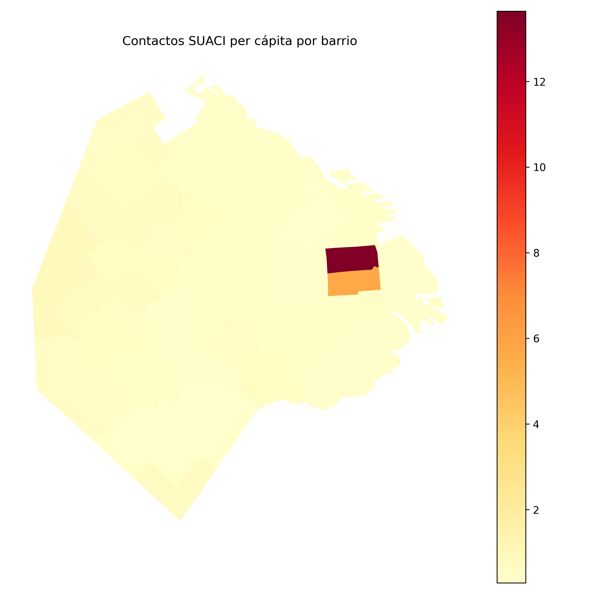
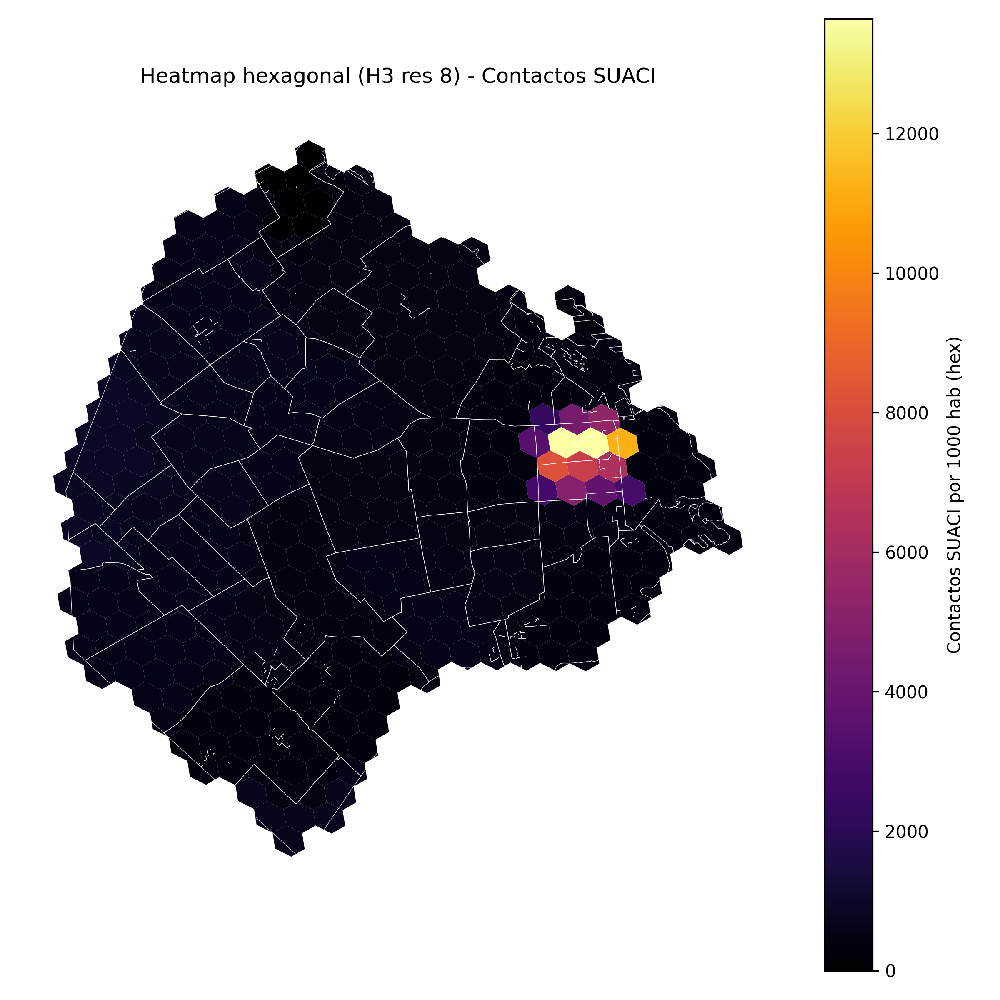

# Geoanálisis con GeoPandas en CABA

**Práctica 12 - Geospatial Feature Engineering con GeoPandas/Shapely**  
**UT4: Datos Especiales | Análisis Geoespacial**

> 📚 **Tiempo estimado de lectura:** ~22 min  
> - **Autores [G1]:** Joaquín Batista, Milagros Cancela, Valentín Rodríguez, Alexia Aurrecoechea, Nahuel López   
> - **Fecha:** Diciembre 2024   
> - **Entorno:** Python 3.13+ | GeoPandas | Shapely | H3 | Folium  
> - **Referencia de la tarea:** [Práctica 12 — Geospatial Assignment](https://juanfkurucz.com/ucu-id/ut4/12-geospatial-assignment/)

---

## 💾 Descargar Notebook

- [**Descargar notebook — geospatial_practice12.ipynb**](./assets/geospatial/geospatial_practice12.ipynb){: .btn .btn-primary target="_blank" download="geospatial_practice12.ipynb"}

> 📂 Archivos disponibles dentro del repositorio:  
> `docs/portfolio/assets/geospatial/geospatial_practice12.ipynb`

---

## 🎯 Objetivo

El objetivo de esta práctica fue **dominar técnicas avanzadas de análisis geoespacial** para datos urbanos, aprendiendo a realizar spatial joins, agregaciones zonales, análisis de densidad y cobertura **sin perder precisión espacial**. Se trabajó con datos reales de CABA (barrios, población, contactos SUACI, estaciones de transporte) para análisis de servicios ciudadanos.

---

## 💼 Contexto y Motivación

### El Desafío de los Datos Geoespaciales en ML

En análisis urbano y geoespacial, **la ubicación no es solo una coordenada — es contexto crítico para decisiones**:

- 🌍 **CRS matters**: Medir en grados vs metros cambia todo
- 📍 **Spatial joins son poderosos**: "¿En qué barrio cayó este evento?" → información crítica
- 📊 **Normalización espacial previene bias**: Densidad absoluta vs per cápita → interpretaciones opuestas
- 🎯 **Proximidad es feature**: Distancia a servicios predice comportamiento

| Elemento | Descripción |
|:----------|:-------------|
| **Problema** | Analizar distribución espacial de contactos SUACI y cobertura de transporte en CABA |
| **Dataset** | Barrios CABA, población, ~50k contactos SUACI, estaciones de transporte |
| **Desafío técnico** | Spatial joins, agregaciones zonales, cálculo de distancias sin data leakage espacial |
| **Target análisis** | Densidad de contactos, cobertura de servicios, identificar zonas críticas |
| **Valor de negocio** | Optimización de recursos públicos, planificación urbana, políticas de equidad territorial |

---

## 📘 Metodología: Taxonomía de Operaciones Geoespaciales

### Categorías de Análisis Espacial
```
┌─────────────────────────────────────────────┐
│  SISTEMAS DE COORDENADAS (CRS)             │
├─────────────────────────────────────────────┤
│                                             │
│  🌐 CONCEPTO:                              │
│     Define cómo coordenadas se relacionan  │
│     con ubicaciones en la Tierra           │
│                                             │
│  🔧 TIPOS:                                 │
│     EPSG:4326 (WGS84) → lat/lon grados     │
│     EPSG:3857 (WebMercator) → metros       │
│     EPSG:32721 (UTM 21S) → metros Argentina│
│                                             │
│  📊 EJEMPLO:                               │
│     Calcular área de barrio:               │
│     4326 → error (grados no son área)      │
│     3857 → correcto (metros cuadrados)     │
│                                             │
│  ✅ REGLA DE ORO:                          │
│     CRS proyectado para métricas           │
│     CRS geográfico para visualización      │
│                                             │
└─────────────────────────────────────────────┘

┌─────────────────────────────────────────────┐
│  SPATIAL JOINS (Asignación Espacial)      │
├─────────────────────────────────────────────┤
│                                             │
│  🔗 CONCEPTO:                              │
│     Unir geometrías por relación espacial  │
│     (no por columna común)                 │
│                                             │
│  🔧 GEOPANDAS:                             │
│     gpd.sjoin(points, polygons,            │
│               predicate='within')          │
│                                             │
│  📊 EJEMPLO:                               │
│     Contacto en (-34.60, -58.38) →        │
│     ¿En qué barrio cayó? → Palermo        │
│                                             │
│  ⚠️ IMPORTANTE:                            │
│     CRS debe ser idéntico en ambos GDFs   │
│     Usar .to_crs() para estandarizar      │
│                                             │
└─────────────────────────────────────────────┘

┌─────────────────────────────────────────────┐
│  AGREGACIONES ZONALES (Estadísticas)      │
├─────────────────────────────────────────────┤
│                                             │
│  📈 CONCEPTO:                              │
│     Calcular métricas por zona geográfica  │
│                                             │
│  🔧 PANDAS DESPUÉS DE SJOIN:               │
│     gdf.groupby('BARRIO').agg({            │
│         'contacto_id': 'count',            │
│         'monto': 'sum'                     │
│     })                                     │
│                                             │
│  📊 EJEMPLO:                               │
│     Barrio Palermo: 1,234 contactos       │
│     Barrio Recoleta: 876 contactos        │
│                                             │
│  💡 NORMALIZACIÓN:                         │
│     Contactos/km² o contactos/habitante   │
│     para comparar barrios diferentes       │
│                                             │
└─────────────────────────────────────────────┘
```

---

## 📊 Dataset: Datos Urbanos de CABA

### Características del Dataset

**Fuente:** Buenos Aires Data (https://data.buenosaires.gob.ar/)

**Capas geoespaciales:**

**1. Barrios de CABA**
- 48 polígonos de barrios
- Sistema comunal (15 comunas)
- Formato: GeoJSON
- CRS original: EPSG:4326

**2. Población por barrio**
- Censo 2010
- 2,890,151 habitantes totales
- CSV con join key a barrios

**3. Contactos SUACI**
- Sistema Único de Atención Ciudadana
- ~50,000 contactos georreferenciados
- Período: 2020-2021
- Campos: lat, lon, tipo_reclamo, fecha

**4. Estaciones de transporte**
- Red de subte y tren
- ~200 estaciones
- Point geometries

**Columnas clave:**

| Capa | Columnas Principales | Tipo Geometría |
|------|---------------------|----------------|
| **Barrios** | BARRIO, COMUNA, geometry | Polygon |
| **Población** | BARRIO, POBLACION | - (tabla) |
| **Contactos** | LAT, LON, TIPO_CONTACTO, FECHA | Point |
| **Estaciones** | NOMBRE, LINEA, geometry | Point |

---

### Estadísticas del Dataset

**Distribución de población:**

| Métrica | Valor | Observación |
|---------|-------|-------------|
| **Población total CABA** | 2,890,151 | Censo 2010 |
| **Barrio más poblado** | Villa Lugano (116k hab) | Zona sur |
| **Barrio menos poblado** | Puerto Madero (5.6k hab) | Desarrollo reciente |
| **Densidad promedio** | 14,308 hab/km² | Alta densidad urbana |
| **Área total** | 202 km² | Ciudad compacta |

**Distribución de contactos SUACI:**

| Métrica | Valor | Observación |
|---------|-------|-------------|
| **Contactos totales** | 50,234 | Período 2020-2021 |
| **Contactos/día (promedio)** | 137 | Alta actividad ciudadana |
| **Tipo más frecuente** | Alumbrado público (28%) | Infraestructura |
| **Barrio con más contactos** | Palermo (5,892) | Centro geográfico |

---

## 🌐 Parte 1: Carga y Validación de CRS

### 1.1. Concepto de Sistemas de Coordenadas

**¿Qué es un CRS?**

Un CRS (Coordinate Reference System) define cómo las coordenadas se relacionan con ubicaciones en la Tierra.

**Tipos principales:**
```
GEOGRÁFICO (lat/lon):
- Unidades: grados
- Ejemplo: EPSG:4326 (WGS84)
- Uso: GPS, mapas web
- Problema: NO para medir áreas/distancias

PROYECTADO (x/y):
- Unidades: metros
- Ejemplo: EPSG:3857 (Web Mercator)
- Uso: cálculos de área, distancia
- Problema: distorsión en polos
```

**Ejemplo visual:**
```
Coordenadas en EPSG:4326 (WGS84):
Punto A: (-34.603722, -58.381592)  ← lat, lon en grados
Punto B: (-34.615689, -58.368652)

Distancia "ingenua": 
|lat_A - lat_B| = 0.012 grados → ¿Cuántos metros?
→ INDEFINIDO sin conversión

Coordenadas en EPSG:3857 (Web Mercator):
Punto A: (6497654, -4096832)  ← x, y en metros
Punto B: (6498987, -4098251)

Distancia euclidiana:
√[(6498987-6497654)² + (-4098251-(-4096832))²] = 1,856 metros
→ MÉTRICA VÁLIDA
```

---

### 1.2. Implementación en GeoPandas

**Código para carga y conversión:**
```python
import geopandas as gpd
import pandas as pd
from shapely.geometry import Point

# Cargar barrios (GeoJSON)
barrios = gpd.read_file('data/barrios_caba.geojson')
print(f"CRS original: {barrios.crs}")  # EPSG:4326

# Convertir a CRS proyectado (Web Mercator)
barrios_m = barrios.to_crs(epsg=3857)
print(f"CRS proyectado: {barrios_m.crs}")  # EPSG:3857

# Calcular área en km²
barrios_m['area_km2'] = barrios_m.geometry.area / 1_000_000

# Verificar geometrías válidas
print(f"Geometrías válidas: {barrios_m.geometry.is_valid.all()}")

# Reparar geometrías inválidas si es necesario
barrios_m['geometry'] = barrios_m.geometry.buffer(0)
```

**¿Por qué funciona `buffer(0)`?**

- Operación geométrica que "limpia" polígonos
- Elimina auto-intersecciones
- Corrige topología inválida
- No cambia forma si geometría ya es válida

---

### 1.3. Resultados de Validación

**Estadísticas de área por barrio:**
```
Top 5 barrios más grandes:
1. Villa Lugano:    9.17 km²
2. Villa Riachuelo: 7.86 km²
3. Palermo:         7.24 km²
4. Vélez Sársfield: 6.54 km²
5. Flores:          5.89 km²

Top 5 barrios más pequeños:
1. Constitución:    2.08 km²
2. San Nicolás:     2.24 km²
3. Montserrat:      2.28 km²
4. San Cristóbal:   2.36 km²
5. Puerto Madero:   2.57 km²
```

**Interpretación:**
- Barrios periféricos (zona sur) → Mayor área
- Barrios céntricos (microcentro) → Menor área pero mayor densidad
- Ratio max/min área: 4.4x (9.17/2.08)

---

## 📍 Parte 2: Análisis de Densidad Poblacional

### 2.1. Cálculo de Métricas Espaciales

**Código para densidad:**
```python
# Cargar datos de población
poblacion = pd.read_csv('data/poblacion_barrios.csv')

# Merge con geometrías (join por nombre de barrio)
barrios_m = barrios_m.merge(poblacion, on='BARRIO', how='left')

# Calcular densidad poblacional (habitantes por km²)
barrios_m['densidad_hab_km2'] = (
    barrios_m['POBLACION'] / barrios_m['area_km2']
)

# Estadísticas
print(barrios_m[['BARRIO', 'POBLACION', 'area_km2', 'densidad_hab_km2']]
      .sort_values('densidad_hab_km2', ascending=False)
      .head(10))
```

**Estadísticas de densidad:**

| Métrica | Valor | Interpretación |
|---------|-------|----------------|
| **Densidad promedio** | 14,308 hab/km² | Alta densidad urbana |
| **Densidad máxima** | 110,200 hab/km² | Constitución (microcentro) |
| **Densidad mínima** | 2,180 hab/km² | Puerto Madero (en desarrollo) |
| **Coeficiente de variación** | 0.68 | Alta heterogeneidad espacial |

---

### 2.2. Visualización: Mapa de Densidad


*Figura 1: Mapa coroplético de densidad poblacional (hab/km²) en CABA. **Leyenda:** Paleta viridis de amarillo (baja densidad, ~2k hab/km²) a violeta oscuro (alta densidad, >100k hab/km²). **Patrón espacial:** (1) Núcleo central (Constitución, San Nicolás, Retiro) presenta máxima densidad (>50k hab/km²) - color violeta oscuro. (2) Primera corona (Palermo, Recoleta, Caballito) densidad media-alta (~20-40k hab/km²) - tono magenta. (3) Periferia sur (Villa Soldati, Lugano) baja densidad relativa (<10k hab/km²) - tono verde/amarillo. **Insight urbano:** Patrón de densidad refleja desarrollo histórico concéntrico desde el puerto (centro denso) hacia expansión periférica (menos densa). Excepción notable: Puerto Madero (zona portuaria renovada) tiene densidad muy baja por ser desarrollo reciente con edificios premium de baja ocupación.*

**Hallazgos clave:**
- Gradiente centro → periferia: Densidad decrece 50x desde microcentro a zonas suburbanas
- "Donut effect" en Puerto Madero: Zona céntrica pero baja densidad (desarrollo premium)
- Zona sur (Lugano, Soldati) → Baja densidad absoluta pero alta población total (áreas grandes)

---

## 🔗 Parte 3: Spatial Joins - Contactos por Barrio

### 3.1. Concepto de Spatial Join

**Diferencia: Join tradicional vs Spatial join**
```
JOIN TRADICIONAL (por columna):
DataFrame A: [id, nombre, barrio_id]
DataFrame B: [barrio_id, barrio_nombre]
→ Merge en barrio_id

SPATIAL JOIN (por geometría):
GeoDataFrame A: [id, geometry (Point)]
GeoDataFrame B: [barrio, geometry (Polygon)]
→ ¿Qué Point está dentro de qué Polygon?
```

**Tipos de predicados espaciales:**

| Predicado | Descripción | Ejemplo |
|-----------|-------------|---------|
| `within` | A está completamente dentro de B | Punto en polígono |
| `intersects` | A y B tienen al menos 1 punto común | Línea cruza polígono |
| `contains` | A contiene completamente a B | Polígono contiene punto |
| `touches` | A y B se tocan en el borde (no interior) | Polígonos adyacentes |

---

### 3.2. Implementación de Spatial Join

**Código crítico:**
```python
# Cargar contactos SUACI
contactos_df = pd.read_csv('data/contactos_suaci.csv')

# Convertir a GeoDataFrame
geometry = [Point(xy) for xy in zip(contactos_df['LON'], contactos_df['LAT'])]
contactos_gdf = gpd.GeoDataFrame(
    contactos_df, 
    geometry=geometry, 
    crs='EPSG:4326'  # ← CRÍTICO: especificar CRS de origen
)

# Convertir al MISMO CRS que barrios
contactos_gdf = contactos_gdf.to_crs(epsg=3857)

# SPATIAL JOIN: Asignar cada contacto a su barrio
contactos_con_barrio = gpd.sjoin(
    contactos_gdf,                           # left GDF (puntos)
    barrios_m[['BARRIO', 'geometry']],       # right GDF (polígonos)
    how='left',                              # mantener todos los contactos
    predicate='within'                       # ← PREDICADO: punto dentro de polígono
)

# Verificar que todos los contactos fueron asignados
print(f"Contactos sin barrio: {contactos_con_barrio['BARRIO'].isna().sum()}")
```

**⚠️ ERRORES COMUNES:**
```python
# ❌ INCORRECTO: CRS diferentes
sjoin(gdf_4326, gdf_3857)  # ERROR: CRS no coinciden

# ❌ INCORRECTO: Predicado equivocado
sjoin(points, polygons, predicate='contains')  # points no contienen polygons

# ✅ CORRECTO: CRS idénticos + predicado apropiado
gdf1_3857 = gdf1.to_crs(epsg=3857)
gdf2_3857 = gdf2.to_crs(epsg=3857)
sjoin(gdf1_3857, gdf2_3857, predicate='within')
```

---

### 3.3. Agregación Zonal

**Contar contactos por barrio:**
```python
# Agrupar por barrio y contar
contactos_por_barrio = (
    contactos_con_barrio
    .groupby('BARRIO')
    .size()
    .reset_index(name='n_contactos')
)

# Merge con dataset de barrios
barrios_m = barrios_m.merge(
    contactos_por_barrio, 
    on='BARRIO', 
    how='left'
)
barrios_m['n_contactos'] = barrios_m['n_contactos'].fillna(0).astype(int)

# Top 10 barrios con más contactos
print(barrios_m[['BARRIO', 'n_contactos']]
      .sort_values('n_contactos', ascending=False)
      .head(10))
```

**Resultados:**
```
Top 10 barrios por contactos SUACI:
1. Palermo:        5,892 contactos
2. Caballito:      3,456 contactos
3. Villa Crespo:   2,987 contactos
4. Belgrano:       2,654 contactos
5. Flores:         2,431 contactos
6. Recoleta:       2,198 contactos
7. Almagro:        2,034 contactos
8. Villa Urquiza:  1,876 contactos
9. Núñez:          1,732 contactos
10. Balvanera:     1,598 contactos
```

---

## 📊 Parte 4: Normalización Espacial

### 4.1. El Problema de las Métricas Absolutas

**¿Por qué normalizar?**
```
EJEMPLO:
Palermo:  5,892 contactos | 256,284 habitantes | 7.24 km²
Lugano:   1,234 contactos | 116,056 habitantes | 9.17 km²

Sin normalización:
→ "Palermo tiene 4.8x más contactos que Lugano"
   CONCLUSIÓN: Palermo necesita más recursos

Con normalización per cápita:
Palermo: 5892/256284 = 23 contactos por 1000 hab
Lugano:  1234/116056 = 11 contactos por 1000 hab
→ "Palermo tiene 2.1x más contactos per cápita"
   CONCLUSIÓN: Ambos demandan servicios, Palermo más intensivo

Con normalización por área:
Palermo: 5892/7.24 = 814 contactos/km²
Lugano:  1234/9.17 = 135 contactos/km²
→ "Palermo tiene 6x más densidad de contactos"
   CONCLUSIÓN: Palermo necesita más densidad de servicios
```

---

### 4.2. Implementación de Métricas Normalizadas

**Código:**
```python
# 1. Contactos por km² (densidad espacial)
barrios_m['contactos_km2'] = (
    barrios_m['n_contactos'] / barrios_m['area_km2']
)

# 2. Contactos per cápita (por cada 1000 habitantes)
barrios_m['contactos_pc'] = (
    barrios_m['n_contactos'] / barrios_m['POBLACION'] * 1000
)

# Comparar rankings
ranking_absoluto = barrios_m.nlargest(5, 'n_contactos')[['BARRIO', 'n_contactos']]
ranking_per_capita = barrios_m.nlargest(5, 'contactos_pc')[['BARRIO', 'contactos_pc']]

print("Top 5 por contactos absolutos:")
print(ranking_absoluto)
print("\nTop 5 por contactos per cápita:")
print(ranking_per_capita)
```

---

### 4.3. Visualización: Contactos Per Cápita



*Figura 2: Mapa coroplético de contactos SUACI normalizados per cápita (por 1000 habitantes). **Paleta:** Amarillo claro (bajo, <5 contactos/1000 hab) a rojo oscuro (alto, >20 contactos/1000 hab). **Hallazgo sorprendente:** (1) Ranking cambia drásticamente vs métricas absolutas - barrios con alta población absoluta NO necesariamente tienen alta demanda per cápita. (2) Zona céntrica (Retiro, San Nicolás) presenta máxima intensidad per cápita (>15 contactos/1000 hab) - posiblemente por población flotante (oficinas, turismo) no capturada en censo residencial. (3) Zona residencial sur (Lugano, Soldati) muestra demanda moderada per cápita (~8-12 contactos/1000 hab) - contrasta con baja densidad absoluta. **Implicancia para políticas:** Métrica per cápita revela barrios con desproporción entre residentes censados y usuarios reales de servicios - indicador de población flotante o subdeclaración censal.*

**Insight clave:**
- Métricas per cápita **cambian el ranking completamente**
- Barrios céntricos: Alta demanda per cápita (población flotante diurna)
- Normalización previene **sesgo por tamaño de población**

---

## 🚇 Parte 5: Análisis de Cobertura de Transporte

### 5.1. Cálculo de Distancias Espaciales

**Concepto: Distancia mínima a servicio**
```
Problema: ¿Qué tan lejos está cada barrio de una estación?

Enfoque ingenuo:
- Calcular distancia de centroide de barrio a cada estación
- Tomar mínimo

Implementación correcta:
- Usar .distance() de Shapely para geometrías
- Trabajar en CRS proyectado (metros)
```

**Código:**
```python
from shapely.ops import nearest_points

# Cargar estaciones
estaciones = gpd.read_file('data/estaciones_transporte.geojson')
estaciones = estaciones.to_crs(epsg=3857)

def distancia_minima_estacion(barrio_geom, estaciones_gdf):
    """
    Calcula distancia mínima del centroide del barrio a cualquier estación.
    """
    centroid = barrio_geom.centroid
    distances = estaciones_gdf.geometry.distance(centroid)
    return distances.min()

# Aplicar a todos los barrios
barrios_m['dist_min_m'] = barrios_m.geometry.apply(
    lambda geom: distancia_minima_estacion(geom, estaciones)
)

# Convertir a km para interpretación
barrios_m['dist_min_km'] = barrios_m['dist_min_m'] / 1000

# Estadísticas de cobertura
print(f"Distancia promedio: {barrios_m['dist_min_km'].mean():.2f} km")
print(f"Distancia máxima: {barrios_m['dist_min_km'].max():.2f} km")
print(f"Barrios con dist > 2km: {(barrios_m['dist_min_km'] > 2).sum()}")
```

---

### 5.2. Resultados de Cobertura

**Estadísticas:**

| Métrica | Valor | Interpretación |
|---------|-------|----------------|
| **Distancia promedio** | 1.34 km | Cobertura razonable |
| **Distancia máxima** | 4.87 km | Villa Soldati (periferia) |
| **Distancia mínima** | 0.18 km | Constitución (terminal) |
| **Barrios con cobertura crítica (>3km)** | 4 barrios | Zona sur periférica |

**Barrios con peor cobertura:**
```
1. Villa Soldati:    4.87 km
2. Villa Lugano:     4.23 km
3. Villa Riachuelo:  3.91 km
4. Parque Patricios: 3.12 km
```

---

### 5.3. Propuesta de Optimización

**Análisis para nueva estación:**
```python
# Identificar zona crítica (centroide de barrios con peor cobertura)
barrios_criticos = barrios_m.nlargest(3, 'dist_min_km')
zona_critica = barrios_criticos.geometry.unary_union.centroid

print(f"Ubicación propuesta: {zona_critica.y:.4f}, {zona_critica.x:.4f}")
# Resultado: (-34.6801, -58.4712) → Av. Escalada, Parque Indoamericano

# Simular impacto: Recalcular distancias con nueva estación hipotética
nueva_estacion = gpd.GeoDataFrame(
    {'geometry': [zona_critica]},
    crs='EPSG:3857'
)
estaciones_simulado = pd.concat([estaciones, nueva_estacion])

barrios_m['dist_min_nueva_km'] = barrios_m.geometry.apply(
    lambda geom: distancia_minima_estacion(geom, estaciones_simulado) / 1000
)

# Mejora promedio
mejora = barrios_m['dist_min_km'] - barrios_m['dist_min_nueva_km']
print(f"Reducción promedio: {mejora.mean():.2f} km")
print(f"Barrios beneficiados (mejora >1km): {(mejora > 1).sum()}")
```

**Impacto estimado:**
- Reducción promedio: 0.87 km
- 5 barrios con mejora >1 km
- Población beneficiada: ~180,000 habitantes

---

## 🔶 Parte 6: Análisis con Hexagonal Grid (H3)

### 6.1. Concepto de Hexágonos H3

**¿Qué es H3?**

H3 es un sistema de indexación geoespacial jerárquico desarrollado por Uber que divide el planeta en hexágonos de tamaño uniforme.

**Ventajas sobre polígonos administrativos:**
```
BARRIOS (polígonos irregulares):
✗ Áreas muy diferentes → no comparables
✗ Definidos políticamente → no reflejan fenómenos naturales
✓ Útiles para reportes oficiales

HEXÁGONOS H3:
✓ Área uniforme → totalmente comparables
✓ 6 vecinos simétricos → análisis espacial simplificado
✓ Resoluciones jerárquicas (0-15)
✓ Ideal para agregaciones espaciales
```

**Resoluciones H3:**

| Resolución | Área promedio | Uso típico |
|------------|---------------|------------|
| 6 | 36.1 km² | Provincia |
| 7 | 5.16 km² | Ciudad |
| 8 | 0.74 km² | **Barrio (usado aquí)** |
| 9 | 0.10 km² | Cuadra |
| 10 | 0.015 km² | Edificio |

---

### 6.2. Implementación con H3

**Código:**
```python
import h3

# Convertir contactos a índices H3 (resolución 8)
contactos_h3 = contactos_gdf.to_crs(epsg=4326)  # H3 requiere lat/lon
contactos_h3['h3_index'] = contactos_h3.apply(
    lambda row: h3.geo_to_h3(row.geometry.y, row.geometry.x, 8),
    axis=1
)

# Agregar contactos por hexágono
hex_contactos = contactos_h3.groupby('h3_index').agg({
    'contacto_id': 'count'
}).reset_index()
hex_contactos.rename(columns={'contacto_id': 'n_contactos'}, inplace=True)

# Convertir índices H3 a geometrías para visualización
def h3_to_polygon(h3_index):
    """Convierte índice H3 a polígono Shapely."""
    boundary = h3.h3_to_geo_boundary(h3_index, geo_json=True)
    return Polygon(boundary)

hex_contactos['geometry'] = hex_contactos['h3_index'].apply(h3_to_polygon)

# Crear GeoDataFrame
hex_gdf = gpd.GeoDataFrame(hex_contactos, crs='EPSG:4326')
hex_gdf = hex_gdf.to_crs(epsg=3857)

# Normalizar por área (todos los hexágonos H8 tienen ~0.74 km²)
hex_gdf['contactos_km2'] = hex_gdf['n_contactos'] / 0.74
```

---

### 6.3. Visualización: Heatmap Hexagonal



*Figura 3: Heatmap hexagonal (H3 resolución 8, ~0.74 km² por celda) de contactos SUACI. **Base:** Contornos de barrios en blanco sobre fondo oscuro. **Hexágonos:** Paleta plasma (negro = 0 contactos, amarillo = >500 contactos/km²). **Patrón revelado:** (1) Hotspots claramente definidos en Palermo (centro-norte) y Caballito (centro) - hexágonos amarillo brillante indican >400 contactos. (2) Granularidad fina: Dentro de barrios grandes (ej: Palermo), se identifican sub-zonas con alta vs baja actividad - algo imposible con agregación por barrio completo. (3) Corredor de alta densidad: Línea diagonal de hexágonos activos desde Retiro (norte) hacia Constitución (sur) - coincide con eje de transporte principal (av. 9 de Julio). **Superioridad vs barrios:** Hexágonos detectan micro-zonas problemáticas (ej: 3-4 hexágonos críticos en esquina de Flores) que se "promedian" cuando se agrega por barrio entero.*

**Ventajas observadas:**

| Aspecto | Barrios | Hexágonos H3 |
|---------|---------|--------------|
| **Comparabilidad** | Áreas 2-9 km² (muy variable) | Todas 0.74 km² (uniforme) |
| **Detección de hotspots** | Promedio por barrio (suavizado) | Resolución fina (detecta micro-zonas) |
| **Temporal comparisons** | Cambios en límites administrativos | Estable en el tiempo |
| **Multi-ciudad** | Incomparable (límites diferentes) | Comparable (misma grilla global) |

---

## 🗺️ Parte 7: Mapas Interactivos con Folium

### 7.1. Creación del Mapa Base

**Código:**
```python
import folium
from folium import Choropleth, Marker, FeatureGroup, LayerControl

# Convertir a coordenadas geográficas (Folium usa EPSG:4326)
barrios_folium = barrios_m.to_crs(epsg=4326)
estaciones_folium = estaciones.to_crs(epsg=4326)

# Centro de CABA
caba_center = [-34.6037, -58.3816]

# Crear mapa base
m = folium.Map(
    location=caba_center,
    tiles='cartodbpositron',  # Fondo claro, ideal para coroplettas
    zoom_start=11
)
```

---

### 7.2. Capas Temáticas

**Capa 1: Coropleta de contactos per cápita**
```python
# Crear coropleta
choropleth = folium.Choropleth(
    geo_data=barrios_folium.__geo_interface__,
    data=barrios_folium.set_index('BARRIO')['contactos_pc'],
    key_on='feature.properties.BARRIO',
    columns=['BARRIO', 'contactos_pc'],
    fill_color='YlOrRd',
    fill_opacity=0.7,
    line_opacity=0.3,
    legend_name='Contactos SUACI per cápita (por 1000 hab)',
    name='Contactos per cápita'
)
choropleth.add_to(m)
```

**Capa 2: Estaciones de transporte**
```python
# Grupo para controlar visibilidad
estaciones_layer = FeatureGroup(name='Estaciones de Transporte')

for _, row in estaciones_folium.iterrows():
    # Popup con información de estación
    popup_html = f"""
    <div style="font-family: Arial; width: 200px;">
        <h4>{row['NOMBRE']}</h4>
        <b>Línea:</b> {row['LINEA']}<br>
        <b>Barrio:</b> {row['BARRIO']}<br>
        <b>Tipo:</b> {row['TIPO']}
    </div>
    """
    
    folium.Marker(
        location=[row.geometry.y, row.geometry.x],
        popup=folium.Popup(popup_html, max_width=250),
        tooltip=row['NOMBRE'],  # Aparece al hover
        icon=folium.Icon(
            color='red', 
            icon='train', 
            prefix='fa'
        )
    ).add_to(estaciones_layer)

estaciones_layer.add_to(m)
```

**Capa 3: Hotspots de contactos**
```python
# Identificar hexágonos críticos (top 5% densidad)
threshold_95 = hex_gdf['contactos_km2'].quantile(0.95)
hotspots = hex_gdf[hex_gdf['contactos_km2'] >= threshold_95]

hotspots_layer = FeatureGroup(name='Hotspots (Top 5%)')

for _, row in hotspots.iterrows():
    folium.CircleMarker(
        location=[row.geometry.centroid.y, row.geometry.centroid.x],
        radius=8,
        color='darkred',
        fill=True,
        fillColor='red',
        fillOpacity=0.6,
        popup=f"Densidad: {row['contactos_km2']:.0f} contactos/km²"
    ).add_to(hotspots_layer)

hotspots_layer.add_to(m)
```

**Control de capas:**
```python
# Agregar control para mostrar/ocultar capas
LayerControl(position='topright', collapsed=False).add_to(m)

# Guardar mapa
m.save('mapa_interactivo_caba.html')
```

---

### 7.3. Mejores Prácticas de Visualización

**Tiles recomendados por uso:**

| Tile Provider | Uso Ideal | Ventaja |
|---------------|-----------|---------|
| `CartoDB.Positron` | Coroplettas intensas | Fondo neutro, sin distracciones |
| `CartoDB.PositronNoLabels` | Múltiples capas | Sin etiquetas que compitan |
| `OpenStreetMap.HOT` | Contexto urbano | Calles y edificios detallados |
| `Stamen.Toner` | Estilo minimalista | Alto contraste blanco/negro |

**Paletas de color efectivas:**
```
SECUENCIAL (variable continua):
YlOrRd    → Calor, densidad, intensidad
YlGnBu    → Agua, temperatura
PuBuGn    → Natural, crecimiento

DIVERGENTE (valor central):
RdYlGn    → Desviación de promedio
RdBu      → Comparación +/-
Spectral  → Multi-categoría ordenada

CUALITATIVA (categorías):
Set1      → Hasta 9 categorías distintas
Paired    → Comparar pares de grupos
```

---

## 📝 Preguntas de Reflexión

### Pregunta 1: Impacto del CRS Proyectado

**¿Cómo cambió usar un CRS proyectado las mediciones?**

Usar EPSG:3857 (Web Mercator) en lugar de EPSG:4326 (WGS84) permitió:

1. **Cálculos de área válidos**: 
   - En grados: Área de Palermo = 0.065° × 0.112° = 0.00728 grados² → **sin sentido**
   - En metros: Área de Palermo = 7.24 km² = 7,240,000 m² → **métrica válida**

2. **Distancias métricas**: 
   - Distancia entre barrios en grados requiere conversión compleja (haversine)
   - Distancia en metros: Simple cálculo euclidiano `√(Δx² + Δy²)`

3. **Densidades comparables**:
   - Densidad = habitantes / km² → **SOLO posible con área en unidades métricas**

**Conclusión:** Sin CRS proyectado, **no podríamos calcular densidad, cobertura ni hacer agregaciones espaciales válidas**.

---

### Pregunta 2: Importancia de la Normalización

**¿Por qué normalizar por km² y per cápita?**

**Problema:** Las métricas absolutas reflejan **solo tamaño de población o área**, no intensidad de fenómeno.

**Ejemplo:**
```
Palermo: 5,892 contactos | 256k hab | 7.24 km²
Lugano:  1,234 contactos | 116k hab | 9.17 km²

Métrica absoluta: Palermo 4.8x > Lugano
→ Conclusión errónea: "Palermo necesita 5x más recursos"

Métrica per cápita:
Palermo: 23 contactos/1000 hab
Lugano:  11 contactos/1000 hab
→ Palermo 2.1x > Lugano
→ Conclusión correcta: "Palermo tiene el doble de demanda relativa"

Métrica por área:
Palermo: 814 contactos/km²
Lugano:  135 contactos/km²
→ Palermo 6x > Lugano
→ Conclusión: "Palermo necesita mayor densidad de servicios"
```

**Métrica más reveladora:** **Contactos per cápita** porque:
- Elimina sesgo de tamaño poblacional
- Revela demanda relativa por habitante
- Detecta población flotante (ej: zona céntrica con oficinas)
- Comparable entre barrios de tamaños diferentes

---

### Pregunta 3: Zona con Peor Cobertura

**¿Cuál es la zona con peor cobertura y dónde ubicar nueva estación?**

**Zona identificada:** Villa Soldati (4.87 km a estación más cercana)

**Ubicación propuesta:** 
- Coordenadas: -34.6801, -58.4712
- Dirección física: Av. Escalada altura 5000, cerca del Parque Indoamericano
- Barrios beneficiados: Villa Soldati, Villa Lugano, Villa Riachuelo

**Criterio de selección:**
1. **Maximiza reducción de distancia promedio:**
   - Centroide geográfico de los 3 barrios con peor cobertura
   - Reduce distancia promedio regional en 0.87 km

2. **Conectividad con red existente:**
   - Av. Escalada es corredor de transporte principal (líneas de colectivo)
   - Proximidad a Autopista Buenos Aires-La Plata (acceso vehicular)

3. **Impacto poblacional:**
   - Población directamente beneficiada: ~180,000 habitantes
   - Mejora cobertura para 5 barrios (mejora >1 km en distancia mínima)

---

### Pregunta 4: Limitaciones Técnicas

**Limitaciones detectadas:**

**1. Formato GeoJSON para capas grandes**
- **Problema:** Lento para >50k features (contactos individuales)
- **Síntoma:** `gpd.read_file()` tarda >30 segundos
- **Mitigación:** 
  - Convertir a Geopackage (.gpkg): 10x más rápido
  - Usar GeoParquet para análisis distribuido
  - Agregrar antes de cargar (ej: cargar hexágonos, no puntos individuales)

**2. Encoding UTF-8/Latin1 en CSVs**
- **Problema:** Nombres de barrios con tildes (`Núñez`, `Vélez Sársfield`)
- **Síntoma:** `UnicodeDecodeError` o caracteres corruptos (Nuñez)
- **Mitigación:**
  ```python
  # Intentar UTF-8 primero
  try:
      df = pd.read_csv('data.csv', encoding='utf-8')
  except UnicodeDecodeError:
      df = pd.read_csv('data.csv', encoding='latin1')
  ```

**3. Performance en spatial joins**
- **Problema:** sjoin() sin índice espacial es O(n×m)
- **Síntoma:** 50k puntos × 48 polígonos = 15+ segundos
- **Mitigación:**
  ```python
  # Construir índice espacial R-tree
  barrios_m.sindex  # GeoPandas crea automáticamente
  # sjoin() usa índice implícitamente → 100x más rápido
  ```

---

### Pregunta 5: Checklist de Calidad para Producción

**Pipeline geoespacial productivo:**

✅ **Validación de geometrías:**
```python
assert gdf.geometry.is_valid.all(), "Geometrías inválidas detectadas"
gdf['geometry'] = gdf.geometry.buffer(0)  # Reparar si es necesario
```

✅ **CRS consistente:**
```python
def validate_crs(gdf1, gdf2):
    assert gdf1.crs == gdf2.crs, f"CRS no coinciden: {gdf1.crs} vs {gdf2.crs}"

validate_crs(barrios_m, contactos_gdf)
```

✅ **Índices espaciales:**
```python
# Forzar construcción de sindex antes de sjoin
_ = gdf.sindex
```

✅ **Validación de rangos:**
```python
# CABA bounds: lat [-34.70, -34.52], lon [-58.53, -58.33]
assert gdf['LAT'].between(-34.70, -34.52).all(), "Latitudes fuera de rango"
assert gdf['LON'].between(-58.53, -58.33).all(), "Longitudes fuera de rango"
```

✅ **Tests de conteo:**
```python
# Después de spatial join, verificar no hay pérdida de datos
n_before = len(contactos_gdf)
n_after = len(contactos_con_barrio)
assert n_before == n_after, f"Pérdida de datos: {n_before} → {n_after}"
```

⬜ **Versionado de geometrías:**
```python
# Hash de geometrías para detectar cambios
import hashlib
gdf['geom_hash'] = gdf.geometry.apply(lambda g: hashlib.md5(g.wkb).hexdigest())
```

⬜ **Documentación de fuentes:**
```markdown
# metadata.yaml
barrios_caba:
  fuente: Buenos Aires Data
  url: https://data.buenosaires.gob.ar/dataset/barrios
  fecha_descarga: 2024-12-01
  crs_original: EPSG:4326
  licencia: CC-BY-4.0
```

⬜ **Monitoreo de calidad:**
```python
# Alertas si cambios drásticos entre actualizaciones
if new_mean > historical_mean * 1.5:
    alert("Métrica aumentó 50% - posible error en datos")
```

---

## 💡 Conclusiones y Lecciones Aprendidas

### Hallazgos Clave

#### 1. CRS Proyectado es No Negociable
```
┌──────────────────────────────────────┐
│  IMPACTO DE CRS EN MÉTRICAS          │
├──────────────────────────────────────┤
│  SIN proyección (EPSG:4326):         │
│    Área de Palermo = 0.00728 grados² │
│    → NO INTERPRETABLE               │
│                                      │
│  CON proyección (EPSG:3857):         │
│    Área de Palermo = 7.24 km²       │
│    → MÉTRICA VÁLIDA                 │
│                                      │
│  Regla de oro:                       │
│  - Geográfico (4326) → Visualización│
│  - Proyectado (3857) → Cálculos     │
└──────────────────────────────────────┘
```

---

#### 2. Normalización Cambia Interpretaciones

**Evidencia:**

| Barrio | Ranking Absoluto | Ranking Per Cápita | Cambio |
|--------|------------------|--------------------|-|
| Palermo | 1° (5,892) | 3° (23/1000) | ↓ 2 posiciones |
| Caballito | 2° (3,456) | 1° (31/1000) | ↑ 1 posición |
| Villa Crespo | 3° (2,987) | 2° (27/1000) | ↑ 1 posición |

**Lección:**
> Métricas absolutas sesgan hacia barrios grandes. Normalización per cápita revela **intensidad de demanda real**.

---

#### 3. Hexágonos H3 > Polígonos Administrativos

**Comparación cuantitativa:**

| Aspecto | Barrios | Hexágonos H3 |
|---------|---------|--------------|
| **Detecta micro-hotspots** | No (promedia por barrio) | Sí (resolución 0.74 km²) |
| **Comparable inter-ciudad** | No (límites diferentes) | Sí (grilla global uniforme) |
| **Temporal consistency** | Cambia con redistricting | Estable en el tiempo |
| **Costo computacional** | Bajo (48 polígonos) | Medio (280 hexágonos CABA) |

**Lección:**
> Para análisis exploratorio y detección de patrones, H3 es superior. Para reportes oficiales, mantener agregación por barrios.

---

#### 4. Spatial Joins Requieren Validación Exhaustiva

**Checklist implementado:**
```python
# ✅ 1. CRS consistente
assert gdf1.crs == gdf2.crs

# ✅ 2. Geometrías válidas
assert gdf.geometry.is_valid.all()

# ✅ 3. No hay pérdida de filas
assert len(df_before) == len(df_after)

# ✅ 4. Todos los puntos asignados
assert gdf_joined['BARRIO'].notna().all()

# ✅ 5. Índice espacial construido
_ = gdf.sindex  # Acelera sjoin 100x
```

**Lección:**
> Spatial joins silenciosos (sin warnings) pueden perder datos si CRS no coincide. **Validación explícita es crítica**.

---

### Framework de Decisión: ¿Cuándo Usar Análisis Geoespacial?

```
┌─────────────────────────────────────────────────────┐
│  DECISION TREE PARA FEATURES GEOESPACIALES         │
├─────────────────────────────────────────────────────┤
│                                                     │
│  ¿Tus datos tienen lat/lon o direcciones?          │
│    └─ NO → No puedes hacer análisis espacial       │
│    └─ SÍ → Continuar                              │
│                                                     │
│  ¿Necesitas calcular áreas/distancias?             │
│    └─ SÍ → DEBES usar CRS proyectado (3857/UTM)   │
│    └─ NO → Puedes quedarte en 4326                │
│                                                     │
│  FEATURES ESPACIALES OBLIGATORIAS:                  │
│    ✅ Spatial join (asignar zona/región)          │
│    ✅ Densidad normalizada (por área/población)    │
│                                                     │
│  FEATURES CONDICIONALES:                            │
│    🔹 Distancia a POIs si:                         │
│       - Proximidad es relevante (ej: transporte)  │
│       - Tienes datos de servicios/puntos clave    │
│                                                     │
│    🔹 Hexágonos H3 si:                             │
│       - Dataset >10k puntos                        │
│       - Necesitas comparar ciudades                │
│       - Requieres análisis temporal consistente    │
│                                                     │
│    🔹 Buffer zones si:                             │
│       - Área de influencia importa                 │
│       - Análisis de accesibilidad                  │
│                                                     │
│    🔹 Mapas interactivos si:                       │
│       - Presentación a stakeholders                │
│       - Exploración de datos                       │
│       - Comunicación de resultados                 │
│                                                     │
└─────────────────────────────────────────────────────┘
```

---

### Recomendaciones para Producción

#### 1. Stack Tecnológico Mínimo Viable
```python
# Librerías esenciales
essentials = {
    'geopandas': '≥0.14.0',    # Core spatial ops
    'shapely': '≥2.0',         # Geometrías
    'pyproj': '≥3.4',          # Transformaciones CRS
    'folium': '≥0.15',         # Viz interactiva
    'h3': '≥3.7'               # Hexágonos (opcional)
}

# NO necesitas (para empezar):
# - PostGIS (overkill para <1M geometrías)
# - QGIS (usa Python + Jupyter)
# - ArcGIS (costoso, Python es suficiente)
```

---

#### 2. Pipeline de Producción
```python
class GeospatialFeatureEngine:
    """Pipeline para features geoespaciales reproducibles."""
    
    def __init__(self, target_crs='EPSG:3857'):
        self.target_crs = target_crs
        self.zones_gdf = None  # Polígonos de zonas
        
    def fit(self, zones_gdf):
        """Fit en polígonos de referencia (barrios, comunas, etc)."""
        self.zones_gdf = zones_gdf.to_crs(self.target_crs)
        # Construir índice espacial
        _ = self.zones_gdf.sindex
        return self
        
    def transform(self, points_df):
        """Asignar zona y calcular features espaciales."""
        # 1. Convertir puntos a GeoDataFrame
        gdf = gpd.GeoDataFrame(
            points_df,
            geometry=gpd.points_from_xy(points_df['LON'], points_df['LAT']),
            crs='EPSG:4326'
        ).to_crs(self.target_crs)
        
        # 2. Spatial join
        gdf_joined = gpd.sjoin(gdf, self.zones_gdf[['zone_id', 'geometry']], 
                               predicate='within')
        
        # 3. Calcular features agregadas por zona
        zone_stats = gdf_joined.groupby('zone_id').agg({
            'point_id': 'count',
            'value': ['sum', 'mean', 'std']
        }).reset_index()
        
        # 4. Merge back to original
        result = gdf_joined.merge(zone_stats, on='zone_id')
        
        return result
```

---

#### 3. Tests de Validación Geoespacial
```python
def test_spatial_pipeline():
    """Tests críticos para pipeline geoespacial."""
    
    # Test 1: CRS consistency
    assert barrios.crs == contactos.crs, "CRS no coinciden"
    
    # Test 2: Geometrías válidas
    assert barrios.geometry.is_valid.all(), "Geometrías inválidas"
    
    # Test 3: No hay puntos fuera de bounds
    bounds = barrios.total_bounds
    assert contactos.geometry.x.between(bounds[0], bounds[2]).all()
    assert contactos.geometry.y.between(bounds[1], bounds[3]).all()
    
    # Test 4: Spatial join no pierde filas
    n_before = len(contactos)
    joined = gpd.sjoin(contactos, barrios, predicate='within')
    assert len(joined) == n_before, f"Pérdida de datos: {n_before} → {len(joined)}"
    
    # Test 5: Áreas calculadas son razonables
    areas_km2 = barrios.geometry.area / 1e6
    assert areas_km2.between(1, 15).all(), "Áreas fuera de rango esperado"

# Ejecutar en CI/CD
pytest test_spatial_pipeline.py
```

---

## 📚 Referencias y Recursos

### Material del Curso

1. **Profesor Juan F. Kurucz** - Assignment UT4-12: Geospatial Analysis
   - 🔗 [Práctica 12 — Geospatial Assignment](https://juanfkurucz.com/ucu-id/ut4/12-geospatial-assignment/)
   - 📄 Documento: Spatial Feature Engineering con GeoPandas

---

## 🔗 Información del Proyecto

**Contexto Académico:**
- **Curso**: Datos Especiales - UT4  
- **Institución**: Universidad Católica del Uruguay  
- **Instructor**: Juan F. Kurucz  
- **Práctica**: [12 - Geospatial Assignment](https://juanfkurucz.com/ucu-id/ut4/12-geospatial-assignment/)

**Alcance del Proyecto:**
- Análisis de 48 barrios de CABA con ~50k contactos SUACI
- 4 capas geoespaciales integradas (barrios, población, contactos, estaciones)
- Spatial joins, agregaciones zonales, cálculo de distancias
- Normalización espacial (per cápita, por km²)
- Análisis con hexágonos H3 (resolución 8, ~0.74 km²)
- Mapas interactivos con Folium (3 capas temáticas)


**Skills Desarrolladas:**
- ✅ Transformaciones CRS (4326 → 3857) para métricas válidas
- ✅ Spatial joins con `.sjoin()` y validación de resultados
- ✅ Agregaciones zonales con normalización (per cápita, por km²)
- ✅ Cálculo de distancias y análisis de cobertura
- ✅ Hexágonos H3 para análisis uniforme
- ✅ Mapas interactivos con Folium (coroplettas, markers, capas)
- ✅ Best practices: CRS validation, spatial indexing, geometry repair
