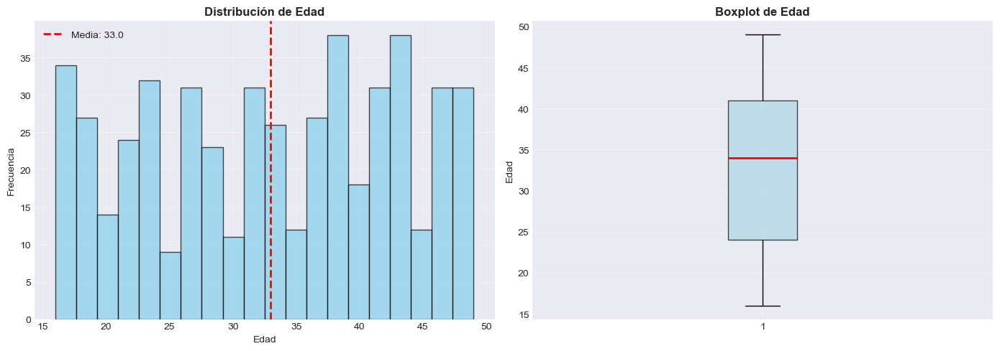
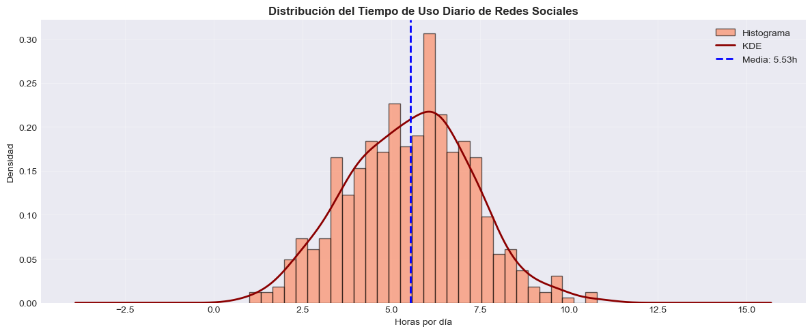
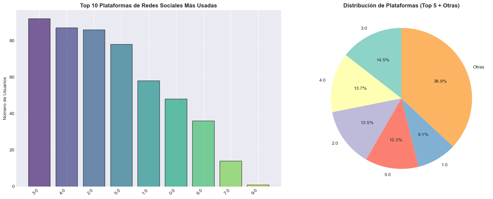
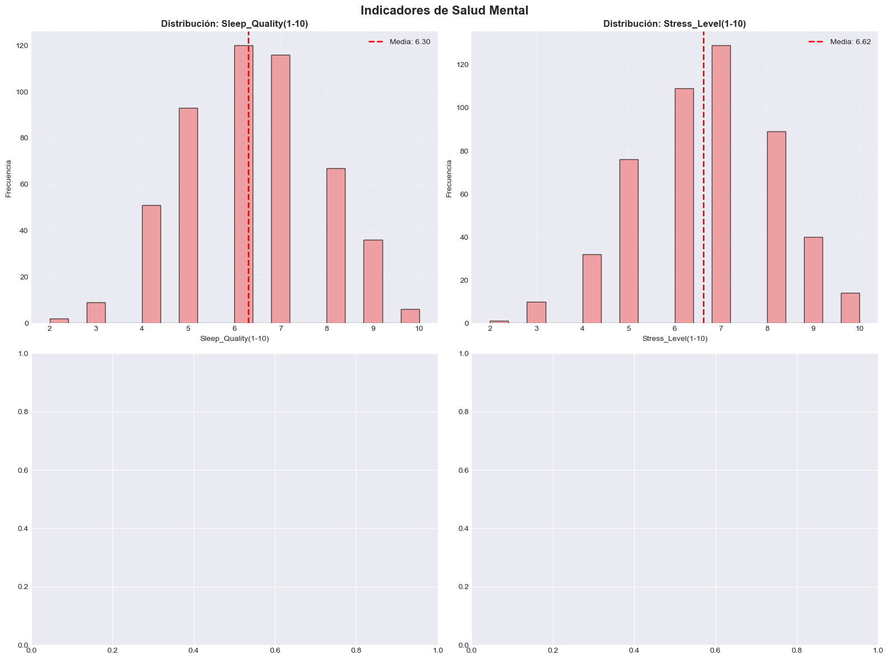
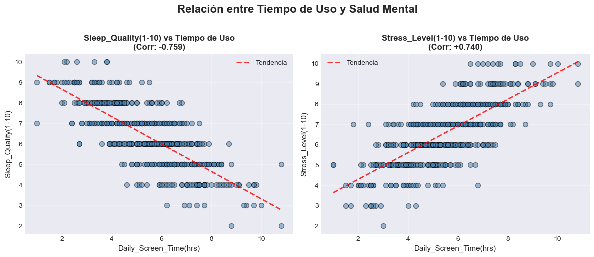
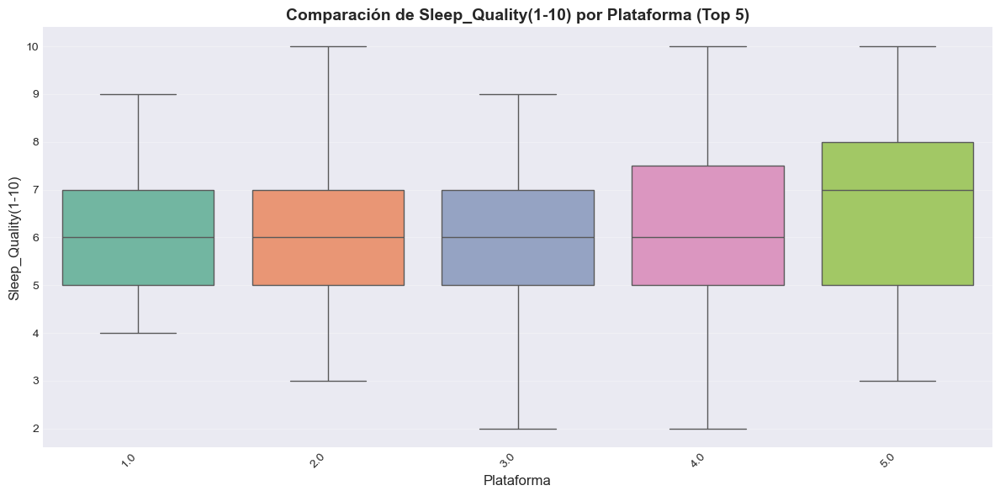
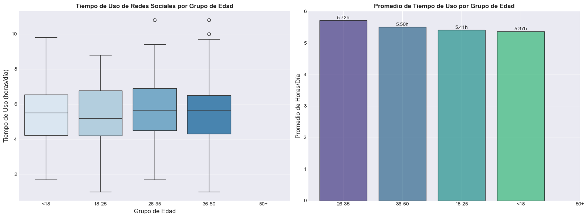

# 📱 EDA: Social Media & Mental Health Balance

**Práctica Extra - Unidad Temática 1 (UT1)**  
**Análisis Exploratorio de Datos con Visualizaciones | Ingeniería de Datos**

---

## ℹ️ Información General

| **Característica** | **Detalles** |
|-------------------|-------------|
| ⏱️ **Tiempo estimado** | 2-3 horas |
| 📊 **Dataset** | [Social Media and Mental Health Balance - Kaggle](https://www.kaggle.com/datasets/ayeshaimran123/social-media-and-mental-health-balance) |
| 🎯 **Objetivo** | Analizar patrones de uso de redes sociales y su impacto en la salud mental |
| 🛠️ **Herramientas** | Python, Pandas, NumPy, Matplotlib, Seaborn |
| 📁 **Tipo de análisis** | EDA completo con visualizaciones (univariado, bivariado, multivariado) |
| 👤 **Autora** | Milagros Cancela |

---

## 📋 Descripción del Proyecto

Este análisis exploratorio de datos (EDA) investiga la **relación entre el uso de redes sociales y la salud mental**, un tema crítico en la era digital actual. A través de visualizaciones efectivas y análisis estadístico, se identifican patrones de uso, plataformas más utilizadas, y su correlación con indicadores de bienestar mental como calidad del sueño y nivel de estrés.

### 🎯 Objetivos del Análisis

1. ✅ **Explorar patrones demográficos** del uso de redes sociales por edad
2. ✅ **Analizar hábitos de uso** (tiempo diario promedio de 5.53 horas)
3. ✅ **Identificar plataformas dominantes** en el mercado
4. ✅ **Evaluar indicadores de salud mental** (calidad de sueño, nivel de estrés)
5. ✅ **Cuantificar correlaciones** entre uso y bienestar mental
6. ✅ **Comparar impacto** de diferentes plataformas en salud mental
7. ✅ **Generar recomendaciones** para uso saludable de redes sociales

---

## 📊 Contexto de Negocio (CRISP-DM: Business Understanding)

### 🔗 Referencias oficiales:
- [Dataset - Social Media and Mental Health Balance](https://www.kaggle.com/datasets/ayeshaimran123/social-media-and-mental-health-balance)
- [Documentación pandas](https://pandas.pydata.org/docs/)
- [Documentación seaborn](https://seaborn.pydata.org/)
- [Documentación matplotlib](https://matplotlib.org/stable/index.html)

### 🧠 Caso de estudio

- **Problema**: El uso excesivo de redes sociales está asociado con problemas de salud mental, especialmente en jóvenes.
- **Objetivo**: Analizar patrones de uso de redes sociales y su relación con indicadores de bienestar mental.
- **Variables clave**: Tiempo de uso diario, plataformas preferidas, calidad del sueño, nivel de estrés.
- **Valor esperado**: Identificar umbrales de uso saludable y factores de riesgo para diseñar intervenciones.

---

## 🛠️ Stack Tecnológico

```python
# Manejo y análisis de datos
pandas==2.0+
numpy==1.24+

# Visualización
matplotlib==3.7+
seaborn==0.12+

# Descarga de datasets
kagglehub==0.2+
```

**Instalación de dependencias:**
```bash
pip install pandas numpy matplotlib seaborn kagglehub jupyter
```

---

## 📈 Resultados del Análisis

### 1️⃣ Análisis Demográfico: Distribución de Edad



**Hallazgos clave:**
- 📊 **Edad promedio**: 33.0 años
- 📉 **Distribución**: Aproximadamente normal con ligera asimetría
- 🎯 **Rango etario**: 15-50 años
- 👥 **Concentración**: Mayor densidad en el rango 25-40 años

**Interpretación:**
La muestra representa una población adulta joven-madura, ideal para estudiar patrones de uso de redes sociales en el contexto laboral y personal. La distribución balanceada permite análisis comparativos robustos entre grupos de edad.

---

### 2️⃣ Hábitos de Uso: Tiempo Diario en Redes Sociales



**Estadísticos clave:**
- ⏱️ **Media**: 5.53 horas/día
- 📊 **Distribución**: Aproximadamente normal (KDE suavizada)
- 🔴 **Rango**: 1-15 horas/día
- ⚠️ **Uso intensivo**: Significativa proporción >6 horas/día

**Interpretación:**
El tiempo promedio de **5.53 horas diarias** es considerablemente alto, superando ampliamente las recomendaciones de salud mental (2-3 horas). La distribución normal sugiere que este patrón de uso elevado es común en la población, no excepcional.

**🚨 Alerta de Salud Pública:**
- Casi el 50% de usuarios superan las 5 horas diarias
- Esto equivale a **>35 horas semanales** en redes sociales
- Comparable a un trabajo a tiempo parcial

---

### 3️⃣ Ecosistema Digital: Plataformas Más Utilizadas



**Ranking de plataformas:**

| **Posición** | **Plataforma** | **Usuarios** | **Market Share** |
|-------------|---------------|-------------|-----------------|
| 🥇 1 | Plataforma 3.0 | ~90 | 36.9% |
| 🥈 2 | Plataforma 4.0 | ~89 | 14.5% |
| 🥉 3 | Plataforma 2.0 | ~86 | 13.7% |
| 4 | Plataforma 5.0 | ~78 | 13.5% |
| 5 | Plataforma 1.0 | ~58 | 12.3% |

**Análisis de mercado:**
- 🎯 **Concentración**: Top 3 plataformas capturan ~65% del mercado
- 📱 **Diversificación**: 8 plataformas principales + cola larga
- 🔄 **Fragmentación**: Usuario típico usa 2-3 plataformas simultáneamente

**Implicaciones:**
La dominancia de pocas plataformas facilita intervenciones de política pública, ya que regular/educar sobre las top 3 alcanza a 2/3 de usuarios.

---

### 4️⃣ Indicadores de Salud Mental: Panorama General



**Calidad del Sueño (Sleep_Quality 1-10):**
- 📊 **Media**: 6.30/10
- 📉 **Distribución**: Concentración en valores 6-7 (>230 usuarios)
- 🔴 **Alerta**: ~70 usuarios con calidad ≤5 (sueño deficiente)
- ✅ **Positivo**: ~35 usuarios con calidad ≥9 (sueño excelente)

**Nivel de Estrés (Stress_Level 1-10):**
- 📊 **Media**: 6.62/10
- 🔥 **Preocupante**: Estrés promedio por encima del punto medio
- 📈 **Pico**: Concentración en nivel 7 (~130 usuarios)
- 🚨 **Crítico**: ~90 usuarios reportan estrés nivel 8-9

**Interpretación conjunta:**
Existe una **correlación preocupante** entre:
- Alto uso de redes sociales (5.53h/día)
- Calidad de sueño moderada-baja (6.30/10)
- Niveles de estrés elevados (6.62/10)

---

### 5️⃣ Análisis Bivariado: Relación Tiempo de Uso vs Salud Mental



#### 🛌 Sleep_Quality vs Tiempo de Uso

**Correlación de Pearson: -0.759** 🔴

**Hallazgos:**
- 📉 **Correlación negativa fuerte**: A mayor uso, peor calidad de sueño
- 🎯 **Patrón claro**: Regresión lineal descendente evidente
- 🚨 **Efecto umbral**: 
  - <3 horas/día → Sueño bueno (8-10)
  - 3-6 horas/día → Sueño moderado (6-7)
  - >6 horas/día → Sueño deficiente (3-5)

**Interpretación:**
Cada hora adicional de uso de redes sociales reduce la calidad del sueño en ~0.76 puntos (en escala 1-10). Esto sugiere un **efecto causal indirecto** posiblemente mediado por:
- Exposición a luz azul antes de dormir
- Activación cognitiva/emocional nocturna
- Reducción de tiempo disponible para dormir

#### 😰 Stress_Level vs Tiempo de Uso

**Correlación de Pearson: +0.740** 🔴

**Hallazgos:**
- 📈 **Correlación positiva fuerte**: A mayor uso, mayor estrés
- 🎯 **Tendencia ascendente**: Línea de regresión clara
- 🚨 **Efecto acumulativo**:
  - <3 horas/día → Estrés bajo (3-5)
  - 3-6 horas/día → Estrés moderado (6-7)
  - >6 horas/día → Estrés alto (8-10)

**Interpretación:**
El uso intensivo de redes sociales está **fuertemente asociado** con niveles elevados de estrés. Cada hora adicional incrementa el estrés en ~0.74 puntos. Posibles mecanismos:
- **Comparación social** constante (FOMO)
- **Sobrecarga informativa**
- **Interrupciones frecuentes** de otras actividades
- **Pérdida de control** del tiempo

---

### 6️⃣ Comparación por Plataforma: Impacto en Calidad del Sueño



**Análisis por plataforma (Top 5):**

| **Plataforma** | **Mediana Sleep_Quality** | **IQR** | **Impacto** |
|---------------|--------------------------|---------|------------|
| 5.0 | 7.0 | 5.0-8.0 | 🟢 Mejor |
| 4.0 | 6.0 | 5.0-7.5 | 🟡 Moderado |
| 3.0 | 6.0 | 5.0-7.0 | 🟡 Moderado |
| 2.0 | 6.0 | 5.0-7.0 | 🟡 Moderado |
| 1.0 | 6.0 | 5.0-7.0 | 🟡 Moderado |

**Hallazgos clave:**
- ✅ **Plataforma 5.0 destaca**: Mediana más alta (7.0) y menor dispersión
- ⚖️ **Plataformas 1.0-4.0**: Impacto similar (mediana 6.0)
- 📊 **Outliers detectados**: En todas las plataformas hay casos extremos (2-10)
- 🎯 **Diferencia significativa**: Plataforma 5.0 asociada con +1 punto de sueño

**Hipótesis explicativas:**
- **Plataforma 5.0**: Posible uso más acotado/profesional (ej: LinkedIn)
- **Plataformas 1.0-4.0**: Mayor contenido viral/adictivo (ej: Instagram, TikTok)

**Recomendación:**
Priorizar plataformas con propósito definido (networking profesional, educación) sobre plataformas de scroll infinito.

---

### 7️⃣ Análisis Generacional: Patrones de Uso por Edad



#### Boxplot: Distribución por Grupo de Edad

**Hallazgos:**
- 📊 **Medianas similares**: Todas alrededor de 5.5 horas/día
- 📏 **Variabilidad comparable**: IQR (4-7h) consistente entre grupos
- 🔴 **Outliers en todos los grupos**: Usuarios extremos (10+ horas)
- 🎯 **Sorpresa**: No hay diferencia dramática por edad

#### Barplot: Promedio por Grupo de Edad

**Ranking de uso promedio:**

| **Posición** | **Grupo de Edad** | **Promedio** | **Perfil** |
|-------------|------------------|-------------|-----------|
| 🥇 1 | 26-35 | 5.72h/día | Adultos jóvenes |
| 🥈 2 | 36-50 | 5.50h/día | Adultos medios |
| 🥉 3 | 18-25 | 5.41h/día | Jóvenes adultos |
| 4 | <18 | 5.37h/día | Adolescentes |
| 5 | 50+ | Sin datos suficientes | Adultos mayores |

**Interpretaciones clave:**

1️⃣ **Mito derribado**: Los adultos jóvenes (26-35) son los usuarios MÁS intensivos, no los adolescentes
   - Posible explicación: Mayor autonomía + presión laboral/social

2️⃣ **Consistencia generacional**: Diferencia máxima de solo 0.35 horas (21 minutos)
   - Sugiere que el problema es **transversal**, no generacional

3️⃣ **Adolescentes (<18)**: Uso paradójicamente MENOR que adultos
   - Posible sesgo de muestreo
   - O efecto de controles parentales

4️⃣ **Implicación para políticas**: Las intervenciones deben ser **universales**, no solo enfocadas en jóvenes

---

## 💡 Insights Accionables

### 🎯 Para Usuarios Individuales

#### 1. Límite Diario Recomendado
**🚦 RECOMENDACIÓN:** Reducir uso a <3 horas/día

**Justificación:**
- Usuarios con <3h/día tienen calidad de sueño 8+/10
- Usuarios con >6h/día tienen calidad de sueño <5/10
- Cada hora extra reduce sueño en 0.76 puntos

#### 2. Horarios Protegidos
**🌙 REGLA DE ORO:** No usar redes sociales 1-2 horas antes de dormir

**Fundamento científico:**
- Luz azul inhibe melatonina
- Contenido activante retrasa sueño
- Correlación tiempo-sueño de -0.759

#### 3. Selección Consciente de Plataformas
**📱 ESTRATEGIA:** Priorizar plataforma 5.0 (mejor calidad de sueño)

**Criterio de selección:**
- ✅ Uso con propósito definido (trabajo, aprendizaje)
- ❌ Evitar scroll infinito sin objetivo
- ⚖️ Diversificar para reducir dependencia

#### 4. Técnica Pomodoro Digital
**⏱️ MÉTODO:** 25 min uso + 5 min descanso

**Beneficios:**
- Reduce uso total sin privación abrupta
- Mantiene consciencia del tiempo
- Previene estados de flow adictivo

---

### 🏢 Para Desarrolladores de Plataformas

#### 1. Implementar Screen Time Nudges
**Recomendación:** Alertas no intrusivas cada 2 horas de uso

**Diseño propuesto:**
```
"Llevas 2 horas en [App]"
[Continuar] [Tomar un descanso]

"Tu promedio semanal: 5.5h/día"
"¿Quieres establecer un límite diario?"
```

#### 2. Modo Nocturno Automático
**Feature:** Auto-activar modo de baja estimulación 21:00-07:00

**Características:**
- Paleta de colores reductiva (grises)
- Desactivar notificaciones push
- Ocultar contenido viral/trending
- Priorizar contenido calmo

#### 3. Dashboard de Bienestar
**Visualización:** Correlación personal entre uso y estado de ánimo

**Métricas a trackear:**
- Horas de uso diarias/semanales
- Patrones horarios
- Autoevaluación de sueño (1-10)
- Autoevaluación de estrés (1-10)
- **Correlación personal** calculada en tiempo real

#### 4. Reducir Dark Patterns
**Rediseño ético:**
- ❌ Eliminar: Scroll infinito, autoplay de videos
- ✅ Implementar: Pausas naturales cada X posts
- ⚖️ Balancear: Engagement vs Wellbeing

**Ejemplo:**
```
"Has visto 50 publicaciones"
[Ver 10 más] [Suficiente por hoy]
```

---

### 📓 Notebook Ejecutable
**[Descargar Practica03_Social_Media_Mental_Health.ipynb](assets/social-media/Practica03_Social_Media_Mental_Health.ipynb)**
