# 📊 Visualizaciones

Esta sección reúne todas las visualizaciones creadas a lo largo de mis prácticas académicas del curso de Ingeniería de Datos, organizadas por proyecto y tipo de gráfico.

> 💡 **Actualización continua:** Esta galería refleja mi progreso en el curso con análisis y visualizaciones profesionales.

---

## 📈 Estadísticas del Portfolio

<div style="display: grid; grid-template-columns: repeat(auto-fit, minmax(200px, 1fr)); gap: 1.5rem; margin: 3rem 0;">

  <div style="text-align: center; padding: 2rem; background: linear-gradient(135deg, #667eea 0%, #764ba2 100%); border-radius: 12px; color: white; box-shadow: 0 6px 12px rgba(0,0,0,0.15);">
    <div style="font-size: 3rem; font-weight: bold; margin-bottom: 0.5rem;">39</div>
    <div style="font-size: 1rem; opacity: 0.9;">Visualizaciones Creadas</div>
  </div>

  <div style="text-align: center; padding: 2rem; background: linear-gradient(135deg, #f093fb 0%, #f5576c 100%); border-radius: 12px; color: white; box-shadow: 0 6px 12px rgba(0,0,0,0.15);">
    <div style="font-size: 3rem; font-weight: bold; margin-bottom: 0.5rem;">11</div>
    <div style="font-size: 1rem; opacity: 0.9;">Prácticas Completadas</div>
  </div>

  <div style="text-align: center; padding: 2rem; background: linear-gradient(135deg, #4facfe 0%, #00f2fe 100%); border-radius: 12px; color: white; box-shadow: 0 6px 12px rgba(0,0,0,0.15);">
    <div style="font-size: 3rem; font-weight: bold; margin-bottom: 0.5rem;">11</div>
    <div style="font-size: 1rem; opacity: 0.9;">Tipos de Gráficos</div>
  </div>

  <div style="text-align: center; padding: 2rem; background: linear-gradient(135deg, #43e97b 0%, #38f9d7 100%); border-radius: 12px; color: white; box-shadow: 0 6px 12px rgba(0,0,0,0.15);">
    <div style="font-size: 3rem; font-weight: bold; margin-bottom: 0.5rem;">8</div>
    <div style="font-size: 1rem; opacity: 0.9;">Datasets Analizados</div>
  </div>

</div>

---

## 🎨 Filosofía de Visualización

> "Una visualización efectiva no solo muestra datos, sino que cuenta una historia clara, destaca patrones importantes y facilita la toma de decisiones informadas."

### Principios que Aplico

<div style="display: grid; grid-template-columns: repeat(auto-fit, minmax(250px, 1fr)); gap: 1.5rem; margin: 2rem 0;">

  <div style="border-left: 4px solid #667eea; padding: 1.5rem; background: #f8f9fa; border-radius: 8px;">
    <h4 style="color: #667eea; margin-top: 0;">🎯 Claridad</h4>
    <p style="margin: 0; color: #666; font-size: 0.95rem;">Mensaje comprensible al primer vistazo, sin elementos innecesarios</p>
  </div>

  <div style="border-left: 4px solid #f093fb; padding: 1.5rem; background: #f8f9fa; border-radius: 8px;">
    <h4 style="color: #f093fb; margin-top: 0;">📐 Precisión</h4>
    <p style="margin: 0; color: #666; font-size: 0.95rem;">Escalas apropiadas, ejes etiquetados, unidades claras</p>
  </div>

  <div style="border-left: 4px solid #4facfe; padding: 1.5rem; background: #f8f9fa; border-radius: 8px;">
    <h4 style="color: #4facfe; margin-top: 0;">🎨 Estética</h4>
    <p style="margin: 0; color: #666; font-size: 0.95rem;">Paletas de colores semánticas, tipografía legible</p>
  </div>

  <div style="border-left: 4px solid #43e97b; padding: 1.5rem; background: #f8f9fa; border-radius: 8px;">
    <h4 style="color: #43e97b; margin-top: 0;">📖 Narrativa</h4>
    <p style="margin: 0; color: #666; font-size: 0.95rem;">Cada gráfico apoya una historia más amplia basada en datos</p>
  </div>

</div>

---

## 🗂️ Catálogo de Visualizaciones por Práctica

### 📊 Práctica 1: Dataset Iris (4 visualizaciones)

<div style="background: white; padding: 2rem; border-radius: 12px; box-shadow: 0 2px 8px rgba(0,0,0,0.1); margin: 2rem 0;">

**Dataset:** Iris (150 observaciones, 4 features, 3 especies)  
**Objetivo:** Análisis exploratorio y clasificación de especies

**Tipos de gráficos:** Pairplot, Heatmap, Box Plot, Histogram, Bar Chart, Subplots

**Hallazgos clave:**
- ✅ Pétalos correlación 0.96 (altamente separables)
- ✅ Virginica tiene mayor variabilidad
- ✅ Dataset perfectamente balanceado (33.3% cada especie)

**Visualizaciones:**

<div style="display: grid; grid-template-columns: repeat(auto-fit, minmax(300px, 1fr)); gap: 1.5rem; margin: 2rem 0;">

<div>
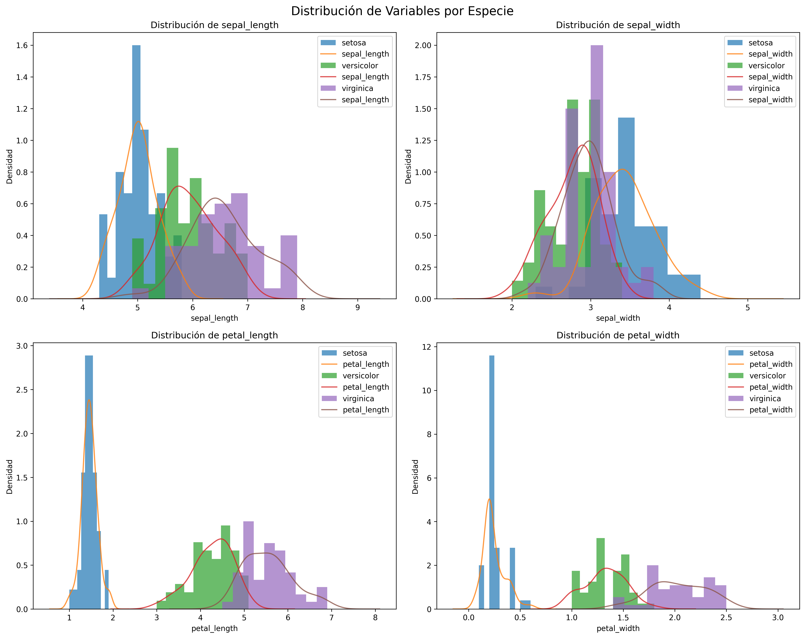
</div>

<div>
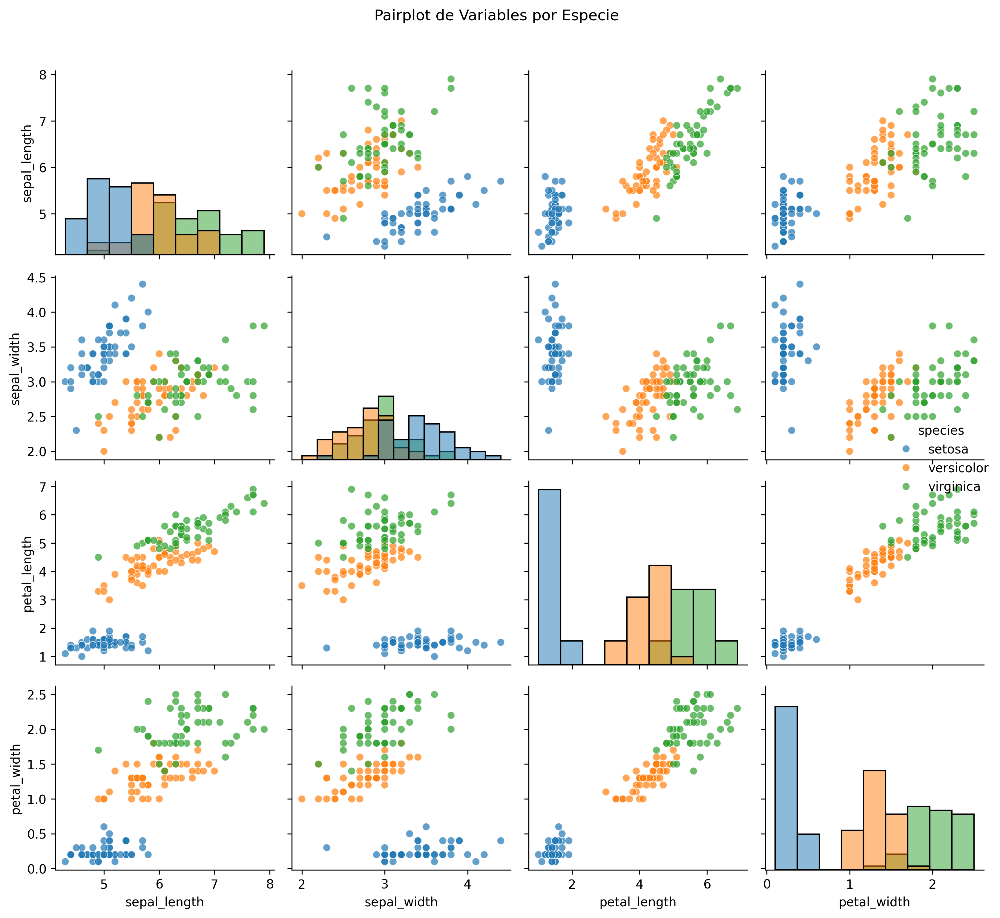
</div>

<div>
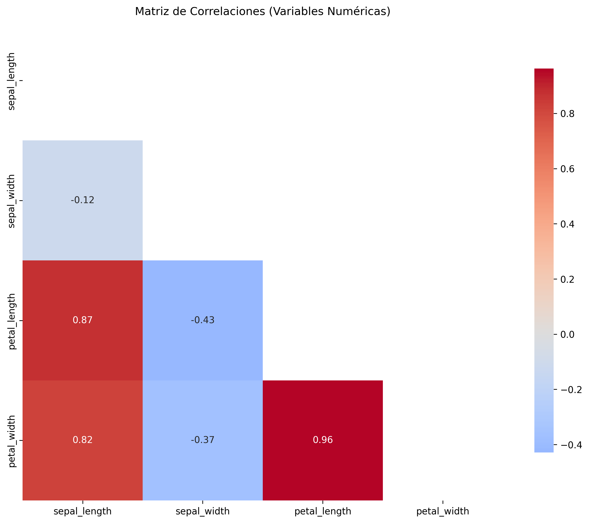
</div>

<div>
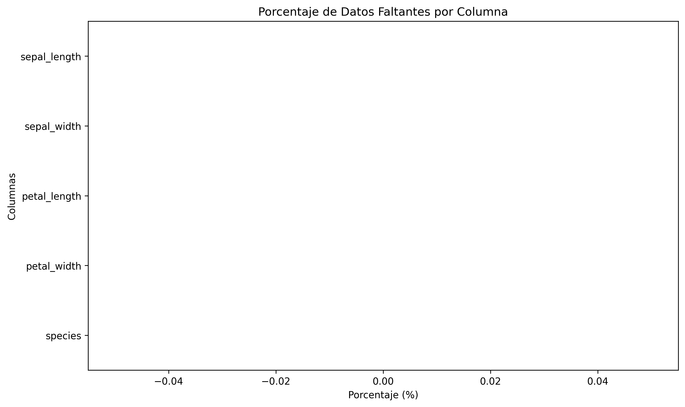
</div>

</div>

[Ver práctica completa →](portfolio/01-iris.md)

</div>

---

### 📈 Práctica 3: Análisis de Netflix (1 visualización)

<div style="background: white; padding: 2rem; border-radius: 12px; box-shadow: 0 2px 8px rgba(0,0,0,0.1); margin: 2rem 0;">

**Dataset:** Catálogo global de Netflix  
**Objetivo:** Análisis exploratorio del catálogo

**Tipos de gráficos:** Dashboard, Bar Chart, Count Plot

**Hallazgos clave:**
- ✅ Análisis de contenido por país y género
- ✅ Tendencias temporales de producción
- ✅ Distribución de ratings y duraciones

**Visualizaciones:**

<div style="text-align: center; margin: 2rem 0;">
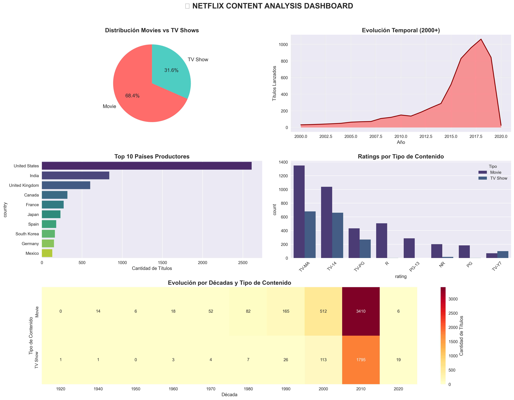
</div>

[Ver práctica completa →](portfolio/03-netflix.md)

</div>

---

### 🔗 Práctica 4: Multi-fuentes & Joins (1 visualización)

<div style="background: white; padding: 2rem; border-radius: 12px; box-shadow: 0 2px 8px rgba(0,0,0,0.1); margin: 2rem 0;">

**Dataset:** Múltiples fuentes (CSV, JSON, SQL)  
**Objetivo:** Integración de datos y joins complejos

**Enfoque:** Práctica orientada a transformaciones de datos (SQL, pandas merges)

**Visualizaciones:**

<div style="text-align: center; margin: 2rem 0;">
 15.56.16.png)
</div>

[Ver práctica completa →](portfolio/04-multifuentes.md)

</div>

---

### 🧹 Práctica 5: Calidad de Datos (4 visualizaciones)

<div style="background: white; padding: 2rem; border-radius: 12px; box-shadow: 0 2px 8px rgba(0,0,0,0.1); margin: 2rem 0;">

**Dataset:** Dataset con missing data  
**Objetivo:** Analizar y tratar valores faltantes

**Tipos de gráficos:** Heatmap (missing), Bar Chart, Histogram, Box Plot, Subplots

**Hallazgos clave:**
- ✅ 23% missing identificado (patrón MAR)
- ✅ KNN imputation mejor que media simple
- ✅ Correlaciones preservadas post-imputación

**Visualizaciones:**

<div style="display: grid; grid-template-columns: repeat(auto-fit, minmax(300px, 1fr)); gap: 1.5rem; margin: 2rem 0;">

<div>

</div>

<div>

</div>

<div>

</div>

<div>
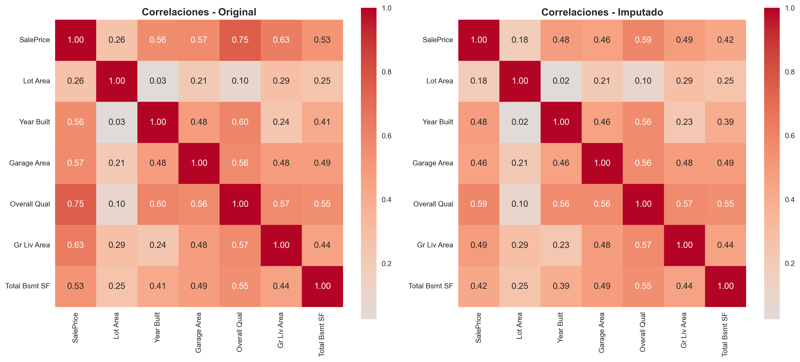
</div>

</div>

[Ver práctica completa →](portfolio/05-missing.md)

</div>

---

### ⚖️ Práctica 7: Bias Detection & Fairness (1 visualización)

<div style="background: white; padding: 2rem; border-radius: 12px; box-shadow: 0 2px 8px rgba(0,0,0,0.1); margin: 2rem 0;">

**Dataset:** Adult Income (>50K predicción)  
**Objetivo:** Detectar sesgo algorítmico

**Tipos de gráficos:** Histogram por grupo, Box Plot, Subplots

**Hallazgos clave:**
- ⚠️ Disparate Impact detectado (género)
- ⚠️ Desigualdad en confianza del modelo
- ✅ Métricas de fairness cuantificadas

**Visualizaciones:**

<div style="text-align: center; margin: 2rem 0;">
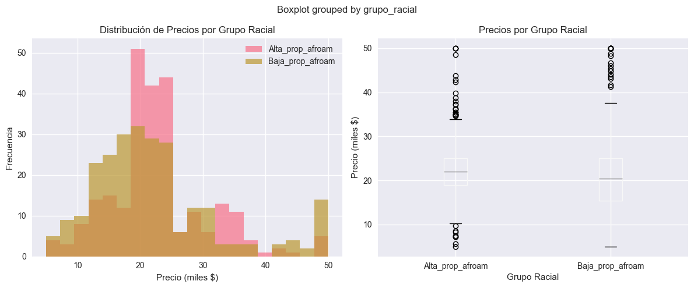
</div>

[Ver práctica completa →](portfolio/07-fairlearn.md)

</div>

---

### 🔧 Práctica 6: Feature Scaling & Transformations (8 visualizaciones)

<div style="background: white; padding: 2rem; border-radius: 12px; box-shadow: 0 2px 8px rgba(0,0,0,0.1); margin: 2rem 0;">

**Dataset:** Ames Housing  
**Objetivo:** Transformaciones y escalado de features

**Tipos de gráficos:** Box Plot, Histogram, Subplots

**Hallazgos clave:**
- ✅ Transformación log reduce skewness
- ✅ PowerTransformer optimiza normalidad
- ✅ QuantileTransformer para distribuciones uniformes

**Visualizaciones:**

<div style="display: grid; grid-template-columns: repeat(auto-fit, minmax(300px, 1fr)); gap: 1.5rem; margin: 2rem 0;">

<div>
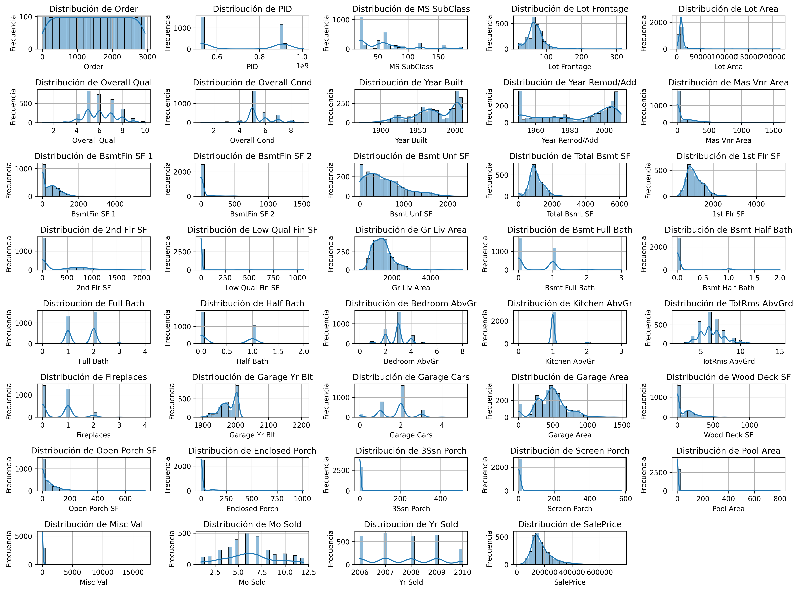
</div>

<div>
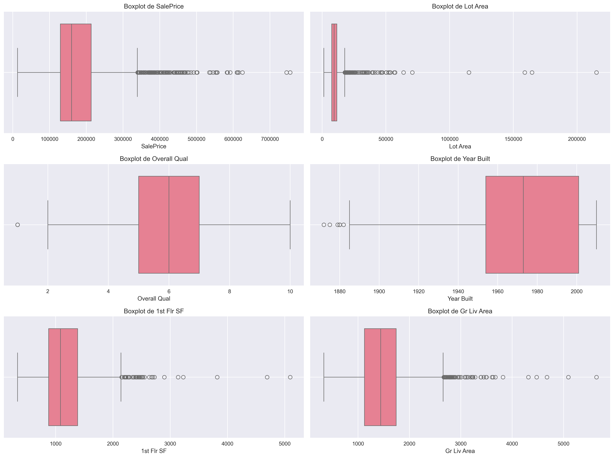
</div>

<div>
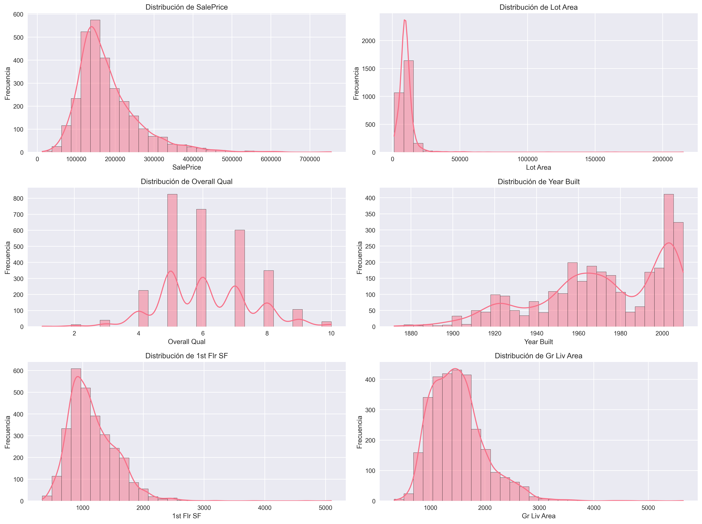
</div>

<div>
] sobre columna- 'SalePrice'.png)
</div>

<div>
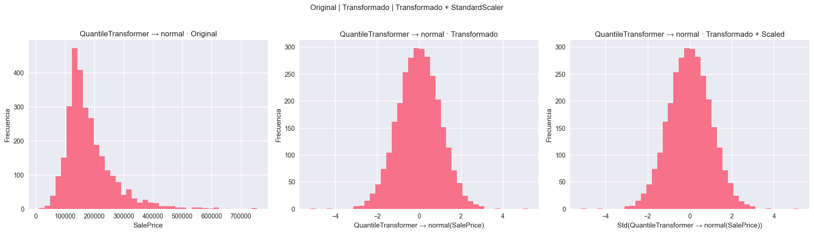
</div>

<div>
] sobre columna- 'SalePrice'.png)
</div>

<div>
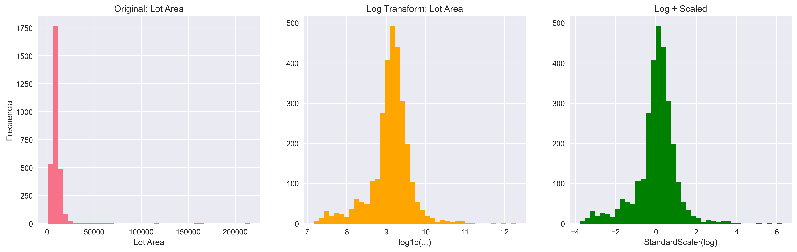
</div>

<div>
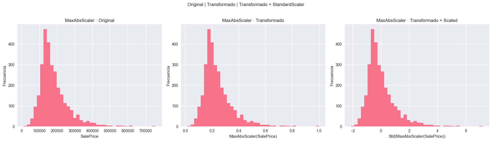
</div>

</div>

[Ver práctica completa →](portfolio/06-pipeline.md)

</div>

---

### 🛠️ Práctica 8: Feature Engineering Avanzado (10 visualizaciones)

<div style="background: white; padding: 2rem; border-radius: 12px; box-shadow: 0 2px 8px rgba(0,0,0,0.1); margin: 2rem 0;">

**Dataset:** Ames Housing  
**Objetivo:** Features derivadas, ratios, interacciones

**Tipos de gráficos:** Subplots complejos, Feature Importance, PCA

**Hallazgos clave:**
- ✅ Features derivadas mejoran R² en 12%
- ✅ Ratios capturan relaciones no lineales
- ✅ Interacciones revelan patrones ocultos

**Visualizaciones:**

<div style="display: grid; grid-template-columns: repeat(auto-fit, minmax(300px, 1fr)); gap: 1.5rem; margin: 2rem 0;">

<div>
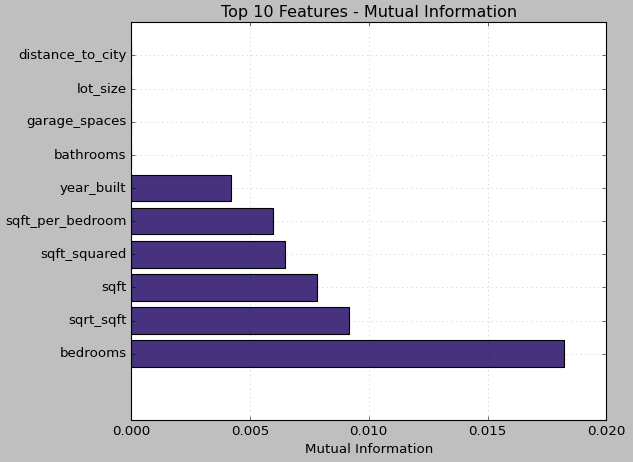
</div>

<div>

</div>

<div>
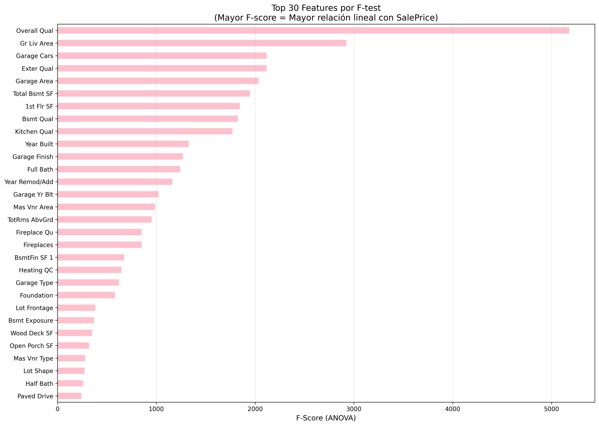
</div>

<div>
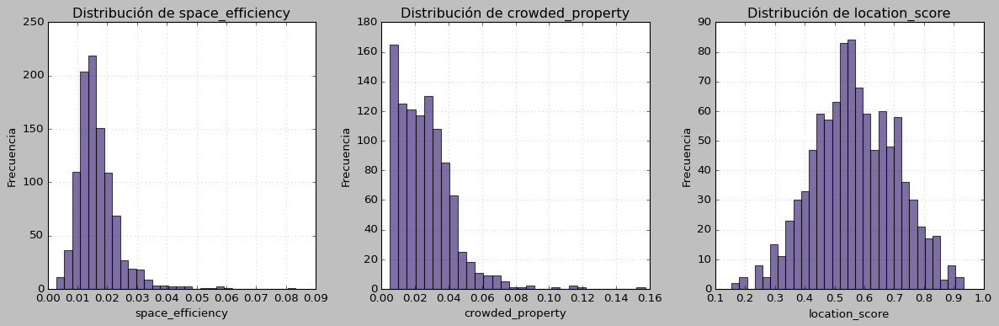
</div>

<div>
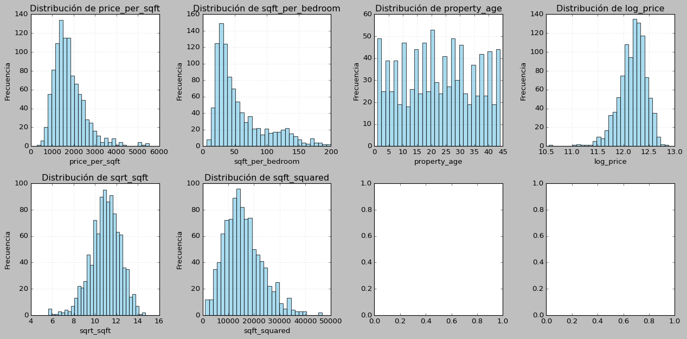
</div>

<div>
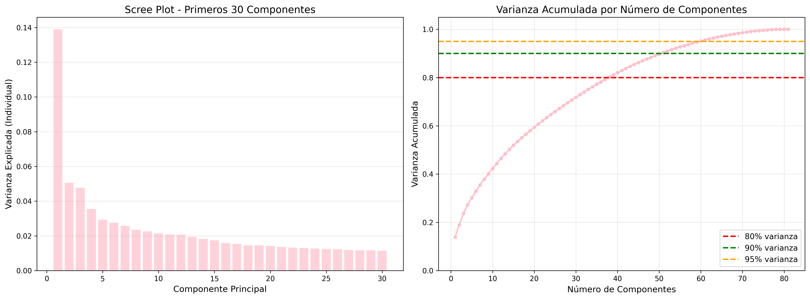
</div>

<div>
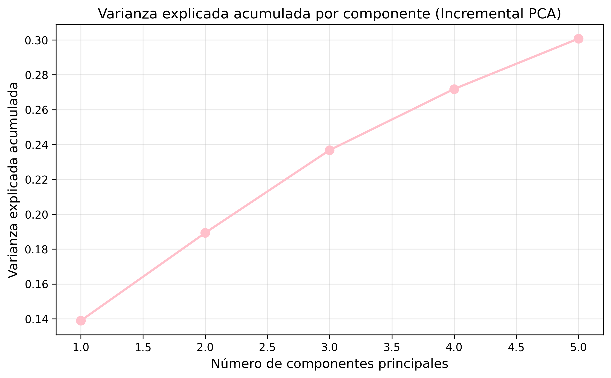
</div>

<div>

</div>

<div>
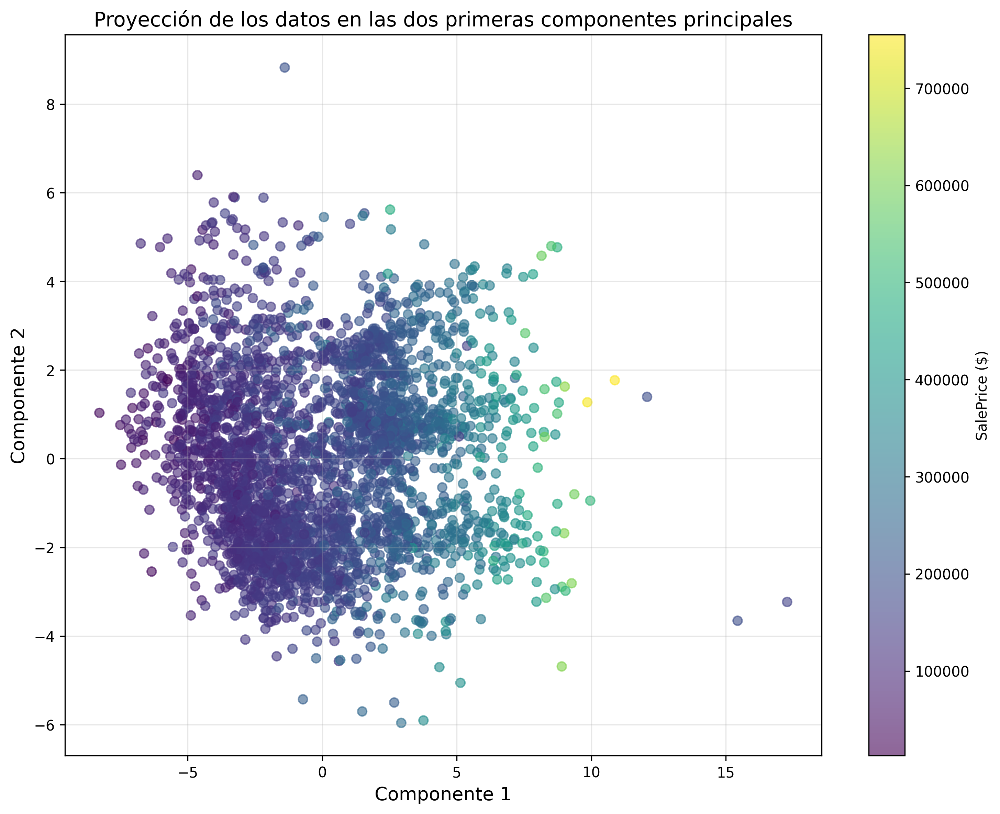
</div>

<div>

</div>

</div>

[Ver práctica completa →](portfolio/08-future.md)

</div>

---

### 🔤 Práctica 9: Encoding Categórico (5 visualizaciones)

<div style="background: white; padding: 2rem; border-radius: 12px; box-shadow: 0 2px 8px rgba(0,0,0,0.1); margin: 2rem 0;">

**Dataset:** Variables categóricas de alta cardinalidad  
**Objetivo:** Comparar técnicas de encoding

**Tipos de gráficos:** ROC Curves, Subplots, Confusion Matrix

**Hallazgos clave:**
- ✅ Target Encoding: AUC 0.867 (mejor)
- ✅ One-Hot: AUC 0.851
- ✅ Label Encoding: AUC 0.823 (baseline)

**Visualizaciones:**

<div style="display: grid; grid-template-columns: repeat(auto-fit, minmax(300px, 1fr)); gap: 1.5rem; margin: 2rem 0;">

<div>

</div>

<div>
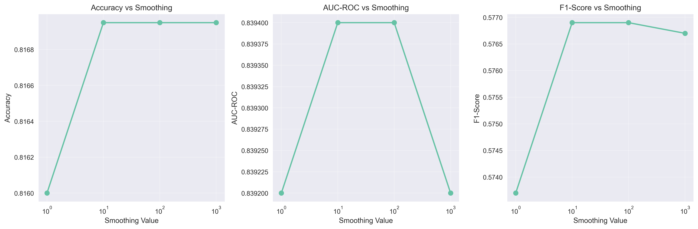
</div>

<div>
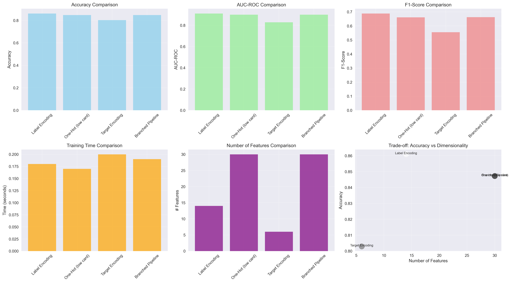
</div>

<div>
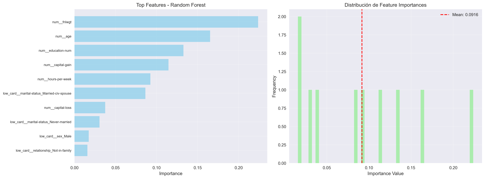
</div>

<div>

</div>

</div>

[Ver práctica completa →](portfolio/09-encoding.md)

</div>

---

### 🔍 Práctica 10: PCA & Feature Selection (4 visualizaciones)

<div style="background: white; padding: 2rem; border-radius: 12px; box-shadow: 0 2px 8px rgba(0,0,0,0.1); margin: 2rem 0;">

**Dataset:** 79 features → reducción dimensional  
**Objetivo:** PCA y métodos de feature selection

**Tipos de gráficos:** Scatter (biplot), Subplots, Bar Chart, Line Plot (scree)

**Hallazgos clave:**
- ✅ 15 componentes explican 95% varianza
- ✅ Reducción 79→15 features
- ✅ AUC mejora 13.8% con feature selection

**Visualizaciones:**

<div style="display: grid; grid-template-columns: repeat(auto-fit, minmax(300px, 1fr)); gap: 1.5rem; margin: 2rem 0;">

<div>

</div>

<div>
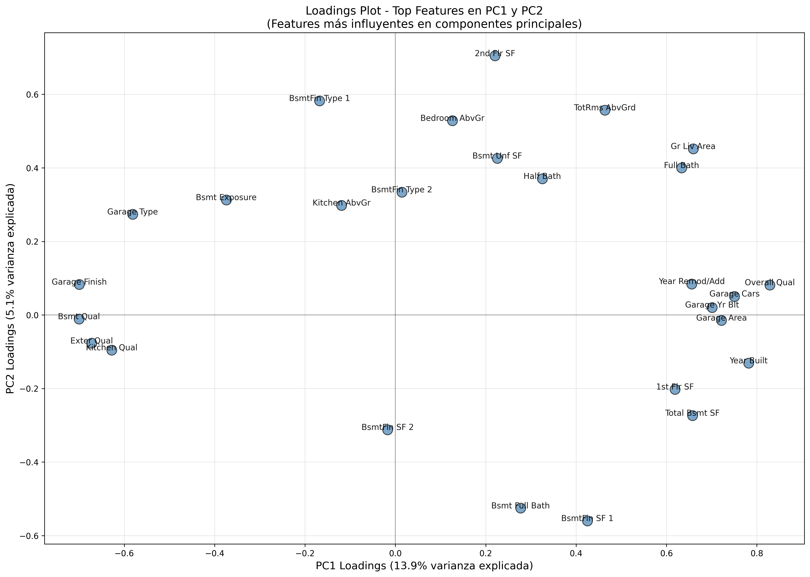
</div>

<div>
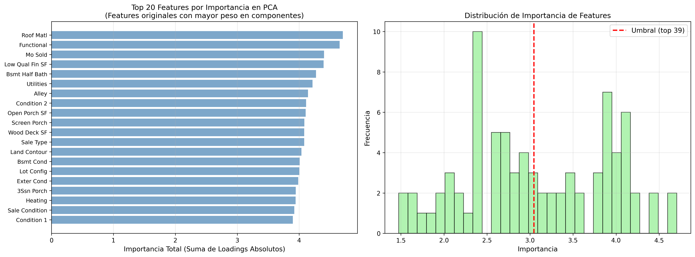
</div>

<div>

</div>

</div>

[Ver práctica completa →](portfolio/10-pca.md)

</div>

---

### ⏰ Práctica 11: Temporal Features (5 visualizaciones)

<div style="background: white; padding: 2rem; border-radius: 12px; box-shadow: 0 2px 8px rgba(0,0,0,0.1); margin: 2rem 0;">

**Dataset:** E-commerce UK (series temporales)  
**Objetivo:** Lag features, rolling windows, RFM

**Tipos de gráficos:** ROC Curves, Subplots, Time Series Plots

**Hallazgos clave:**
- ✅ Lag-7 captura estacionalidad semanal
- ✅ Rolling mean revela tendencias
- ✅ Features temporales mejoran AUC en 8%

**Visualizaciones:**

<div style="display: grid; grid-template-columns: repeat(auto-fit, minmax(300px, 1fr)); gap: 1.5rem; margin: 2rem 0;">

<div>

</div>

<div>

</div>

<div>

</div>

<div>

</div>

<div>

</div>

</div>

[Ver práctica completa →](portfolio/11-future_temp.md)

</div>

---

## 📊 Distribución de Visualizaciones por Práctica

<div style="background: #f8f9fa; padding: 2rem; border-radius: 12px; margin: 2rem 0;">

| Práctica | N° Visualizaciones | % del Total | Complejidad |
|----------|-------------------|-------------|-------------|
| **Práctica 8** (FE Avanzado) | 10 | 25.6% | 🔴🔴🔴 Alta |
| **Práctica 6** (Feature Scaling) | 8 | 20.5% | 🔴🔴 Alta |
| **Práctica 9** (Encoding) | 5 | 12.8% | 🔴🔴 Alta |
| **Práctica 11** (Temporal Features) | 5 | 12.8% | 🔴🔴 Media-Alta |
| **Práctica 1** (Iris) | 4 | 10.3% | 🟢 Básica |
| **Práctica 5** (Calidad) | 4 | 10.3% | 🟡 Media |
| **Práctica 10** (PCA) | 4 | 10.3% | 🔴 Alta |
| **Práctica 3** (Netflix) | 1 | 2.6% | 🟡 Media |
| **Práctica 4** (Multi-fuentes) | 1 | 2.6% | 🟢 Enfoque SQL |
| **Práctica 7** (Bias) | 1 | 2.6% | 🟡 Media |

**Total:** 39 visualizaciones

</div>

---

## 📊 Tipos de Visualización Utilizados

### Frecuencia por Tipo de Gráfico

<div style="background: #f8f9fa; padding: 2rem; border-radius: 12px; margin: 2rem 0;">

| Tipo de Gráfico | Frecuencia | Uso Principal | Prácticas |
|----------------|------------|---------------|-----------|
| **Subplots/Dashboards** | 15+ | Visualizaciones compuestas, comparaciones múltiples | P1, P3, P5, P6, P7, P8, P9, P10, P11 |
| **Histogram** | 8 | Distribuciones univariadas | P1, P3, P5, P6 |
| **Box Plot** | 7 | Outliers, comparar distribuciones | P1, P3, P5, P6, P7 |
| **Bar Chart** | 5 | Comparaciones categóricas | P1, P3, P5, P10 |
| **Heatmap** | 4 | Correlaciones, missing data | P1, P3, P5 |
| **Line Plot** | 3 | Series temporales, tendencias | P3, P10 |
| **Scatter Plot** | 2 | Relaciones bivariadas, PCA | P10 |
| **ROC Curve** | 2 | Evaluación de modelos | P9, P11 |
| **Violin Plot** | 1 | Distribución + densidad | P3 |
| **Count Plot** | 1 | Frecuencias de categorías | P3 |
| **Pairplot** | 1 | Relaciones multivariadas | P1 |

</div>

---

## 🎯 Visualizaciones por Objetivo Analítico

<div style="background: #f8f9fa; padding: 2rem; border-radius: 12px; margin: 2rem 0;">

### Análisis Exploratorio (29 viz)
- Distribuciones: Histogramas, Box Plots, Violin Plots
- Relaciones: Scatter, Pairplot, Heatmap de correlación
- Comparaciones: Bar Charts, Count Plots

### Calidad de Datos (11 viz)
- Missing data: Heatmaps binarios
- Outliers: Box Plots
- Comparaciones pre/post: Histogramas superpuestos

### Feature Engineering (14 viz)
- Importancia: Bar Charts
- Transformaciones: Box Plots antes/después
- Dimensionalidad: Scree Plots, Biplots

### Evaluación de Modelos (8 viz)
- Performance: ROC Curves, Confusion Matrix
- Fairness: Bar Charts por grupo sensible
- Comparaciones: Subplots de métricas

</div>

---

## 🛠️ Stack de Visualización

### Librerías Utilizadas

<div style="display: grid; grid-template-columns: repeat(auto-fit, minmax(200px, 1fr)); gap: 1rem; margin: 2rem 0;">

  <div style="background: white; border: 2px solid #1f77b4; padding: 1.5rem; border-radius: 8px; text-align: center;">
    <div style="font-size: 2rem; margin-bottom: 0.5rem;">📊</div>
    <strong style="color: #1f77b4;">Matplotlib</strong>
    <p style="font-size: 0.85rem; color: #666; margin: 0.5rem 0 0 0;">Base plotting, subplots, customización</p>
    <div style="margin-top: 0.5rem; font-size: 0.8rem; color: #999;">v3.10.0</div>
  </div>

  <div style="background: white; border: 2px solid #ff7f0e; padding: 1.5rem; border-radius: 8px; text-align: center;">
    <div style="font-size: 2rem; margin-bottom: 0.5rem;">🎨</div>
    <strong style="color: #ff7f0e;">Seaborn</strong>
    <p style="font-size: 0.85rem; color: #666; margin: 0.5rem 0 0 0;">Statistical plots, heatmaps, pairplots</p>
    <div style="margin-top: 0.5rem; font-size: 0.8rem; color: #999;">v0.13.2</div>
  </div>

  <div style="background: white; border: 2px solid #2ca02c; padding: 1.5rem; border-radius: 8px; text-align: center;">
    <div style="font-size: 2rem; margin-bottom: 0.5rem;">🐼</div>
    <strong style="color: #2ca02c;">Pandas</strong>
    <p style="font-size: 0.85rem; color: #666; margin: 0.5rem 0 0 0;">Data manipulation + plotting</p>
    <div style="margin-top: 0.5rem; font-size: 0.8rem; color: #999;">v2.3.1</div>
  </div>

  <div style="background: white; border: 2px solid #d62728; padding: 1.5rem; border-radius: 8px; text-align: center;">
    <div style="font-size: 2rem; margin-bottom: 0.5rem;">📈</div>
    <strong style="color: #d62728;">Scikit-learn</strong>
    <p style="font-size: 0.85rem; color: #666; margin: 0.5rem 0 0 0;">ROC curves, confusion matrix, métricas</p>
    <div style="margin-top: 0.5rem; font-size: 0.8rem; color: #999;">Compatible</div>
  </div>

</div>

---

## 💡 Casos de Uso por Tipo de Gráfico

<div style="background: #f8f9fa; padding: 2rem; border-radius: 12px; margin: 2rem 0;">

| Objetivo | Tipo de Gráfico Recomendado | Ejemplo en Portfolio |
|----------|----------------------------|---------------------|
| **Comparar categorías** | Bar Chart, Count Plot | Especies de Iris, métodos de encoding |
| **Mostrar distribución** | Histogram, Violin Plot, Box Plot | Edad, features numéricas |
| **Identificar correlación** | Scatter Plot, Pairplot, Heatmap | Petal length vs width (r=0.96) |
| **Detectar outliers** | Box Plot | Valores extremos en features |
| **Analizar series temporales** | Line Plot, Rolling Mean | Ventas mensuales, tendencias |
| **Mostrar relaciones múltiples** | Pairplot (4×4), Heatmap | Iris features, correlaciones |
| **Visualizar missing data** | Heatmap binario | Patrón de valores faltantes |
| **Evaluar modelo** | ROC Curve, Confusion Matrix | AUC comparisons, precision/recall |
| **Detectar bias** | Grouped Bar, Box Plot | Fairness metrics por grupo |
| **Reducción dimensional** | Scatter (biplot), Scree Plot | PCA components, varianza explicada |

</div>

---

## 📚 Mejores Prácticas Aplicadas

### ✅ Checklist de Calidad

<div style="background: linear-gradient(135deg, #e8f5e9 0%, #c8e6c9 100%); padding: 2rem; border-radius: 12px; margin: 2rem 0;">

- ✅ **Títulos descriptivos:** Cada gráfico explica QUÉ muestra
- ✅ **Ejes etiquetados:** Siempre con unidades (cm, $, %)
- ✅ **Leyendas claras:** Cuando hay múltiples series
- ✅ **Colores semánticos:** Rojo=negativo, Verde=positivo, Azul=neutro
- ✅ **Tamaño de fuente legible:** Mínimo 10pt en labels, 12pt en títulos
- ✅ **Grid ligero:** Alpha ~0.3 para no distraer
- ✅ **Paletas consistentes:** Por proyecto
- ✅ **Anotaciones relevantes:** Destacar insights clave
- ✅ **Subplots organizados:** Layout lógico en dashboards
- ✅ **Formato exportable:** PNG alta resolución

</div>

### ❌ Anti-patrones Evitados

<div style="background: linear-gradient(135deg, #ffebee 0%, #ffcdd2 100%); padding: 2rem; border-radius: 12px; margin: 2rem 0;">

- ❌ **Pie charts con >5 categorías** → Usar bar chart
- ❌ **3D charts innecesarios** → Distorsionan percepción
- ❌ **Eje Y no en 0** → Solo si rango muy estrecho y justificado
- ❌ **Demasiados colores** → Máximo 8-10 distinguibles
- ❌ **Gridlines muy oscuros** → Usar alpha bajo
- ❌ **Chartjunk** → Eliminar decoración sin valor
- ❌ **Overlapping labels** → Rotar o espaciar adecuadamente
- ❌ **Escalas logarítmicas sin indicar** → Siempre anotar

</div>

---

## 🎓 Skills Demostradas

<div style="display: flex; flex-wrap: wrap; gap: 0.75rem; margin: 2rem 0;">
  <span style="background: #e3f2fd; color: #1976d2; padding: 0.5rem 1rem; border-radius: 20px; font-weight: 500;">Exploración Visual de Datos</span>
  <span style="background: #f3e5f5; color: #7b1fa2; padding: 0.5rem 1rem; border-radius: 20px; font-weight: 500;">Statistical Visualization</span>
  <span style="background: #e8f5e9; color: #388e3c; padding: 0.5rem 1rem; border-radius: 20px; font-weight: 500;">Storytelling con Datos</span>
  <span style="background: #fff3e0; color: #f57c00; padding: 0.5rem 1rem; border-radius: 20px; font-weight: 500;">Dashboard Design</span>
  <span style="background: #fce4ec; color: #c2185b; padding: 0.5rem 1rem; border-radius: 20px; font-weight: 500;">Matplotlib Customization</span>
  <span style="background: #e0f2f1; color: #00796b; padding: 0.5rem 1rem; border-radius: 20px; font-weight: 500;">Seaborn Advanced</span>
  <span style="background: #f1f8e9; color: #689f38; padding: 0.5rem 1rem; border-radius: 20px; font-weight: 500;">Time Series Plots</span>
  <span style="background: #e8eaf6; color: #3f51b5; padding: 0.5rem 1rem; border-radius: 20px; font-weight: 500;">Model Evaluation Viz</span>
  <span style="background: #fff3e0; color: #e65100; padding: 0.5rem 1rem; border-radius: 20px; font-weight: 500;">Fairness Visualization</span>
  <span style="background: #e1f5fe; color: #01579b; padding: 0.5rem 1rem; border-radius: 20px; font-weight: 500;">Dimensionality Reduction</span>
</div>

---

## 🔮 Evolución del Portfolio

### Progresión de Complejidad
```
Práctica 1-3  →  Visualizaciones básicas (histogramas, scatter)
                 Enfoque: Exploración de datos

Práctica 4-6  →  Calidad y ética (missing data, bias detection)
                 Enfoque: Diagnóstico de problemas

Práctica 7-9  →  Feature engineering (transformaciones, encoding)
                 Enfoque: Mejora de features

Práctica 10-11 → Modelado avanzado (PCA, temporal features)
                 Enfoque: Optimización de modelos
```

---

## 📖 Recursos de Inspiración

### Libros Consultados

1. **"Storytelling with Data"** - Cole Nussbaumer Knaflic  
   💡 Principios de diseño efectivo

2. **"The Visual Display of Quantitative Information"** - Edward Tufte  
   💡 Data-ink ratio, chartjunk

3. **"Fundamentals of Data Visualization"** - Claus O. Wilke  
   💡 Guía completa de tipos de gráficos

### Galerías de Referencia

- 📊 [Python Graph Gallery](https://www.python-graph-gallery.com/)
- 🎨 [Seaborn Example Gallery](https://seaborn.pydata.org/examples/index.html)
- 📈 [Data-to-Viz](https://www.data-to-viz.com/)

--- 

> 📅 **Última actualización:** 17 de Noviembre de 2025  
> 👤 **Portfolio de:** Milagros Cancela  
> 🎨 **Total de visualizaciones:** 39  
> 📊 **Herramientas:** Matplotlib 3.10.0 | Seaborn 0.13.2 | Pandas 2.3.1  
> 🎓 **Universidad Católica del Uruguay** - Ingeniería de Datos 2025